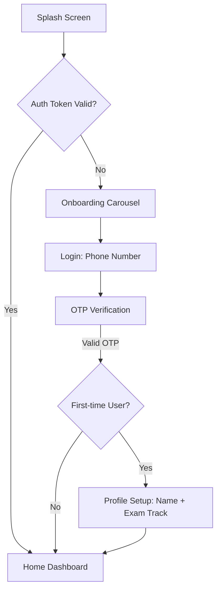
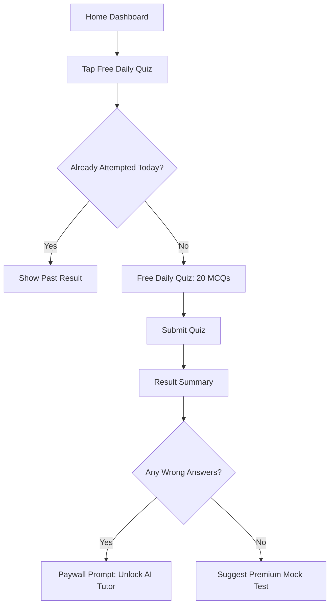
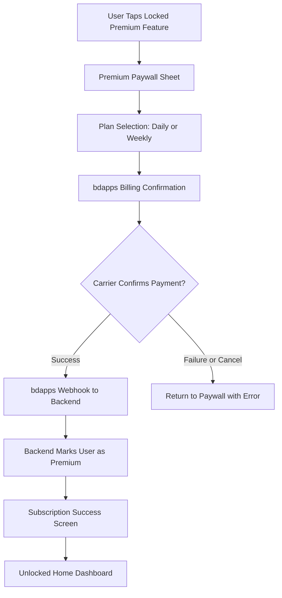
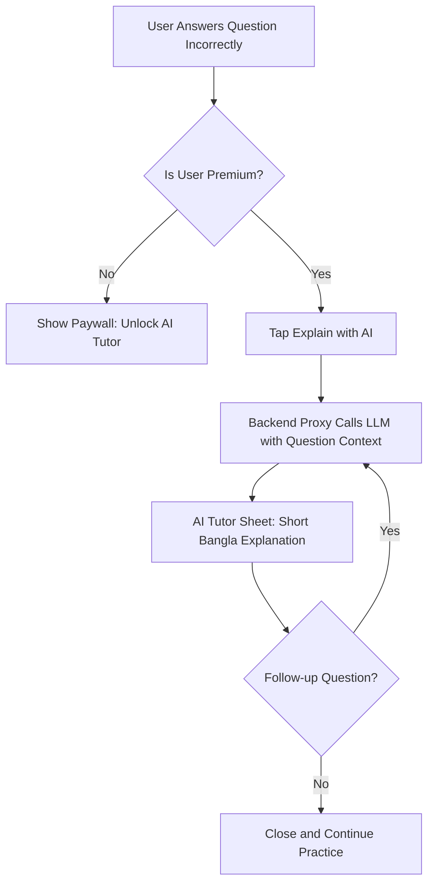
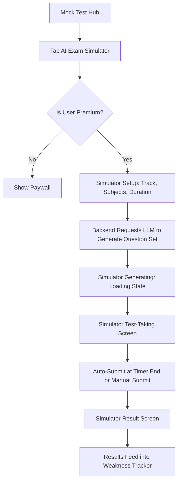
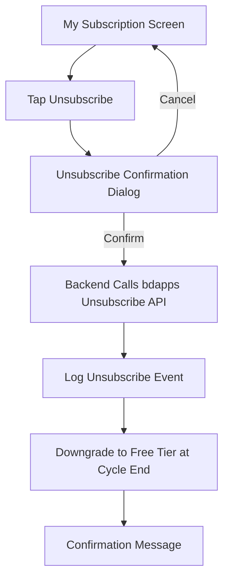
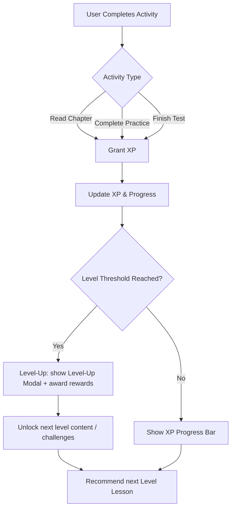
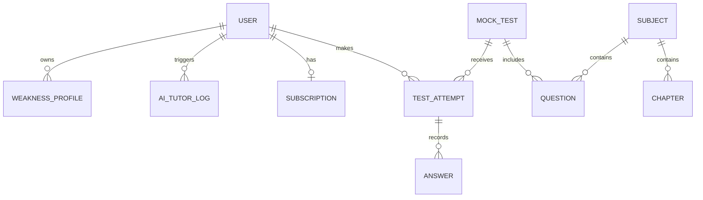

# Software Requirements Specification

# BCS Booster AI — The Smart Job Prep Companion & Guidebook

_This SRS translates the BCS Booster AI product brief into an implementation-ready specification: every user-facing screen, the flows that connect them, the visual design system, and the Flutter/backend architecture needed to build it._

| Version | Date       | Author           | Status                       |
| ------- | ---------- | ---------------- | ---------------------------- |
| 1.0     | 2026-07-11 | Product/Dev Team | Draft for build & evaluation |

**Contents:** 1. Introduction · 2. Overall Description · 3. Functional Requirements · 4. Screen Inventory · 5. User Flows · 6. UI/UX Design Concepts · 7. Flutter Technical Architecture · 8. Non-Functional Requirements · 9. External Interface Requirements · 10. Data Model Overview · 11. Prioritization (MoSCoW) & Bootcamp Alignment · 12. Assumptions, Dependencies & Risks

---

## 1. Introduction

### 1.1 Purpose

Defines the functional, screen-level, flow-level, and design requirements for **BCS Booster AI**, a SaaS exam-prep ecosystem for BCS, government bank, and primary teacher recruitment candidates in Bangladesh. It exists so design and engineering can build directly from one source of truth instead of re-interpreting the pitch.

### 1.2 Document Scope

Covers the candidate-facing app (guidebook, question bank, mock tests, weakness tracker), the three AI modules, bdapps subscription/monetization, and the admin panel.

### 1.3 Intended Audience

Flutter engineers, backend engineers, UI/UX designers, QA, product owner, and bootcamp evaluators.

### 1.4 Product Scope

**In scope (v1):** guidebook, question bank, daily/live mock tests + leaderboard, weakness tracker, AI Conversational Tutor, AI Dynamic Exam Simulator, Easy Guide to AI, bdapps carrier billing (subscribe/unsubscribe), admin panel, and a gamified progression layer (levels, XP, badges, lives/energy, and rewards) to increase engagement.
**Out of scope (v1):** native iOS build, full offline-first sync, languages beyond Bangla/English, non-bdapps payment rails.

### 1.5 Definitions & Acronyms

- **BCS** — Bangladesh Civil Service · **BPSC** — Bangladesh Public Service Commission
- **DAU** — Daily Active Users · **LLM** — Large Language Model · **MCQ** — Multiple-Choice Question
- **bdapps** — Robi Axiata's app store and carrier-billing platform
- **MoSCoW** — Must / Should / Could / Won't prioritization

### 1.6 Target Platforms

BCS Booster AI ships from **one Flutter codebase** to two targets:

- **Android app**, distributed via bdapps — primary channel for real candidates (carrier billing requires this native/telecom context).
- **Flutter Web build**, deployed at a single URL — lets judges and admins exercise guidebook navigation, payment UX, and the admin dashboard without installing anything, per the brief's "single live URL" requirement.

This dual-target constraint shapes several decisions flagged later in this document (see §2.4 and Flow 3).

---

## 2. Overall Description

### 2.1 Product Perspective

A standalone ed-tech SaaS product, not dependent on physical coaching infrastructure. Flutter client ⇄ backend proxy (Cloud Functions/API) ⇄ cloud database, LLM provider, and bdapps billing API.

### 2.2 User Classes & Characteristics

| Class                       | Description                                                                    |
| --------------------------- | ------------------------------------------------------------------------------ |
| **Free User**               | Browses limited guidebook topics; one 20-question static quiz/day              |
| **Premium Subscriber**      | Full guidebook, AI Tutor, AI Exam Simulator, live mock tests, weakness tracker |
| **Admin / Content Manager** | Manages content, subscriptions, AI cost, and leaderboard via the admin panel   |

Typical end users are Bangla-first, mobile-first, price-sensitive (micro-payment habits), moderately technical, and often on 3G/4G outside Dhaka/Chattogram — this drives several design and performance requirements below.

### 2.3 Operating Environment

Android 8.0+ devices (phone-first, small screens up to tablets); Flutter Web build tested on current Chrome, Firefox, Edge, Safari.

### 2.4 Design & Implementation Constraints

- Must comply with bdapps guidelines: visible unsubscribe control, transparent billing disclosure.
- Bangla Unicode rendering must be correct and legible across all guidebook and AI-generated content.
- **bdapps carrier billing cannot be completed from a browser** (it requires a SIM-authenticated telecom session). The Flutter Web build must present a clearly labeled simulated/demo billing step so judges can review the full UX without a live subscription (see Flow 3).
- AI cost must stay observable and controllable — every AI call is logged for the admin Token Analytics screen (§4.11).

### 2.5 Assumptions & Dependencies

- LLM provider: Google Gemini (as named in the brief), architected so a different provider could be swapped in later.
- Cloud backend: assumed Firebase (justified in §7); swappable if the team has an existing stack.
- bdapps sandbox/production credentials are provisioned before end-to-end subscription testing.

---

## 3. Functional Requirements

Priority legend: **Must** = required for MVP/bootcamp submission · **Should** = important, can follow shortly after · **Could** = nice-to-have. Full rationale in §11.

### 3.1 Authentication & Onboarding

- **FR-1.1 (Must)** — Register/log in via mobile number + OTP (matches the identity bdapps billing already uses).
- **FR-1.2 (Must)** — Capture target exam track (BCS / Bank / Primary Teacher) during onboarding.
- **FR-1.3 (Should)** — Allow editing exam track/profile later from Settings.
- **FR-1.4 (Could)** — Support Google Sign-In as an alternate login method.

### 3.2 Interactive Study Guidebook

- **FR-2.1 (Must)** — Structured syllabus catalog by subject (Bangladesh Affairs, International Affairs, General Science, Math, English, etc.).
- **FR-2.2 (Must)** — Render chapter notes and summary sheets with full Bangla typography support.
- **FR-2.3 (Should)** — Bookmark/save chapters for later reading.
- **FR-2.4 (Must)** — Free users see only introductory topics; full chapters are subscription-gated.
- **FR-2.5 (Could)** — Adjustable reading font size.

### 3.3 Question Bank

- **FR-3.1 (Must)** — Searchable/filterable bank of previous years' questions by exam type, year, subject.
- **FR-3.2 (Must)** — Each question shows options, correct answer, and explanation.
- **FR-3.3 (Should)** — Practice mode with instant right/wrong feedback per question.

### 3.4 Daily Live Mock Tests & Leaderboard

- **FR-4.1 (Must)** — Timed daily/weekly live mock test with a fixed availability window.
- **FR-4.2 (Must)** — Auto-grade submissions and publish a nationwide merit list within 24 hours.
- **FR-4.3 (Must)** — Live/updated leaderboard, filterable by exam track.
- **FR-4.4 (Should)** — Push notification when a user's rank updates.
- **FR-4.5 (Must)** — Free tier limited to the 20-question static daily quiz; full live mock tests are premium.

### 3.5 Weakness Tracker

- **FR-5.1 (Must)** — Track per-category accuracy, attempts, and time spent across all quizzes/tests.
- **FR-5.2 (Must)** — Auto-curate mini-tests targeting the weakest categories.
- **FR-5.3 (Should)** — Recommend specific guidebook chapters tied to weak categories.
- **FR-5.4 (Should)** — Visual dashboard (charts) of strengths/weaknesses by subject.

### 3.6 AI Conversational Tutor

- **FR-6.1 (Must)** — On an incorrect answer, generate a concise (~50-word) conversational Bangla explanation.
- **FR-6.2 (Must)** — All AI calls route through a backend proxy, never directly from client to LLM (security + cost tracking).
- **FR-6.3 (Should)** — Allow one follow-up question to the Tutor on the same concept.
- **FR-6.4 (Must)** — Gated to premium subscribers.

### 3.7 AI Dynamic Exam Simulator

- **FR-7.1 (Must)** — Premium users configure and launch a fully AI-generated mock exam (track, subjects, duration).
- **FR-7.2 (Must)** — AI generates unique MCQs as structured JSON (question, options, verified answer key), matching official syllabus distribution.
- **FR-7.3 (Must)** — Same timer/auto-submit behavior as the live mock test.
- **FR-7.4 (Should)** — Results feed into the Weakness Tracker like any other test.

### 3.8 Easy Guide to AI / Smart Prompt Assistant

- **FR-8.1 (Must)** — Predefined, clickable Bangla prompt buttons (e.g., _"এই সূত্রটি ধাপে ধাপে বুঝিয়ে দাও"_ / "Explain this formula step-by-step").
- **FR-8.2 (Must)** — Tapping a button auto-constructs the underlying system prompt (plus current chapter/question context) and calls the AI.
- **FR-8.3 (Could)** — Free-form question input in addition to preset buttons.

### 3.9 Subscription & Monetization (bdapps)

- **FR-9.1 (Must)** — Integrate bdapps carrier billing to trigger subscriptions (2 BDT/day or 10 BDT/week).
- **FR-9.2 (Must)** — Unlock premium features immediately on a confirmed subscription webhook.
- **FR-9.3 (Must)** — A clearly visible, working **Unsubscribe** control at all times for active subscribers.
- **FR-9.4 (Must)** — Log every subscribe/unsubscribe/renewal event for compliance and audit.
- **FR-9.5 (Must)** — Public responsive web landing page showcasing features, reachable by judges without login.

### 3.10 Admin Panel

- **FR-10.1 (Must)** — Real-time DAU, active subscribers, churn rate, revenue.
- **FR-10.2 (Must)** — CRUD guidebook chapters, question sets, answer keys.
- **FR-10.3 (Must)** — Schedule/publish/edit daily live mock tests.
- **FR-10.4 (Must)** — Monitor AI token usage/cost per module (Tutor, Simulator, Smart Prompt).
- **FR-10.5 (Must)** — Verify, finalize, and publish leaderboard rankings.
- **FR-10.6 (Should)** — Role-based access for multiple admin/staff accounts.

### 3.11 Gamification

- **FR-11.1 (Must)** — Implement a level & XP system: users earn XP for reading chapters, answering questions, completing tests, and daily streaks.
- **FR-11.2 (Must)** — Present a Duolingo-inspired progression map with level nodes and unlock states, where each level unlocks new lessons, question pools, mini challenges, or small rewards.
- **FR-11.2a (Must)** — Make the Playground/world map the primary post-onboarding experience and the main entry point for daily learning, so users naturally start from the map and move into challenges from there.
- **FR-11.3 (Must)** — Implement an energy/lives mechanic (e.g., 5 hearts) limiting unlimited retries; hearts regenerate over time or via small rewards.
- **FR-11.4 (Must)** — Award badges/achievements for milestones (first mock test, 7-day streak, level reached) and surface them in the Profile/Achievements screen.
- **FR-11.5 (Should)** — Adaptive difficulty: the system increases level difficulty as users level up and improves question selection based on weak categories.
- **FR-11.6 (Should)** — Offer cosmetic or useful micro-rewards (profile badges, XP boosts, extra heart) redeemable in a simple rewards store.
- **FR-11.7 (Could)** — Social progress sharing: allow users to share level-ups or badges to social platforms (opt-in).
- **FR-11.8 (Must)** — All gamification state changes (XP, level, badges, hearts) are logged for analytics and can be queried in the Admin telemetry views.

---

## 4. Screen Inventory

**Access legend:** `Public` = no login · `All` = any logged-in user, free tier may see a limited view · `Premium` = active subscription required · `Admin` = admin panel only.

### 4.1 Onboarding & Authentication

| ID    | Screen                 | Access | Purpose & Key Elements                                                                                    |
| ----- | ---------------------- | ------ | --------------------------------------------------------------------------------------------------------- |
| S-01  | Splash                 | All    | Logo, checks auth token, routes to onboarding or Home                                                     |
| S-02  | Onboarding Carousel    | Public | 3–4 slides on guidebook, mock tests, AI tutor                                                             |
| S-03  | Login (Phone Number)   | Public | Phone input, "Send OTP," ToS/Privacy links                                                                |
| S-04  | OTP Verification       | Public | 6-digit input, resend timer, SMS autofill                                                                 |
| S-05  | Profile Setup          | All    | Name, exam track selector (BCS/Bank/Primary), district (optional)                                         |
| S-06  | Home Dashboard         | All    | Today's quiz CTA, continue reading, leaderboard snapshot, weakness summary, premium banner                |
| S-06A | Playground / World Map | All    | A Duolingo-style map of level nodes with locked/unlocked states, progress, XP, and challenge entry points |

### 4.2 Guidebook

| ID   | Screen                   | Access                     | Purpose & Key Elements                                                   |
| ---- | ------------------------ | -------------------------- | ------------------------------------------------------------------------ |
| S-07 | Guidebook Home           | All (limited free)         | Subject grid: Bangladesh Affairs, Int'l Affairs, Science, Math, English… |
| S-08 | Subject Chapter List     | All (limited free)         | Chapters within a subject, per-chapter progress bar                      |
| S-09 | Chapter Reader           | Free sample / Premium full | Rich-text notes, font-size control, bookmark icon, inline "Ask AI"       |
| S-10 | Summary / Shortcut Sheet | Premium                    | Condensed revision notes and mnemonics                                   |
| S-11 | Bookmarks                | All                        | Saved chapters and questions                                             |
| S-12 | Search                   | All                        | Unified search across guidebook + question bank                          |

### 4.3 Question Bank

| ID   | Screen                   | Access        | Purpose & Key Elements                                |
| ---- | ------------------------ | ------------- | ----------------------------------------------------- |
| S-13 | Question Bank Home       | All           | Filter by exam type / year / subject                  |
| S-14 | Question List            | All           | Paginated list, attempted/unattempted tags            |
| S-15 | Question Practice Detail | All (limited) | MCQ, instant correct/incorrect, "Explain with AI" CTA |

### 4.4 Mock Test / Live Exam

| ID   | Screen                   | Access     | Purpose & Key Elements                                       |
| ---- | ------------------------ | ---------- | ------------------------------------------------------------ |
| S-16 | Mock Test Hub            | All        | Today's live test countdown, upcoming schedule, past results |
| S-17 | Free Daily Quiz          | Free       | 20-question static quiz, once per day                        |
| S-18 | Pre-Test Instructions    | Premium    | Rules, duration, syllabus coverage, "Start" CTA              |
| S-19 | Live Test-Taking         | Premium    | Timer, question navigator grid, flag-for-review, MCQ options |
| S-20 | Submit Confirmation      | Premium    | "X unanswered — submit anyway?" dialog                       |
| S-21 | Result Summary           | Premium    | Score, percentile, category-wise breakdown                   |
| S-22 | Answer Review            | Premium    | Per-question review with correct answer + AI explanation     |
| S-23 | Leaderboard / Merit List | All (view) | Nationwide ranks by track, own rank highlighted              |

### 4.5 Weakness Tracker

| ID   | Screen                | Access  | Purpose & Key Elements                     |
| ---- | --------------------- | ------- | ------------------------------------------ |
| S-24 | Weakness Dashboard    | Premium | Accuracy-by-subject chart, trend over time |
| S-25 | Recommended Mini-Test | Premium | Auto-curated short test on weak topics     |
| S-26 | Recommended Reading   | Premium | Chapter suggestions tied to weak topics    |

### 4.6 AI Conversational Tutor

| ID   | Screen           | Access  | Purpose & Key Elements                                     |
| ---- | ---------------- | ------- | ---------------------------------------------------------- |
| S-27 | AI Tutor Sheet   | Premium | Bottom sheet, ~50-word Bangla explanation, follow-up input |
| S-28 | AI Tutor History | Premium | Searchable list of past explanations                       |

### 4.7 AI Dynamic Exam Simulator

| ID   | Screen                | Access  | Purpose & Key Elements                            |
| ---- | --------------------- | ------- | ------------------------------------------------- |
| S-29 | Simulator Setup       | Premium | Track, subjects, question count, duration sliders |
| S-30 | Simulator Generating  | Premium | Loading state while the AI builds the paper       |
| S-31 | Simulator Test-Taking | Premium | Same pattern as S-19                              |
| S-32 | Simulator Result      | Premium | Score + "Generate another unique paper"           |

### 4.8 Easy Guide to AI

| ID   | Screen               | Access                 | Purpose & Key Elements                                                  |
| ---- | -------------------- | ---------------------- | ----------------------------------------------------------------------- |
| S-33 | Smart Prompt Home    | Premium (free preview) | Grid of predefined Bangla prompt buttons: explain, summarize, translate |
| S-34 | Prompt Response View | Premium                | AI response rendered, copy/share                                        |

### 4.9 Subscription & Monetization

| ID   | Screen                      | Access  | Purpose & Key Elements                                             |
| ---- | --------------------------- | ------- | ------------------------------------------------------------------ |
| S-35 | Public Landing Page (Web)   | Public  | Feature showcase for judges/new users, "Subscribe" CTA             |
| S-36 | Premium Paywall Sheet       | All     | Triggered on locked content tap; plan comparison                   |
| S-37 | Plan Selection              | All     | Daily (2 BDT) vs Weekly (10 BDT) toggle                            |
| S-38 | bdapps Billing Confirmation | All     | Carrier-hosted step; Web build shows a labeled demo/simulated flow |
| S-39 | Subscription Success        | All     | Confirmation + "Explore Premium" CTA                               |
| S-40 | My Subscription             | Premium | Status, renewal date, plan, **Unsubscribe** button                 |
| S-41 | Unsubscribe Confirmation    | Premium | Optional reason, confirm/cancel                                    |

### 4.10 Profile & Settings

| ID   | Screen                  | Access | Purpose & Key Elements                                |
| ---- | ----------------------- | ------ | ----------------------------------------------------- |
| S-42 | Profile                 | All    | Avatar, name, exam track, edit                        |
| S-43 | Settings                | All    | Language (Bangla/English), notifications, theme       |
| S-44 | Notifications Center    | All    | Rank updates, new test alerts, subscription reminders |
| S-45 | Help / FAQ / Support    | All    | Contact, FAQs, unsubscribe help                       |
| S-46 | About / Terms & Privacy | All    | Legal, version info                                   |

### 4.11 Admin Panel (Web)

| ID   | Screen                       | Access | Purpose & Key Elements                                  |
| ---- | ---------------------------- | ------ | ------------------------------------------------------- |
| S-47 | Admin Login                  | Admin  | Email/password, optional 2FA                            |
| S-48 | Admin Dashboard              | Admin  | KPI cards: DAU, MAU, revenue, churn, active subscribers |
| S-49 | Subscriber Telemetry         | Admin  | Subscribe/unsubscribe logs, bdapps revenue              |
| S-50 | Content Mgmt — Guidebook     | Admin  | CRUD chapters/subjects                                  |
| S-51 | Content Mgmt — Question Bank | Admin  | CRUD questions/answer keys                              |
| S-52 | Mock Test Scheduler          | Admin  | Create/schedule/publish tests                           |
| S-53 | AI Engine Analytics          | Admin  | Token usage & cost per module, response-time monitoring |
| S-54 | Leaderboard Control          | Admin  | Review, verify, finalize, publish rankings              |
| S-55 | Admin Users & Roles          | Admin  | Manage staff accounts/permissions                       |

**Total: 55 screens across 11 modules.**

### 4.12 Gamification

| ID   | Screen                   | Access           | Purpose & Key Elements                                                               |
| ---- | ------------------------ | ---------------- | ------------------------------------------------------------------------------------ |
| S-56 | Level Map / Progression  | All              | Visual skill map with levels, XP ring, next objectives, and unlocked content markers |
| S-57 | Level Lesson / Challenge | All (many gated) | Short lesson + practice challenge tied to a level; XP reward shown on completion     |
| S-58 | Achievements & Badges    | All              | List of earned badges, progress to next badge, share/export buttons                  |
| S-59 | Rewards Store            | All              | Simple store to redeem XP or achievements for small boosts (extra heart, XP boost)   |
| S-60 | Level-Up Modal           | All              | Celebratory modal on level-up with summary of rewards and CTA to next challenge      |

**Total: 60 screens across 12 modules.**

---

## 5. User Flows

### Flow 1 — Onboarding & Registration



### Flow 2 — Free Daily Quiz (engagement loop)



### Flow 3 — Premium Subscription via bdapps Carrier Billing



_Note: on the Flutter Web build, step D substitutes a clearly labeled demo billing screen, since real carrier billing needs a SIM-authenticated session unavailable in a browser._

### Flow 4 — AI Conversational Tutor Trigger



### Flow 5 — AI Dynamic Exam Simulator



### Flow 6 — Unsubscribe (compliance-critical)



### Flow 7 — Daily Live Mock Test + Merit List

1. Admin schedules and publishes the day's test window (Admin Panel, S-52).
2. Premium user opens Mock Test Hub (S-16) → sees countdown.
3. Taps Start → Pre-Test Instructions (S-18) → Live Test-Taking (S-19).
4. Timer-bound MCQs; auto-submit on expiry or manual submit → Submit Confirmation (S-20).
5. Backend auto-grades instantly; Result Summary shown (S-21).
6. Nationwide ranking computed and published as the Merit List.
7. User checks rank on Leaderboard (S-23); push notification sent.

### Flow 8 — Weakness Tracker → Personalized Recommendation

1. System aggregates results from quizzes/tests/simulator by category.
2. Weakness Dashboard (S-24) renders accuracy-by-subject.
3. System auto-curates a mini-test on the 2–3 weakest categories.
4. User completes it → dashboard updates.
5. System suggests guidebook chapters tied to the weak categories.

### Flow 9 — Easy Guide to AI / Smart Prompt

1. User opens Smart Prompt Home (S-33) from Guidebook or Home.
2. Taps a preset Bangla button, e.g. _"এই ঐতিহাসিক চুক্তিটি সংক্ষেপে বলো"_ ("Summarize this historical treaty").
3. App maps the button to a hidden system prompt + current context (chapter/question being viewed).
4. Backend proxies the call to the LLM → Prompt Response View (S-34) renders the answer.
5. User copies/shares the response or picks another preset.

### Flow 10 — Admin Content Management

1. Admin logs in (S-47) → Dashboard (S-48).
2. Navigates to Content Management — Guidebook or Question Bank (S-50/S-51).
3. Adds/edits a chapter or question set, sets answer keys.
4. Change saves to the cloud DB and reflects in the app on next fetch.
5. Admin checks AI Engine Analytics (S-53) to confirm token cost stays within budget after the change.

---

### Flow 11 — Level Progression & XP Loop



Notes: XP, level, hearts, and badge events are recorded and surfaced to the Admin telemetry views; level progression can gate content and influence question difficulty.

---

## 6. UI/UX Design Concepts

### 6.1 Visual Identity

| Role                      | Color                                | Use                                         |
| ------------------------- | ------------------------------------ | ------------------------------------------- |
| Primary                   | Deep Green `#0E7C4A`                 | Primary actions, "pass"/success association |
| Secondary                 | Navy `#1B3B6F`                       | Headers, institutional/exam credibility     |
| Accent                    | Amber `#F5A623`                      | Rank, streaks, premium badges               |
| Success / Error / Warning | `#2ECC71` / `#E74C3C` / `#F39C12`    | Feedback states                             |
| Surface                   | `#FAFAFA` (light) / `#121212` (dark) | Backgrounds                                 |

### 6.2 Typography

- **Bangla:** Noto Sans Bengali or Hind Siliguri — strong Unicode coverage for body and headings.
- **Latin/numerals:** Inter or Roboto for mixed English UI labels and numbers.
- Bundle fonts locally via `google_fonts` with offline caching rather than relying on runtime download.
- Respect the system text-scale factor up to ~1.3x without breaking layouts.

### 6.3 Navigation Pattern

- **Mobile:** bottom navigation bar — Home, Guidebook, Tests, AI Tools, Profile.
- **Admin Panel (web):** persistent left sidebar, collapsing to a drawer on narrow viewports.
- Secondary navigation via top app bar + in-context CTAs.

### 6.4 Core Component System

- **Cards** for chapters, questions, leaderboard rows — consistent 12px radius, subtle elevation.
- **Progress indicators** — circular ring for weakness-tracker percentages, linear bar for chapter completion.
- **Timer chip** on live tests, shifting green → amber → red as time runs low.
- **AI explanation bubble** — visually distinct from a user follow-up bubble (icon + left/right alignment).
- **Locked/Premium badge** — consistent lock icon overlay on gated content; tapping opens the Paywall Sheet.
- **Gamification** — streak flame icon, top-3 rank medals, daily-goal ring on the Home Dashboard.

### 6.5 Responsive / Adaptive Layout

Single codebase, breakpoint-driven layout: `<600dp` mobile (bottom nav), `600–1024dp` tablet, `>1024dp` desktop/web-admin (sidebar, multi-column dashboards). Use `LayoutBuilder`/`MediaQuery` rather than separate codebases per platform.

### 6.6 States & Feedback

- Skeleton loaders for guidebook/question lists.
- Explicit "generating your explanation…" state for AI calls (a few seconds of latency is expected) — consider streaming the response token-by-token for the Tutor and Smart Prompt views to reduce perceived wait.
- Friendly empty states with short Bangla copy (e.g., "No bookmarks yet").
- Distinguish "AI service busy, retry" from a generic network error.
- Low-connectivity banner with graceful degradation — cached guidebook content stays readable.

### 6.7 Accessibility & Localization

- Bangla as default locale, English as secondary, via `intl`/ARB files.
- Semantic labels on all interactive elements, in both languages.
- Minimum 48×48dp tap targets; WCAG AA contrast for body text.

### 6.8 Gamification & Motivation

- Daily streak counter on the Home Dashboard to reinforce the "healthy competition, daily engagement" goal from the brief.
- Leaderboard rank badges, "Top 100 today" highlight.
- Brief, tasteful micro-animation (lightweight Lottie) on completing a mock test or improving a weak category — short and non-intrusive.

---

## 7. Flutter Technical Architecture

_(Recommendations below are the senior-dev starting point — flag anywhere your team already has a stack preference and this section adapts around it.)_

### 7.1 Recommended Architecture

- **Pattern:** Clean Architecture, feature-first structure (`auth`, `guidebook`, `question_bank`, `mock_test`, `ai_tutor`, `ai_simulator`, `smart_prompt`, `subscription`, `admin`).
- **Pattern:** Clean Architecture, feature-first structure (`auth`, `guidebook`, `question_bank`, `mock_test`, `ai_tutor`, `ai_simulator`, `smart_prompt`, `subscription`, `gamification`, `admin`).
- **State management:** **Riverpod** — recommended for compile-time safety and testability at a bootcamp team's scale; BLoC is a solid alternative if the team already knows it well.
- **Navigation:** `go_router` — declarative, URL-addressable routes matter here because the Web build and admin panel need real deep links (e.g. `/admin/content/guidebook`).
- **Networking:** `dio` with interceptors for token refresh and retry on flaky mobile networks.
- **Local cache:** `hive` for read-only guidebook/question caching to soften connectivity gaps (not a full offline mode).

### 7.2 Backend & AI Integration

- **Backend:** Firebase (Firestore + Cloud Functions + phone-OTP Auth) recommended for build speed within a bootcamp timeline.
- **AI call pattern:** Client → Cloud Function (`generateExplanation`, `generateSimulatorPaper`, `promptAssist`) → Gemini API → validated response → Client. The API key never ships in the client, and every call is logged for the Token Analytics screen (S-53).
- **Simulator safety:** validate the AI's JSON output against a schema server-side before it reaches the test UI, to guard against malformed or incomplete question sets.
- **bdapps integration:** a Cloud Function webhook receives subscribe/renew/unsubscribe callbacks, updates the `subscriptions` collection, and the client listens via a Firestore stream for near-real-time unlock. Confirm exact webhook payload structure against bdapps' developer docs during implementation.

- **Gamification storage & rules:** gamification state (XP, level, hearts, badges, rewards) is persisted in dedicated collections (e.g., `user_xp`, `user_achievements`, `user_rewards`). Cloud Functions enforce level thresholds, heart regeneration timers, reward redemptions, and server-side validation of XP awards to prevent abuse. Admin telemetry surfaces aggregated gamification metrics.

### 7.3 Suggested Packages

`flutter_riverpod` · `go_router` · `dio` · `google_fonts` · `fl_chart` (weakness-tracker charts) · `flutter_secure_storage` (auth tokens) · `cached_network_image` · `intl` + `flutter_localizations` · `lottie` · `hive`

### 7.4 Folder Structure (sketch)

```
lib/
 ├─ core/          # theme, constants, network client, error handling
 ├─ features/
 │   ├─ auth/
 │   ├─ guidebook/
 │   ├─ question_bank/
 │   ├─ mock_test/
 │   ├─ weakness_tracker/
 │   ├─ ai_tutor/
 │   ├─ ai_simulator/
 │   ├─ smart_prompt/
 │   ├─ subscription/
 │   └─ admin/
 ├─ shared/        # reusable widgets, design tokens
 └─ main.dart
```

---

## 8. Non-Functional Requirements

| Category        | Requirement                                                                                                                 |
| --------------- | --------------------------------------------------------------------------------------------------------------------------- |
| Performance     | AI Tutor explanation target ≤3–5s (P95); cold start <2.5s; 60fps list scrolling                                             |
| Scalability     | Backend must absorb concurrent submission spikes during the daily live-test window; serverless functions scale horizontally |
| Security        | Tokens in secure storage; AI keys never in client; admin panel behind role-based auth; HTTPS everywhere                     |
| Reliability     | Target 99.5% uptime on core reading/quiz features; graceful "AI busy" state instead of a crash if the LLM is unavailable    |
| Compliance      | Strict bdapps adherence — visible unsubscribe, accurate billing disclosure, audited subscription logs                       |
| Usability       | Every core flow completable by a non-technical, Bangla-first user without external help                                     |
| Maintainability | Feature-first modular codebase so AI modules can iterate independently of content modules                                   |

---

## 9. External Interface Requirements

| Interface                           | Purpose                                                                         |
| ----------------------------------- | ------------------------------------------------------------------------------- |
| bdapps API                          | Subscription trigger, billing confirmation, unsubscribe, webhook callbacks      |
| LLM Provider (Gemini or equivalent) | Tutor explanations, structured JSON exam generation, Smart Prompt responses     |
| Cloud Database                      | Guidebook, questions, users, subscriptions, leaderboard, AI logs                |
| Push Notifications                  | Firebase Cloud Messaging — rank updates, test reminders, subscription reminders |
| Analytics                           | DAU/churn event logging feeding the Admin Dashboard                             |

---

## 10. Data Model Overview



Key entities: **User** (profile, exam track), **Subscription** (plan, status, renewal date), **Subject/Chapter** (guidebook content), **Question** (bank + answer key), **MockTest** (scheduled or AI-generated), **TestAttempt/Answer** (grading + leaderboard input), **WeaknessProfile** (per-category rollup), **AITutorLog** (token/cost tracking).

---

## 11. Prioritization (MoSCoW) & Bootcamp Alignment

| Priority       | Features                                                                                                                                                                                                                              |
| -------------- | ------------------------------------------------------------------------------------------------------------------------------------------------------------------------------------------------------------------------------------- |
| **Must (MVP)** | Auth, core Guidebook, Question Bank, Free Daily Quiz, one full Live Mock Test flow, AI Tutor, AI Exam Simulator, Easy Guide to AI, bdapps subscribe/unsubscribe, Admin: content mgmt + telemetry + AI analytics + leaderboard control |
| **Should**     | Full Weakness Tracker dashboard, Bookmarks, Notifications, Tutor follow-up chat                                                                                                                                                       |
| **Could**      | Dark mode, offline chapter caching, Google Sign-In, admin roles/permissions                                                                                                                                                           |
| **Won't (v1)** | Native iOS, languages beyond Bangla/English, non-bdapps payment methods                                                                                                                                                               |

Since the brief ties the AI bonus marks specifically to the three AI modules, **FR-6.x, FR-7.x, and FR-8.x should be built and demoable before polish items** like dark mode or gamification animation.

---

## 12. Assumptions, Dependencies & Risks

| #   | Risk                                                         | Mitigation                                                                                   |
| --- | ------------------------------------------------------------ | -------------------------------------------------------------------------------------------- |
| 1   | AI cost overrun if Tutor/Simulator usage spikes              | Admin Token Analytics (S-53) + per-user daily rate limits                                    |
| 2   | LLM-generated exam questions contain factual/syllabus errors | Server-side schema validation + an admin flagging/spot-check queue for reported AI questions |
| 3   | Variable rural connectivity degrades UX                      | Lightweight `hive` caching, explicit offline/error states                                    |
| 4   | bdapps billing can't be demoed from a browser                | Labeled demo/simulated billing step in the Web build (Flow 3)                                |
| 5   | LLM provider quota/pricing changes                           | Backend proxy pattern keeps the provider swappable without client changes                    |

---

_Next steps: this doc is ready to hand to design (wireframes per §4) and engineering (sprint-plan §3 by MoSCoW). Happy to expand any section, adjust the stack choices in §7, or convert this to a Word document._
