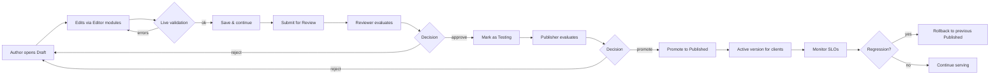
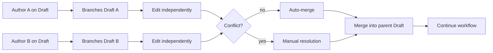
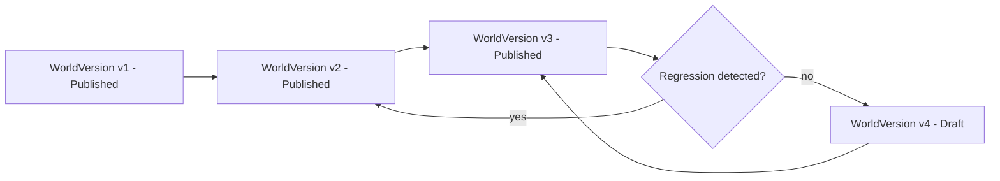
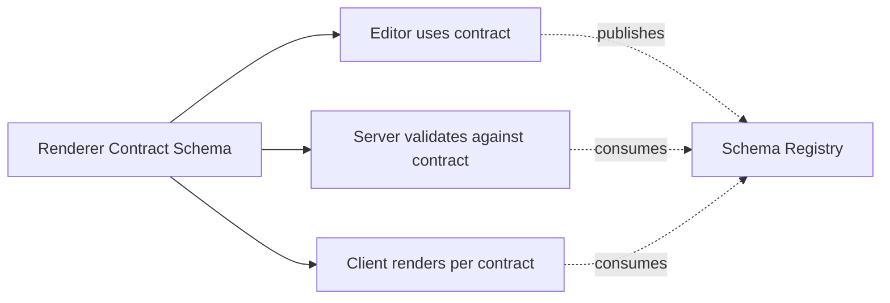
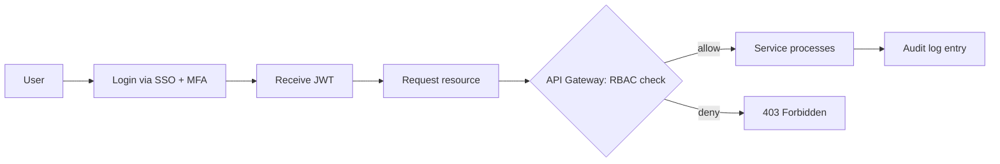
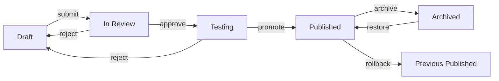
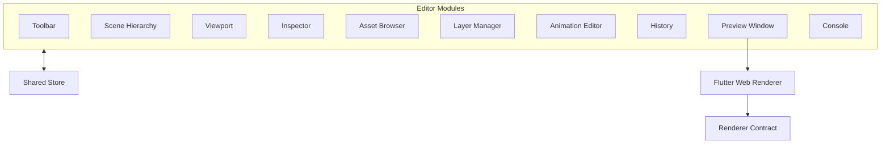

# PrepQuest Admin Panel — Master Planning Document

**Document classification:** Internal — Architectural Blueprint
**Status:** Draft v1.0 (Pre-Implementation)
**Owner:** PrepQuest Engineering — Platform Team
**Audience:** Engineering, Design, Product, Content Operations, QA, Security, DevOps
**Document lifespan target:** ≥ 5 years (with quarterly revisions)
**Supersedes:** None
**Related documents:**

- `Plans/codebase_structure.md` (canonical architecture model)
- `Plans/codebase_structure.json` (machine-readable sibling)
- `Plans/playground_structure.md` (Playground feature deep-dive)
- `docs/playground/PLAYGROUND_*.md` (Playground design system)
- `Plans/BCS_Booster_AI_SRS (1).md` (product requirements)

---

## Table of Contents

1. [Executive Summary](#1-executive-summary)
2. [Project Vision](#2-project-vision)
3. [System Goals](#3-system-goals)
4. [Architecture Philosophy](#4-architecture-philosophy)
5. [Admin Panel Vision](#5-admin-panel-vision)
6. [UI Philosophy](#6-ui-philosophy)
7. [Rendering Philosophy](#7-rendering-philosophy)
8. [Database Philosophy](#8-database-philosophy)
9. [Editor Philosophy](#9-editor-philosophy)
10. [Deployment Strategy](#10-deployment-strategy)
11. [Security Strategy](#11-security-strategy)
12. [Version Control Strategy](#12-version-control-strategy)
13. [Publishing Workflow](#13-publishing-workflow)
14. [Future Expansion](#14-future-expansion)
15. [Appendix A — Editor Module Catalogue](#appendix-a--editor-module-catalogue)
16. [Appendix B — Database Schema (Logical)](#appendix-b--database-schema-logical)
17. [Appendix C — Workflow Diagrams](#appendix-c--workflow-diagrams)
18. [Appendix D — Glossary](#appendix-d--glossary)

---

## 1. Executive Summary

PrepQuest is a feature-first Flutter application that currently ships a hand-crafted, hardcoded Playground world for the Bangladesh competitive-exam market. The product is positioned to expand across multiple exam verticals (BCS, Bank, Primary, NTRCA, Medical, and future cohorts), seasons, themes, and gameplay mechanics. The size, frequency, and diversity of content required to keep learners engaged cannot be sustained by code-only updates — it demands a **content-authoring surface area** comparable in scope to a game engine editor (Unity, Godot, Tiled).

This document defines the **PrepQuest Admin Panel**: a browser-based, role-aware, version-controlled authoring environment that lets content designers, subject-matter experts, and gameplay designers build, simulate, validate, and publish complete learning worlds without writing Dart or shipping a new Flutter build.

### 1.1 The Core Architectural Principle

> **The Mobile App Should Only Render.**

The Flutter mobile client becomes a **pure rendering engine**. Every visible element — every node, building, decoration, path segment, animation, palette, theme, level reward, boss gate, atmospheric cloud, popup, and tutorial overlay — is described as structured data authored through the Admin Panel and delivered to the client via API. The mobile app:

- knows **nothing** about which exam, season, or theme it is rendering,
- contains **no gameplay constants** (XP economy, hearts, cooldowns) in source code,
- has **no business logic** for level progression, scoring, or unlock state — only display,
- fetches a **World Document**, parses it into render primitives, and paints.

### 1.2 What the Admin Panel Owns

The Admin Panel owns the entire content surface of the application:

- **Worlds** — top-level exam verticals (BCS, Bank, Primary, NTRCA, Medical).
- **Levels / Nodes** — individual learning units on a world map.
- **Buildings** — themed structures that decorate the map.
- **Decorations** — atmospheric items (trees, bushes, lanterns, clouds, monuments).
- **Paths** — connecting geometry between nodes.
- **Themes** — color palettes, typography, iconography, weather, lighting.
- **Animations** — keyframed or scripted motion graphs.
- **Events** — seasonal banners, time-boxed offers, multi-week arcs.
- **Rewards & Economy** — XP curves, coin tables, heart rules, streak rules.
- **Boss Mechanics** — gate conditions, retry policy, prize tables.
- **Tutorials** — overlay scripts, hint copy, telemetry triggers.
- **Translations** — every user-visible string keyed and versioned.
- **Assets** — images, Lottie files, fonts, audio, video, custom shaders.

### 1.3 What the Admin Panel Does Not Own

- **Player accounts, authentication, and identity.** Owned by Auth service.
- **Leaderboards, streaks, achievements.** Owned by Gamification service.
- **Subscriptions, billing, entitlements.** Owned by Subscription service.
- **AI explanations, hints, exam generation.** Owned by AI service.
- **Push notifications.** Owned by Notifications service.
- **Telemetry, analytics, monitoring.** Owned by Analytics service.

The Admin Panel writes to **content collections**; it never owns **player-state collections**.

### 1.4 Document Goals

- Communicate intent to every stakeholder without requiring live demos.
- Lock the architecture before the first commit.
- Provide a single source of truth for the next 5 years of platform evolution.
- Define deliverables, ownership, and verifiable acceptance criteria.
- Identify risks and propose mitigations before they become incidents.

---

## 2. Project Vision

### 2.1 The Long-Term Product

PrepQuest is the **first-choice exam-preparation companion** for Bangladesh's competitive examination candidates. Every learner who opens the app should feel that the experience was **made for their exam, their cohort, and their study rhythm** — not for a generic "exam-prep" category.

The Admin Panel exists to make that feeling **sustainable at scale**: the product team can ship new content weekly, designers can prototype new mechanics without engineering involvement, and operations can run time-boxed campaigns without app updates.

### 2.2 The Editorial Mission

PrepQuest is, at its core, a **learning content company** that happens to deliver through a mobile app. The Admin Panel is the editorial desk. Every screen on the device is a **page**; every world is an **issue**; every theme is an **edition**. Our quality bar is that every published world must:

- feel intentional (every element earns its place),
- feel native to its theme (winter looks like winter, not winter-coloured summer),
- feel fair (difficulty curves are documented and reviewed),
- feel rewarding (the player always knows why they progressed),
- feel local (Bangla-first copy, cultural references, holidays, exam calendar).

### 2.3 The Engineering Mission

The Admin Panel is not a CRUD skin over a database. It is a **domain-aware authoring environment** that:

- validates content against domain rules (no two nodes on the same coordinates, no unreachable levels, no missing translations),
- simulates the player experience at edit-time (preview window),
- preserves author intent across renders (asset resolution, animation graphs),
- supports collaborative editing without conflicts (locking, branches, merges),
- rolls back safely when a publish goes wrong (versioning, blue/green content deploys).

### 2.4 Five-Year Vision

| Year | Milestone |
|------|-----------|
| Y1 | Admin Panel MVP: Worlds, Levels, Themes, Assets, Publishing. |
| Y2 | Collaboration: branches, reviews, approval chains, audit log. |
| Y3 | AI-assisted authoring: copy suggestions, difficulty analysis, asset generation. |
| Y4 | Live-ops console: feature flags, A/B tests, time-boxed events, telemetry-driven tuning. |
| Y5 | Multi-tenant: white-label, regional brands, B2B licensing. |

---

## 3. System Goals

The Admin Panel must satisfy the following goals. Each goal is **measurable**, **testable**, and **owned**.

### 3.1 Functional Goals

| ID | Goal | Success Metric |
|----|------|----------------|
| F-1 | Authors can create a new World and publish it without engineering involvement. | Time-to-publish < 1 business day from blank workspace to live. |
| F-2 | Every visual element on the client is data-driven. | Zero hardcoded visual constants in production Flutter source. |
| F-3 | Themes can be swapped without an app release. | Median time from theme approval to client availability < 30 minutes. |
| F-4 | All string copy is translatable and Bangla-first. | 100% of user-visible strings are translation keys; Bangla coverage ≥ 99%. |
| F-5 | Authors can preview a world in an emulator-equivalent before publishing. | Preview parity with client ≥ 95% on visual diff. |
| F-6 | Authors can roll back a published world within 60 seconds. | One-click rollback verified in load test. |
| F-7 | Multi-role workflows (Author, Reviewer, Publisher, Admin). | RBAC enforced server-side; every write audited. |
| F-8 | Collaborative editing with conflict prevention. | No two editors can mutate the same record silently. |
| F-9 | Asset library with versioned, deduplicated, CDN-backed media. | Asset reuse rate ≥ 70%; zero orphan assets after 90 days. |
| F-10 | Event / campaign scheduling with dry-run. | Event simulations match production rollout ≥ 99%. |

### 3.2 Non-Functional Goals

| ID | Goal | Target |
|----|------|--------|
| N-1 | Editor responsiveness | < 100 ms input latency on common actions at p95. |
| N-2 | Preview render time | World of 200 nodes renders in < 500 ms. |
| N-3 | API availability | 99.9% monthly (43 min downtime budget). |
| N-4 | Data durability | 11 nines for published content; 5-year retention. |
| N-5 | Audit completeness | 100% of mutations captured with actor, before, after, reason. |
| N-6 | Onboarding | New author productive in < 2 hours with guided tour. |
| N-7 | Accessibility | Editor meets WCAG 2.1 AA. |
| N-8 | Internationalization | Editor UI localized for English + Bangla at MVP; extensible. |
| N-9 | Mobile responsiveness | Editor usable on 13" tablets (designer travel use case). |
| N-10 | Browser support | Latest 2 versions of Chrome, Edge, Safari, Firefox. |

### 3.3 Business Goals

| ID | Goal | Target |
|----|------|--------|
| B-1 | Content velocity | 4 published worlds per quarter steady state. |
| B-2 | Cost per published world | < 5 engineering hours per world after Y1. |
| B-3 | Time to first revenue event | New event < 24 h from concept to live. |
| B-4 | Operational safety | Zero customer-visible bad publishes in rolling 90 days. |
| B-5 | Compliance | Bangladesh data-protection rules satisfied. |

---

## 4. Architecture Philosophy

### 4.1 Guiding Principles

1. **Render-only client.** The Flutter app contains zero content business logic. Every value is data.
2. **Domain-aware editor.** The Admin Panel knows the rules of worlds, levels, themes, paths. It enforces them.
3. **Editor-as-product.** The Admin Panel is a first-class product, not an internal tool. It has its own roadmap, its own team, its own SLAs.
4. **Server-authoritative.** The server validates every write. The client renders; the server decides.
5. **Versioned everything.** Every content record carries an immutable version lineage.
6. **Reversible by default.** Every action has an undo path; every publish has a rollback.
7. **Schema as contract.** The JSON schemas that describe Worlds and Levels are versioned and shared between editor, server, and client.
8. **Plain-text authoring where possible.** JSON / YAML for structure; Markdown for copy; visual editor for layout.
9. **Component re-use across editor and renderer.** Where possible, the editor previews using the same render primitives the client uses.
10. **Observe everything.** Telemetry, audit, errors — all captured with consistent correlation IDs.

### 4.2 Architectural Style

The Admin Panel is a **modular monolith** at MVP, with clear module boundaries that allow extraction into microservices as load demands.

```
┌──────────────────────────────────────────────────────────┐
│                    Browser Client (SPA)                   │
│  ┌──────────┬──────────┬──────────┬────────────────────┐ │
│  │ Editor   │ Preview  │ Console  │   Asset Studio     │ │
│  │ Modules  │ Window   │ & Logs   │                   │ │
│  └────┬─────┴────┬─────┴────┬─────┴─────────┬─────────┘ │
└───────┼──────────┼──────────┼───────────────┼───────────┘
        │          │          │               │
        ▼          ▼          ▼               ▼
┌──────────────────────────────────────────────────────────┐
│                     API Gateway                           │
│  (auth, rate-limit, RBAC, request validation, audit)      │
└──────┬───────────┬───────────┬───────────┬───────────────┘
       │           │           │           │
       ▼           ▼           ▼           ▼
┌──────────┐ ┌──────────┐ ┌──────────┐ ┌──────────────────┐
│ Content  │ │ Asset    │ │ Workflow │ │ Telemetry &      │
│ Service  │ │ Service  │ │ Service  │ │ Audit Service    │
└────┬─────┘ └────┬─────┘ └────┬─────┘ └─────┬────────────┘
     │            │            │              │
     ▼            ▼            ▼              ▼
┌──────────────────────────────────────────────────────────┐
│  Shared Storage: PostgreSQL · Object Storage · Cache     │
└──────────────────────────────────────────────────────────┘
```

### 4.3 Layered Model (mirrors mobile app)

The Admin Panel backend mirrors the mobile app's Clean Architecture mental model:

| Layer | Responsibility |
|-------|----------------|
| **Presentation** (Editor UI) | React/Next SPA, modular panels. |
| **Domain** (Business rules) | Pure TypeScript modules: validators, rule engines, coordinate math, animation graphs. |
| **Data** (Persistence) | PostgreSQL via Prisma; object storage for assets; Redis cache. |
| **Shared** (Cross-cutting) | Auth, RBAC, audit, telemetry, notifications, i18n. |

### 4.4 Shared Schemas Across Surfaces

A single canonical **Schema Registry** publishes JSON Schema definitions for every entity:

- World, WorldVersion, Level, Building, Decoration, Path, PathSegment, Theme, Animation, Event, RewardTable, Translation, Asset.

Editor, server, and client all consume the **same schema package**. When a field is added, deprecated, or retyped, every surface updates from the registry.

### 4.5 Editor-Renderer Symmetry

The Preview Window does not approximate the client — it **embeds the client's renderer**. A Flutter Web build of the renderer runs inside the editor's Preview tab. Authors edit world data; the Preview tab asks the renderer to render it. The renderer is the **same code path** that ships to mobile.

Result: **what the author sees is what the player gets**, modulo device-specific differences (which the renderer abstracts behind `RenderHints`).

### 4.6 Failure Domains

| Domain | Failure isolation strategy |
|--------|----------------------------|
| Editor UI | Stateless SPA; failures reload without server impact. |
| API | Per-endpoint circuit breakers; bulkhead isolation per service. |
| Database | Read replicas, point-in-time recovery, per-tenant partitioning. |
| Object storage | Multi-region replication; signed URLs scoped per request. |
| Preview | Sandboxed renderer; cannot mutate production data. |

### 4.7 Data Flow Direction

```
Author Action  →  Editor Module  →  Domain Validator  →  API Gateway
                                                       ↓
                                                  Audit Log
                                                       ↓
                                                  Persistence
                                                       ↓
                                              Cache Invalidation
                                                       ↓
                                          Client Fetch (Next Session)
```

There is **no path** from Editor → Client that bypasses the server. The client never reads from authoring databases; it reads from the published-content read store.

---

## 5. Admin Panel Vision

### 5.1 What the Admin Panel Looks Like at MVP

The Admin Panel opens to a **Dashboard** showing the author's recent worlds, pending reviews, scheduled events, and a global activity feed. The persistent **left rail** exposes the major workspaces:

- **Worlds** — list, search, filter, status (Draft / In Review / Published / Archived).
- **Assets** — media library.
- **Themes** — theme authoring.
- **Animations** — animation graph authoring.
- **Events** — time-boxed campaigns.
- **Translations** — string localization.
- **Users & Roles** — RBAC management.
- **Activity** — audit log viewer.
- **Settings** — environment, flags, integrations.

The **Editor** itself is a tabbed workspace that opens when an entity is selected:

```
┌──────────────────────────────────────────────────────────┐
│ Top Bar: World name · Status pill · Save · Publish       │
├────────┬─────────────────────────────────────────────────┤
│        │  ┌─────────────────────┬───────────────────┐    │
│  Out-  │  │                     │                   │    │
│  liner │  │     Viewport        │   Inspector       │    │
│  (Hi-  │  │  (Preview Window)   │  (Properties)     │    │
│  er.)  │  │                     │                   │    │
│        │  │                     │                   │    │
├────────┤  │                     ├───────────────────┤    │
│        │  │                     │                   │    │
│ Asset  │  │                     │   Asset Browser   │    │
│ Brow-  │  │                     │                   │    │
│ ser    │  │                     │                   │    │
├────────┤  ├─────────────────────┴───────────────────┤    │
| Tool-  │  │   Timeline / Animation Tracks            │    │
| bar    │  │                                          │    │
|        │  ├──────────────────────────────────────────┤    │
| Layer  │  │   Console (logs, validation, telemetry)  │    │
| Mgr    │  │                                          │    │
└────────┴─────────────────────────────────────────────────┘
```

The exact layout is customisable and persistable per user.

### 5.2 Author Personas

| Persona | Primary use |
|---------|-------------|
| **Content Author** | Create levels, place nodes, write copy, place assets. |
| **Level Designer** | Sculpt world map: paths, decorations, building placement. |
| **Theme Designer** | Author themes: palettes, typography, weather, atmosphere. |
| **Animator** | Build animation graphs and transition rules. |
| **Subject-Matter Expert** | Author question banks, validate answers, review levels for accuracy. |
| **Reviewer** | Approve / request changes on submissions; cannot publish. |
| **Publisher** | Final gate: promotes Draft → Testing → Published. |
| **Admin** | Manages users, roles, integrations, environment flags. |

### 5.3 What an Author Does in a Typical Session

1. Opens Dashboard, picks the BCS World.
2. Drags a new Level Node onto the map at coordinate (x=240, y=580).
3. Opens the Inspector, sets level number, prerequisite, reward, gate.
4. Picks a building from the Asset Browser, drops it on the map.
5. Adds Bangla + English copy via the Translations panel.
6. Plays Preview to walk the level as if a player.
7. Submits for review; Reviewer approves; Publisher promotes to Published.
8. Mobile clients fetch on next session start; new level appears.

### 5.4 The "Aha" Moments

- **Preview parity.** What I see is exactly what players see.
- **Undo / redo across authoring sessions.** I never lose work.
- **Live validation.** I cannot publish a broken world.
- **Reusable palettes.** I duplicate a level and tweak, instead of starting over.
- **Branching & merging.** My colleague and I can edit different sections without conflict.
- **Diff viewer.** I can see exactly what changed between version 7 and 8.

### 5.5 What the Admin Panel Will Never Be

- **A general-purpose game engine.** We do not aim to compete with Unity or Godot. We solve PrepQuest's authoring problem.
- **A no-code app builder.** Authors do not define Flutter widgets or screen flows.
- **A direct database editor.** All mutations go through validated APIs.
- **A/B test configurator.** Live experiments belong in a separate Live-Ops console (planned Y4).

---

## 6. UI Philosophy

### 6.1 Editor as a Desktop Power Tool

The Admin Panel targets **desktop browsers** as primary (Chrome, Edge, Safari, Firefox, latest two versions). Tablet support is a secondary goal for travel and review use cases.

Visual density is **higher than consumer apps** — designers and content authors are power users. The UI favours:

- information-rich panels,
- keyboard-first navigation,
- multi-pane layouts with adjustable splits,
- persistent state across sessions.

### 6.2 Visual Language

The Admin Panel uses a **distinct visual identity** from the consumer app so authors never confuse the two.

- Neutral, low-saturation palette (graphite, slate, ivory).
- High-contrast typography.
- Generous use of whitespace within panels; dense within content lists.
- Status colors are universal: gray (Draft), amber (In Review), green (Published), blue (Archived).

### 6.3 Layout System

A 12-column responsive grid with three primary templates:

| Template | Use |
|----------|-----|
| **Dashboard** | Cards, tables, charts. |
| **Editor** | Three-pane workspace (Navigator + Viewport + Inspector) with collapsible sides. |
| **List Manager** | Tables with bulk actions (Worlds, Assets, Translations, Users). |

### 6.4 Interaction Patterns

| Pattern | Use |
|---------|-----|
| **Click to select, double-click to edit.** | Standard list / tree interactions. |
| **Drag-and-drop.** | Asset → scene; scene → reorder; level → level slot. |
| **Right-click context menu.** | Power-user shortcuts. |
| **Cmd/Ctrl + K.** | Command palette for any action. |
| **Cmd/Ctrl + S.** | Save (with debounced autosave). |
| **Cmd/Ctrl + Z / Shift+Z.** | Undo / redo across editing session. |
| **Cmd/Ctrl + D.** | Duplicate. |
| **Space + drag.** | Pan viewport. |
| **Scroll / pinch.** | Zoom viewport. |
| **Tab / Shift+Tab.** | Cycle fields in Inspector. |

### 6.5 Feedback & Status

Every mutation produces **visible feedback**:

- Inline validation messages.
- Toast notifications for save/publish events.
- Persistent status bar for sync state.
- Diff overlays in the Inspector when a record has unsaved changes.
- Cross-field errors surfaced as a single banner with deep-link to offending fields.

### 6.6 Accessibility

- WCAG 2.1 AA color contrast across the editor UI.
- Full keyboard navigation; no pointer-only actions.
- ARIA labels for all interactive controls.
- Screen-reader-tested workflows for content authoring.
- Focus indicators always visible.
- Reduced-motion preference respected for animations.

### 6.7 Internationalization

- Editor UI ships English + Bangla at MVP.
- All copy in translation files; no hardcoded strings.
- Authors can switch language at runtime.
- Right-to-left readiness baked into layout primitives (future-proofs Arabic / Urdu expansion).

### 6.8 Empty, Loading, Error States

Every list, every panel defines:

- **Empty state** — explains the purpose, offers the next action.
- **Loading state** — skeletons, not spinners, where possible.
- **Error state** — explains what went wrong, offers recovery.
- **No-permission state** — explains who can do this, offers a request link.

---

## 7. Rendering Philosophy

### 7.1 "The Mobile App Should Only Render" — Operationalised

The Flutter client becomes a **pure rendering engine**. The complete rendering pipeline is:

```
┌─────────────────────────────────────────────────────────┐
│ 1. Fetch                                                  │
│    Client requests: GET /v1/worlds/{worldId}/active       │
│    Returns: WorldDocument (current Published version)     │
└────────────────────────┬────────────────────────────────┘
                         │
┌────────────────────────▼────────────────────────────────┐
│ 2. Parse                                                  │
│    WorldDocument → RenderScene (in-memory tree)           │
│    Validates against client-side schema for safety        │
└────────────────────────┬────────────────────────────────┘
                         │
┌────────────────────────▼────────────────────────────────┐
│ 3. Resolve                                                │
│    Asset keys → CDN URLs (with cache headers)             │
│    Theme tokens → Material ColorScheme                    │
│    Translations → localised strings                       │
└────────────────────────┬────────────────────────────────┘
                         │
┌────────────────────────▼────────────────────────────────┐
│ 4. Layout                                                │
│    Responsive sizing (viewport-aware)                    │
│    Z-order from explicit layer metadata                   │
│    Camera transform from world origin                     │
└────────────────────────┬────────────────────────────────┘
                         │
┌────────────────────────▼────────────────────────────────┐
│ 5. Paint                                                 │
│    CustomPainter for paths, decorations, animations      │
│    Standard widgets for HUD, dialogs                     │
│    CustomPainter + AnimationController for motion        │
└─────────────────────────────────────────────────────────┘
```

### 7.2 What the Renderer Does Not Know

- The exam name.
- The theme name.
- The level number.
- The reward amount.
- The boss mechanic.
- Whether the player is locked.
- Whether the player has progressed.

These are **inputs to the renderer**, encoded in the `WorldDocument`. The renderer renders whatever is in the document. The document is the single source of truth.

### 7.3 What the Renderer Provides

A small, **stable contract** the editor can depend on:

| Capability | Provided by |
|------------|-------------|
| Render a node at coordinate | `NodeRenderer` widget |
| Render a building at coordinate | `BuildingRenderer` widget |
| Render a path segment | `PathSegmentRenderer` widget |
| Render a decoration | `DecorationRenderer` widget |
| Play an animation | `AnimationPlayer` |
| Apply a theme | `ThemeApplier` |
| Render an overlay | `OverlayRenderer` |
| Show a dialog | `DialogRenderer` |
| Show a tutorial hint | `TutorialRenderer` |

The contract is **versioned**. The renderer reports its schema version; the server delivers documents matching that version (with graceful fallback).

### 7.4 Render Hints

The renderer accepts a `RenderHints` object:

- `viewportAspectRatio`
- `devicePixelRatio`
- `reducedMotion`
- `locale`
- `themeVariant`
- `safeAreaInsets`

The renderer never queries these from the OS — the editor previews can override them, allowing authors to simulate any device.

### 7.5 Performance Budgets

| Surface | Budget |
|---------|--------|
| Initial world load (cold cache) | < 2 s on mid-range Android. |
| Initial world load (warm cache) | < 600 ms. |
| Pan / zoom frame | < 16 ms (60 fps). |
| Animation frame | < 16 ms. |
| Asset decode (per asset) | < 100 ms. |
| Memory ceiling (Playground scene) | < 250 MB on low-end devices. |

### 7.6 Determinism

The renderer must produce **identical output** for identical input. This is non-negotiable for:

- preview parity (what the author sees == what the player sees),
- snapshot testing,
- deterministic A/B tests,
- deterministic replay of bug reports.

To achieve this:

- No reliance on wall-clock time; all time is `AnimationTime` from a passed clock.
- No reliance on device locale; locale is passed in.
- No reliance on system fonts; bundled fonts are referenced by ID.
- No random ordering; collections are sorted server-side.

### 7.7 Renderer Compatibility Matrix

The Admin Panel tracks which client versions support which document schema versions:

```
Document Schema vN  →  Client versions [X.Y, X.Y+1]
Document Schema vN+1 → Client versions [X.Y+2, X.Y+3]
```

Old clients receive documents at the highest schema version they understand (server translates if needed).

### 7.8 Renderer Versions & Updates

The renderer is shipped as part of the mobile app. When the renderer evolves:

- New fields are **additive** (old clients ignore unknown fields).
- Removed fields are kept in schema as deprecated for ≥ 2 client versions.
- Schema version is part of every document header.

The Admin Panel can target multiple renderer versions: a "Compat Mode" dropdown lets authors preview how a world will look on older clients.

---

## 8. Database Philosophy

### 8.1 Core Tenets

1. **Content is immutable once published.** A published World Version is read-only forever; corrections create a new version.
2. **Versions are first-class records.** Every world carries a `WorldVersion` lineage.
3. **Drafts are mutable, branched, and mergeable.** Drafts are first-class records with parent pointers.
4. **Server validates everything.** No trust in client payload.
5. **Schema is the contract.** Schema versions drive compatibility.
6. **Audit is mandatory.** Every mutation is recorded with actor, timestamp, before, after, reason.
7. **Reads are cheap.** The published-content read store is replicated, cached, and indexed for client fetches.

### 8.2 Logical Data Model (high level)

| Collection | Purpose |
|------------|---------|
| `worlds` | Top-level exam vertical metadata. |
| `world_versions` | Immutable snapshot of a world at a point in time. |
| `world_drafts` | Mutable working copy branched from a version. |
| `nodes` | Level / boss / challenge nodes belonging to a world draft. |
| `buildings` | Themed structures on a world map. |
| `decorations` | Atmospheric items on a world map. |
| `paths` | Connections between nodes; segment list. |
| `themes` | Color, typography, weather, atmosphere definitions. |
| `animations` | Keyframed motion graphs. |
| `events` | Time-boxed campaigns. |
| `reward_tables` | XP / coin / heart / gem curves. |
| `translations` | Localised strings keyed by ID. |
| `assets` | Media library with versioned uploads. |
| `world_settings` | Per-world economy, gate, boss rules. |
| `audit_log` | Append-only mutation log. |
| `workflow` | Submission, review, approval state machine. |
| `users`, `roles`, `permissions` | RBAC. |
| `feature_flags` | Live flags controlling client behaviour. |

Detailed schema in **Appendix B**.

### 8.3 Write Path

```
Author → Editor Module → Validators → API → Workflow State Machine → DB Write → Audit Log → Cache Invalidation → CDN Invalidation (if assets)
```

Every write is:

1. Authenticated (JWT).
2. Authorized (RBAC).
3. Validated (schema + domain rules).
4. Recorded (audit log).
5. Idempotent (request ID).
6. Reversible (previous state captured).

### 8.4 Read Path

Client fetches via:

```
Client → CDN (signed URL) → Edge Cache → API Gateway → Read Replica → Response
```

The published-content read store is **read-only from the client's perspective** and **read-write only from the publisher's**. There is no path from Editor → Published without going through the publisher's promotion step.

### 8.5 Branching & Merging

Drafts are **branches**:

```
v1.0 ───── v1.1 (Published)
            \
             \─ draft: feature-x (Author A)
              \
               └─ draft: feature-x-2 (Author A, branch from draft)
                \
                 └─ merged → v1.2 (Published)
```

Conflicts are detected via:

- **Field-level optimistic concurrency**: every record carries a `version` counter; writes fail with `409 Conflict` if the counter is stale.
- **Three-way merge** for non-overlapping changes (auto-merge).
- **Manual resolution** for overlapping changes (UI in editor).

### 8.6 Versioning Model

Each `WorldVersion` has:

| Field | Description |
|-------|-------------|
| `id` | ULID. |
| `worldId` | Parent world. |
| `parentId` | The version it branched from. |
| `status` | `draft`, `testing`, `published`, `archived`. |
| `schemaVersion` | Schema version of the document. |
| `createdBy` | Author. |
| `createdAt` | Timestamp. |
| `publishedAt` | Timestamp (nullable). |
| `publishedBy` | Publisher (nullable). |
| `archivedAt` | Timestamp (nullable). |
| `notes` | Author-supplied change description. |
| `payload` | The immutable World Document JSON. |
| `diffSummary` | Pre-computed summary of changes vs parent. |

### 8.7 Cache Strategy

| Layer | Purpose |
|-------|---------|
| **CDN** | Edge-cache published world documents globally. |
| **API cache** | Per-region cache for hot reads. |
| **Database read replicas** | Scale read throughput. |
| **In-memory cache** | Hot lookups (theme tokens, asset URLs). |
| **Client cache** | Device-side cache with explicit invalidation hooks. |

Invalidation strategy:

- Published world promotion: invalidate `world:{id}:active` across CDN.
- Asset update: invalidate asset URLs and asset references.
- Translation update: invalidate `translation:{locale}:{key}`.
- Schema change: graceful fallback; no cache flush needed.

### 8.8 Retention Policy

| Data | Retention |
|------|-----------|
| Audit log | 7 years (compliance). |
| Published world versions | Indefinite. |
| Archived versions | Indefinite. |
| Drafts (orphaned) | 90 days, then archived. |
| Asset versions | Indefinite for production assets; 30 days for draft-only assets. |
| User activity (auth) | 2 years. |
| Telemetry (editor) | 1 year aggregated; 30 days raw. |

### 8.9 Backup & Disaster Recovery

- **Point-in-time recovery** on primary database; RPO ≤ 5 minutes.
- **Cross-region replication** with ≥ 1 region failover; RTO ≤ 30 minutes.
- **Daily snapshot** of object storage with ≥ 30-day retention.
- **Quarterly DR drill** documented and signed off.

---

## 9. Editor Philosophy

### 9.1 The 12 Editor Modules

The Admin Panel workspace is composed of 12 first-class modules. Each is independently developed, testable, and replaceable.

| # | Module | Purpose |
|---|--------|---------|
| 1 | **Dashboard** | Entry surface, activity feed, scheduled events, KPIs. |
| 2 | **World Explorer** | List/filter/search worlds; status workflow controls. |
| 3 | **Toolbar** | Global actions (save, publish, undo/redo, branch, merge). |
| 4 | **Scene Hierarchy** | Tree view of nodes/decorations/buildings/paths; visibility toggles. |
| 5 | **Viewport** | The visual editing surface; pans, zooms, snaps, places entities. |
| 6 | **Inspector** | Property panel for the selected entity; tabs for advanced properties. |
| 7 | **Asset Browser** | Searchable media library; drag-and-drop into viewport. |
| 8 | **Property Editor** | Schema-aware dynamic form generator for any record type. |
| 9 | **Animation Editor** | Timeline, keyframes, curves, transition rules. |
| 10 | **Layer Manager** | Z-order, locking, grouping, parallax layers. |
| 11 | **History** | Undo/redo stack; named checkpoints; cross-session history. |
| 12 | **Preview Window** | Embedded client renderer; play-as-player mode. |
| 13 | **Console** | Validation messages, errors, server logs, telemetry. |

(Module 13 is split out for clarity — the Console is always-on but sometimes treated as a primary module.)

See **Appendix A** for full module specifications.

### 9.2 Module Boundaries

Each module:

- Has a single, well-defined responsibility.
- Communicates with siblings via a **shared store** (Redux-style or Zustand-style) — not direct calls.
- Exposes a stable API surface (events, selectors).
- Has its own tests, its own telemetry, its own error boundary.

### 9.3 The Editing Loop

```
Select entity  →  Inspect properties  →  Modify  →  Live-validate  →
   →  Visual feedback in viewport  →  Save (autosave + explicit)  →
   →  Update shared store  →  Notify collaborators  →  Continue
```

Every step is **observable** (Console), **undoable** (History), and **auditable** (Audit).

### 9.4 Selection Model

The editor uses a **single global selection** (one entity at a time) for the Inspector, with multi-selection for bulk operations on the Scene Hierarchy.

Selection state is part of the shared store. All modules subscribe.

### 9.5 Undo / Redo

- Every action that mutates the draft produces an undo entry.
- Undo entries are grouped by transaction (e.g., "Edit node properties" is one entry, not one per keystroke).
- Undo history persists across sessions **per user per draft**.
- Redo clears on any new mutation.
- Branching / merging create named checkpoints that override undo.

### 9.6 Live Validation

Validation runs **as the user types**, not just on save. The Validation Engine exposes:

- **Field-level rules** (e.g., "XP must be ≥ 0").
- **Cross-field rules** (e.g., "If gate is `boss`, prerequisite must be set").
- **Document-level rules** (e.g., "No two nodes on the same coordinates").
- **Domain rules** (e.g., "Path from node A to node B must not cross an obstacle").

Validation failures:

- surface inline (red border + message),
- appear in the Console with deep links,
- block Publish until resolved or explicitly waived.

### 9.7 Preview Window

The Preview Window embeds a **Flutter Web build** of the same renderer used on mobile. Authors can:

- pan, zoom, rotate as if on device,
- switch device profiles (iPhone SE, Pixel 4a, iPad),
- switch theme variants,
- switch locales,
- play through a level as if a player (with a "preview player" persona),
- record sessions for bug reports.

Preview Window does **not** mutate production data. It operates on a sandboxed copy of the draft.

### 9.8 Property Editor

The Property Editor is **schema-driven**: given any JSON schema, it generates the form. This means:

- Adding a new field to a schema automatically updates the editor.
- Field types map to first-class controls (string → text input, enum → select, number → slider, color → picker, list → repeater, object → nested form).
- Conditional fields are supported (`if A then show B`).
- Custom controls exist where generic ones fall short (e.g., coordinate picker, asset picker, animation reference picker).

### 9.9 Asset Browser

A first-class media library:

- Search by name, tag, type, theme, world.
- Folder-like hierarchies with virtual folders (by tag).
- Bulk upload, bulk metadata edit.
- Version history per asset.
- Previews (image, Lottie player, audio waveform, video, font specimen).
- "Used in" relationships (which worlds / themes reference this asset).
- Deprecation flow: an asset can be marked deprecated, with warnings on usage.

### 9.10 Animation Editor

A timeline-based editor for animation graphs:

- Tracks per animatable property (translate, scale, rotate, opacity, color, custom).
- Keyframes with easing curves.
- Multi-track blending.
- Looping, ping-pong, one-shot.
- Animation events (timeline markers that emit events to the renderer).
- Preview in-place (in viewport) without leaving the editor.

### 9.11 Layer Manager

Z-order and grouping:

- Layer stack mirrors renderer's z-stack.
- Drag-to-reorder.
- Lock layers to prevent accidental edits.
- Group nodes into "scenes" (e.g., BCS Chapters as parallel scenes).
- Parallax layers with depth multipliers.

### 9.12 Scene Hierarchy

Tree view of all entities in a draft:

- Filter by type, tag, theme, locked state.
- Drag-to-reparent (with validation).
- Visibility / lock toggles.
- Bulk operations (multi-select).
- Search-as-you-type with match highlighting.

### 9.13 Toolbar

Top-bar global actions:

- Save (explicit + autosave indicator).
- Publish (gated by validation + RBAC).
- Branch / merge controls.
- Undo / redo with stack preview.
- Status pill (Draft / In Review / Published / Archived).
- World selector.

### 9.14 World Explorer

A list/grid view of all worlds:

- Filters: exam vertical, theme, status, owner, last edited.
- Bulk actions (archive, duplicate, export).
- Status workflow buttons (Submit for Review, Approve, Publish, Archive).
- Quick stats: nodes, decorations, asset count, validation issues.

### 9.15 Dashboard

Entry surface:

- "Continue editing" — most recent drafts.
- "Pending my review" — RBAC-aware.
- "Scheduled events" — calendar of upcoming events.
- "Recent activity" — global feed.
- "KPIs" — published this week, validation issues, etc.

### 9.16 Console

Always-on panel:

- Validation messages with deep links.
- Server logs (scoped to current draft).
- Telemetry previews.
- Audit trail summary.
- Errors with stack traces and one-click "report issue".

---

## 10. Deployment Strategy

### 10.1 Environments

| Environment | Purpose | Audience |
|-------------|---------|----------|
| **Local** | Developer workstation. | Engineers. |
| **Preview** | Ephemeral, per-PR. | Engineers + reviewers. |
| **Staging** | Production-like, persistent. | Internal team + select authors. |
| **Production** | Customer-facing. | All authors (within RBAC). |

### 10.2 Promotion Path

```
Local → Preview → Staging → Production
```

Each promotion is **automated** through CI/CD pipelines. Manual promotion is possible but discouraged and audited.

### 10.3 Continuous Integration

- Every PR triggers: lint, type-check, unit tests, integration tests, schema validation, preview deploy.
- Preview deploys at `preview-{pr}.admin.prepquest.app`.
- Staging deploys on merge to `main`.
- Production deploys on tag (`vYYYY.MM.DD-{n}`).

### 10.4 Continuous Delivery (Content)

Content promotion is **independent** of code promotion:

```
Author saves Draft  →  (in editor)
Author submits for Review  →  Reviewer approves
Publisher promotes  →  Published version available
```

Publishes can be scheduled, paused, and rolled back without code deploys.

### 10.5 Blue/Green for Content

Major publishes (world additions, theme overhauls) use **blue/green** deployment:

- New version goes live to 5% of clients.
- Telemetry monitored for 24 hours.
- If metrics regress, automatic rollback to green.
- If metrics stable, gradual rollout to 100%.

### 10.6 Observability

| Layer | Tooling |
|-------|---------|
| **Logs** | Structured JSON; aggregated; searchable; retained 30 days. |
| **Metrics** | RED metrics (Rate, Errors, Duration) per service. |
| **Traces** | Distributed tracing across services; correlation IDs propagate. |
| **Errors** | Centralised error reporting with source maps. |
| **Audit** | Append-only audit log with retention 7 years. |
| **Alerts** | PagerDuty integration for SLO breaches. |

### 10.7 SLOs

| SLO | Target |
|-----|--------|
| Editor availability | 99.9% (43 min/month). |
| API availability | 99.95% (22 min/month). |
| Preview render p95 | < 500 ms. |
| API p95 latency | < 300 ms. |
| Publish-to-live p95 | < 5 min. |

### 10.8 Infrastructure

- **Compute:** containerised services on managed Kubernetes (or equivalent) with autoscaling.
- **Database:** managed PostgreSQL with read replicas; point-in-time recovery; cross-region replication.
- **Cache:** managed Redis with cluster mode.
- **Object storage:** S3-compatible with multi-region replication; signed URLs.
- **CDN:** global edge cache with signed URL support.
- **Secrets:** managed secret store; rotated quarterly.

### 10.9 Cost Guardrails

- Per-environment budget caps with auto-shutdown on overrun.
- Per-tenant cost attribution.
- Asset deduplication targets (≥ 70% reuse rate).
- Database query budgets per request (enforced server-side).

### 10.10 Disaster Recovery

- RPO ≤ 5 min for primary database.
- RTO ≤ 30 min for primary database.
- Object storage: cross-region replication with ≥ 30-day snapshot retention.
- Quarterly DR drills; results filed and reviewed.

---

## 11. Security Strategy

### 11.1 Threat Model Summary

| Threat | Mitigation |
|--------|-----------|
| **Credential theft** | SSO + MFA; hardware keys preferred. |
| **Privilege escalation** | Server-side RBAC; deny-by-default; quarterly access reviews. |
| **Content tampering** | Server-authoritative writes; signed audit log. |
| **Content exfiltration** | Signed URLs; per-request scoping; rate limits. |
| **Asset abuse** | Scan uploads for malware; rate limits; size limits; MIME sniffing. |
| **Prompt injection (AI features)** | Author inputs isolated; AI outputs validated server-side. |
| **Insider threat** | Audit log with reason field; separation of duties (Author ≠ Publisher). |
| **DDoS** | CDN + WAF; rate limiting; geo-fencing as needed. |
| **Cross-tenant leakage** | Strict per-tenant data partitioning; integration tests. |
| **Schema downgrade attack** | Schema version pinned per request; no implicit downgrade. |

### 11.2 Authentication

- **Single Sign-On (SSO)** for all users (Google Workspace, future: SAML).
- **MFA mandatory** for all roles; hardware keys preferred (FIDO2/WebAuthn).
- **Session management:** short-lived JWTs (15 min) + refresh tokens (8 h).
- **Device binding** for elevated roles (Publisher, Admin).
- **Step-up auth** for sensitive actions (publish, role change, schema migration).

### 11.3 Authorisation

- **RBAC with deny-by-default.** No implicit access.
- **Roles:** Viewer, Author, Reviewer, Publisher, Admin, Auditor.
- **Per-resource ACLs** for sensitive resources (e.g., specific worlds can be locked to specific teams).
- **Service-to-service auth** via mTLS or signed JWTs.
- **Quarterly access review**; stale accounts auto-disabled after 60 days idle.

### 11.4 Data Protection

- **In transit:** TLS 1.3 minimum; HSTS; secure cookies.
- **At rest:** AES-256 encryption for sensitive fields; database encryption at rest.
- **In use:** secrets managed via secret store; never in env files.
- **PII minimisation:** no PII stored in Admin Panel beyond name, email, role.
- **Data residency:** Bangladesh for Bangladesh users; configurable per tenant.

### 11.5 Audit & Compliance

- **Append-only audit log** with cryptographic chain (hash-linked blocks).
- **Every mutation** captured: actor, action, resource, before, after, reason, timestamp, IP, user agent.
- **Read events** for sensitive resources.
- **Audit dashboard** for compliance officers.
- **Compliance:** Bangladesh data-protection rules; GDPR-ready for future expansion.

### 11.6 Content Security

- **Asset upload pipeline** scans for malware, validates MIME, strips metadata.
- **CSP** on the Admin Panel; no inline scripts.
- **Subresource Integrity** on third-party assets.
- **Signed URLs** for object storage; per-request scoping; short TTLs.
- **Rate limits** per user, per IP, per endpoint.

### 11.7 Supply Chain

- **Signed builds** with Sigstore / equivalent.
- **Dependency scanning** on every PR; auto-block on critical CVEs.
- **SBOM** generated per release.
- **Vetted base images**; minimal attack surface.
- **Lock files** committed; reproducible builds.

### 11.8 Application Security

- **Input validation** at every API boundary; schema-driven.
- **Output encoding** for all user-supplied copy.
- **SQL injection prevention** via parameterised queries only.
- **XSS prevention** via React's default escaping + CSP.
- **CSRF prevention** via SameSite cookies + double-submit tokens.
- **SSRF prevention** for asset ingestion.

### 11.9 Operational Security

- **Principle of least privilege** for all service accounts.
- **Secrets rotation** quarterly.
- **Background checks** for staff with elevated access.
- **Incident response runbook** with quarterly tabletop exercises.
- **Bug bounty programme** from Y2.

### 11.10 Privacy

- **Privacy by design** for new features.
- **DPIA** for high-risk changes.
- **User data export** on request (account export).
- **Account deletion** with grace period (30 days).
- **Consent management** for telemetry.

---

## 12. Version Control Strategy

### 12.1 Repository Strategy

- **Monorepo** for Admin Panel (frontend + backend + shared schemas).
- **Sub-packages** with clear boundaries:
  - `@admin/editor` (frontend)
  - `@admin/api` (backend services)
  - `@admin/schemas` (canonical JSON Schema package)
  - `@admin/renderer-contract` (renderer interface)
  - `@admin/shared` (utilities, types)

### 12.2 Branching Model

```
main ─────────────────────────────────────────►
   │   ▲
   │   └── feature/*  (squash merge)
   │
   └── release/*  (long-lived, hotfixable)
```

- `main` is always deployable.
- `feature/*` branches are short-lived (≤ 1 week).
- `release/*` branches are hotfix-only.
- Tags mark production releases: `vYYYY.MM.DD-{n}`.

### 12.3 Commit Standards

- **Conventional Commits** enforced via lint.
- Signed commits encouraged (GPG / SSH).
- PR titles follow the same convention.
- Squash-merge to `main` for clean history.

### 12.4 Pull Request Standards

- **Required checks:** lint, type-check, unit tests, integration tests, schema validation, preview deploy, reviewer approval.
- **Reviewers:** ≥ 1 for features; ≥ 2 for schema migrations; ≥ 2 for security-sensitive changes.
- **Size:** PRs ≤ 400 lines of changed code where possible; larger PRs split.
- **Description:** must include motivation, approach, testing, screenshots (UI), and rollback plan.

### 12.5 Schema Versioning

- **Schema package** is independently versioned: `@admin/schemas@N.M.K`.
- **Breaking changes** require a major version bump and migration plan.
- **Additive changes** are minor / patch.
- **Schema registry** serves schemas with version negotiation.
- **Client compatibility matrix** documents which client versions support which schema versions.

### 12.6 Tag & Release Strategy

- **Calendar versioning** for the Admin Panel: `vYYYY.MM.DD-{n}`.
- **Pre-release tags** for staging: `vYYYY.MM.DD-rc{n}`.
- **Hotfix tags** increment n: `vYYYY.MM.DD-{n+1}`.
- **Release notes** generated from conventional commits + manual summary.

### 12.7 Content Versioning (Distinct from Code)

Content versions live in the database, not in git. The model:

- **Draft** — mutable working copy, branched from a version.
- **Testing** — frozen copy under review.
- **Published** — immutable, live for clients.
- **Archived** — immutable, retired from serving.

Every version has a ULID, a parent pointer, and a payload hash. The history of a world is a Merkle tree of versions.

### 12.8 Code & Content Coupling

Schema migrations are the **only** place where code and content must agree. The flow:

1. Schema PR merged.
2. Migration script deployed (idempotent).
3. Backfill job runs (if needed).
4. Old content translated to new schema (backwards-compatible window).
5. New content flows at the new schema.
6. Old clients receive translated-down content until they upgrade.

### 12.9 Audit Trail

- **Git history** is the canonical record of code changes.
- **Audit log** is the canonical record of content changes.
- **Cross-references:** every published version records the schema version and the renderer contract version it targets.

### 12.10 Branch Protection

- `main` is protected; no direct pushes.
- Required status checks (cannot bypass).
- Up-to-date branch requirement before merge.
- Conversation resolution before merge.

---

## 13. Publishing Workflow

### 13.1 State Machine

```
Draft ──submit──► InReview ──approve──► Testing ──promote──► Published
                       │                     │                   │
                       └──reject──┐          └──reject──┐        │
                                  ▼                     ▼        │
                                Draft                  Draft      │
                                                                   │
                                                  ┌──archive──────┤
                                                  ▼               │
                                              Archived            │
                                                  │               │
                                                  └──rollback──────┘
```

### 13.2 Roles & Gates

| Transition | Required Role | Additional Requirements |
|------------|---------------|--------------------------|
| Draft → InReview | Author | All blocking validation issues resolved. |
| InReview → Draft | Reviewer or Author | Reject reason captured. |
| InReview → Testing | Reviewer | Approval notes captured. |
| Testing → Draft | Reviewer or Publisher | Reject reason captured. |
| Testing → Published | Publisher | Step-up auth; release notes captured. |
| Published → Archived | Publisher | Reason captured; rollback plan attached. |
| Archived → Published | Publisher | Rollback target confirmed. |

### 13.3 Pre-Publish Checks

Before a publish is allowed:

1. **Schema validation** passes.
2. **Domain rules** pass (no broken paths, no missing translations).
3. **Asset references** resolve (every asset ID in the document exists).
4. **Preview parity** test renders without errors.
5. **Required reviewers** have approved.
6. **Release notes** are present.
7. **Rollback plan** is documented (target version ULID).

### 13.4 Scheduled Publishing

Publishes can be **scheduled**:

- "Publish at 2026-08-01 00:00 Dhaka time."
- The scheduler promotes automatically at the scheduled time.
- A grace period (e.g., 5 minutes) allows last-minute cancellation.

### 13.5 Gradual Rollout

For major publishes:

- 5% canary (24 hours).
- 25% (24 hours).
- 50% (24 hours).
- 100%.

Each stage is gated by SLO compliance. Regression auto-rolls-back to the previous version.

### 13.6 Rollback

Rollback is **always available**:

- One-click in the Dashboard.
- Atomic swap to the previous Published version.
- Audit log records the rollback with reason.
- Telemetry continues on the rolled-back version.
- Subsequent re-publish creates a new version (not a re-apply of the bad one).

### 13.7 Auditability

Every transition records:

- Actor (user ID, role).
- Timestamp.
- Reason / notes.
- Before-state hash.
- After-state hash.
- IP address.
- User agent.
- Correlation ID (request that triggered the transition).

### 13.8 Notifications

Stakeholders are notified via:

- In-app notifications.
- Optional email digests.
- Optional Slack/Teams webhooks (configurable).

### 13.9 Approval Chains

Configurable per workspace:

- **Single reviewer** for low-risk changes.
- **Two reviewers** for medium-risk.
- **Two reviewers + publisher** for high-risk.
- **Schema-affecting** changes always require Publisher.

### 13.10 Branching & Merging Within Drafts

Authors can branch their own drafts to explore variations:

- Branch from any version.
- Edit independently.
- Merge back via three-way merge.
- Conflicts resolved manually in a dedicated UI.

### 13.11 Diff Viewer

Every version has a **diff viewer**:

- Side-by-side comparison vs parent.
- Field-level highlights (added, removed, changed).
- Visual diff for asset changes (image side-by-side).
- Path / hierarchy diff for world structure.

### 13.12 Version Notes

Each version carries **release notes**:

- One-line summary.
- Bullet list of changes (auto-generated + manual).
- Author-supplied context.

Release notes are visible to internal team and (optionally) to players via in-app "What's new" UI.

---

## 14. Future Expansion

This section plans the Admin Panel's evolution over a 5-year horizon. Each expansion is **independently shippable** and **non-breaking** to existing content.

### 14.1 Year 1 — Foundations

| Initiative | Description |
|------------|-------------|
| **Y1-Q1** | MVP Editor: Worlds, Levels, Themes, Assets, Publishing. |
| **Y1-Q2** | Collaboration v1: branches, merges, review workflow, audit log. |
| **Y1-Q3** | Preview parity v1: embedded renderer, device profiles, theme variants. |
| **Y1-Q4** | Multi-world v1: BCS + Bank worlds published; templates enable rapid vertical expansion. |

### 14.2 Year 2 — Operational Maturity

| Initiative | Description |
|------------|-------------|
| **Y2-Q1** | AI-assisted copy: subject-matter experts get Bangla/English draft suggestions. |
| **Y2-Q2** | Difficulty analysis: AI scores level difficulty from question bank data. |
| **Y2-Q3** | Asset generation: AI-assisted illustration drafts (with strict brand enforcement). |
| **Y2-Q4** | Live-ops console v1: feature flags, A/B test configurator, telemetry-driven tuning. |

### 14.3 Year 3 — Multi-Tenancy & Scale

| Initiative | Description |
|------------|-------------|
| **Y3-Q1** | White-label branding: tenants can re-skin the editor and player UI. |
| **Y3-Q2** | Regional brands: separate brand identities per region. |
| **Y3-Q3** | B2B licensing: institutions can license the platform for internal cohorts. |
| **Y3-Q4** | Federation: cross-tenant content marketplaces with licensing terms. |

### 14.4 Year 4 — Authoring Beyond Worlds

| Initiative | Description |
|------------|-------------|
| **Y4-Q1** | Question bank authoring: full editor for question pools (replaces current stub). |
| **Y4-Q2** | Mock test authoring: configurable test blueprints, scoring rubrics. |
| **Y4-Q3** | Guidebook authoring: chapter → reader → bookmarks → progress editor. |
| **Y4-Q4** | Live event authoring: tournaments, leagues, time-boxed challenges. |

### 14.5 Year 5 — Intelligence & Autonomy

| Initiative | Description |
|------------|-------------|
| **Y5-Q1** | AI co-author: suggests entire world layouts based on exam blueprint. |
| **Y5-Q2** | Telemetry-driven content tuning: weak topics auto-suggested for expansion. |
| **Y5-Q3** | Player-personalised paths: AI tailors world progression to player weaknesses. |
| **Y5-Q4** | Generative assets: AI generates illustrations under brand constraints. |

### 14.6 Expansion Themes (Cross-Cutting)

#### 14.6.1 Multi-World Support

Beyond BCS, planned verticals:

- **BCS** (Bangladesh Civil Service) — primary.
- **Bank** (Bangladesh Bank recruitment).
- **Primary** (Primary school teacher recruitment).
- **NTRCA** (Non-Government Teachers Registration).
- **Medical** (Medical admission).
- **Future cohorts** — driven by market demand.

Each vertical inherits the same scaffolding; per-vertical customisations live in theme assets, reward tables, and copy.

#### 14.6.2 Theme Engine

Themes are first-class content:

- **Classic Meadow** — default, evergreen.
- **Winter** — seasonal; cool palette, snowfall weather.
- **Monsoon** — seasonal; rain weather, lush palette.
- **Night** — dim, mystical palette; stars.
- **Ramadan** — cultural; lanterns, crescent, prayer-time awareness.
- **Eid** — cultural; festive palette, fireworks.
- **Future themes** — community-driven; voted by learners.

Themes can be authored from scratch or derived (a child theme overrides specific tokens).

#### 14.6.3 Seasonal & Event System

- **Seasons** — multi-week arcs (Winter, Monsoon).
- **Holidays** — cultural events (Eid, Pohela Boishakh, Victory Day).
- **Live events** — tournaments, leagues, challenges.
- **Time-boxed offers** — subscription promos, content unlocks.
- **Anniversaries** — platform milestones celebrated in-world.

#### 14.6.4 Weather System

- **Sunny, Cloudy, Rainy, Snowy, Foggy, Windy, Stormy.**
- Per-theme defaults; per-event overrides.
- Weather affects particles, palette tints, audio mix.
- Authorable; no code changes needed.

#### 14.6.5 Guilds & Co-Op (Y2+)

- **Guilds** — player-formed groups; shared progression.
- **Co-op levels** — multiplayer challenges.
- **Guild worlds** — guilds own a sub-map; collective unlocks.

The Admin Panel will need guild-authoring surfaces; planned in Y2.

#### 14.6.6 AI Mentor (Y2+)

- **In-world AI tutor** — embedded NPCs that explain concepts.
- **Authored dialogue trees** — branching conversations.
- **AI-generated explanations** — fallback when authored dialogue is absent.
- **Strict guardrails** — AI never invents exam content; only paraphrases approved sources.

#### 14.6.7 Premium Surfaces

- **Premium-only worlds** — gated by subscription.
- **Premium assets** — exclusive themes / decorations.
- **Premium features** — analytics, advanced tooling.

#### 14.6.8 Learning Centres (Y3+)

- **Institution subscriptions** — schools/colleges buy seats.
- **Cohort views** — instructors see class progress.
- **Assignment authoring** — instructors assign specific levels.
- **Performance reports** — generated from authored rubrics.

### 14.7 Expansion Readiness Checklist

For every expansion, before shipping:

- [ ] Schema migration plan documented.
- [ ] Backwards compatibility window defined (≥ 2 client versions).
- [ ] Audit log captures new entity types.
- [ ] Validation rules added for new entity types.
- [ ] Preview parity verified.
- [ ] Documentation updated.
- [ ] Authors onboarded (training material).
- [ ] Rollback plan tested.

### 14.8 Sunset & Deprecation

Every feature has a **lifecycle**:

- **Beta** — internal only; high-iteration.
- **GA** — production; full support.
- **Maintenance** — bug fixes only.
- **Deprecated** — still works; warning in UI; sunset date set.
- **Sunset** — removed; migration path documented ≥ 6 months in advance.

### 14.9 Expansion Anti-Goals

To preserve focus, the Admin Panel will **not** pursue:

- General-purpose game engine features.
- No-code app builders.
- Direct database access for authors.
- Free-form 3D modelling (2D authoring only at MVP; 2.5D later if demanded).
- Video editing tools (asset import only).
- Code execution environments.

### 14.10 Expansion Triggers

A new expansion is prioritised when:

- ≥ 30% of authoring time is spent working around its absence,
- ≥ 3 partners / stakeholders request it,
- it unblocks a planned product initiative,
- it has measurable ROI within 2 quarters.

---

## Appendix A — Editor Module Catalogue

### A.1 Dashboard

| Attribute | Detail |
|-----------|--------|
| **Purpose** | Entry surface, KPIs, recent activity. |
| **Panels** | Continue editing; Pending my review; Scheduled events; Recent activity; KPIs. |
| **Inputs** | User identity; current drafts; workflow state. |
| **Outputs** | Navigation to other modules. |
| **Permissions** | All authenticated users see their personalised dashboard. |
| **Future expansion** | Customisable widgets; team dashboards; cross-tenant overviews. |

### A.2 World Explorer

| Attribute | Detail |
|-----------|--------|
| **Purpose** | List / filter / search worlds. |
| **Views** | Table; Grid; Calendar (by publish date). |
| **Filters** | Exam vertical; Theme; Status; Owner; Last edited; Tags. |
| **Actions** | Open; Duplicate; Submit for Review; Approve; Publish; Archive; Export. |
| **Permissions** | Author sees own + shared; Reviewer sees all in review; Publisher sees all publishable; Admin sees all. |
| **Future expansion** | Saved filters; smart collections; bulk operations; bulk publish. |

### A.3 Toolbar

| Attribute | Detail |
|-----------|--------|
| **Purpose** | Global actions on current draft. |
| **Buttons** | Save; Submit; Branch; Merge; Undo/Redo; Status pill; World selector. |
| **State** | Save indicator (clean / dirty / saving / error). |
| **Future expansion** | Macros; shortcuts palette; command history timeline. |

### A.4 Scene Hierarchy

| Attribute | Detail |
|-----------|--------|
| **Purpose** | Tree view of all entities in the draft. |
| **Operations** | Select; multi-select; drag-to-reparent; toggle visibility; toggle lock; duplicate; delete; rename. |
| **Filtering** | By type, tag, theme, locked, hidden. |
| **Search** | Fuzzy with match highlighting. |
| **Future expansion** | Grouping rules; saved hierarchies; cross-world hierarchies. |

### A.5 Viewport

| Attribute | Detail |
|-----------|--------|
| **Purpose** | The visual editing surface. |
| **Capabilities** | Pan; zoom; rotate; snap-to-grid; snap-to-entity; multi-select box; ruler; guides; minimap. |
| **Modes** | Select; Place; Paint (e.g., path drawing); Measure. |
| **Layers** | Mirrors renderer z-order; toggleable. |
| **Future expansion** | 2.5D mode; multi-viewport split; VR preview (long-term). |

### A.6 Inspector

| Attribute | Detail |
|-----------|--------|
| **Purpose** | Property panel for the selected entity. |
| **Tabs** | Properties; Animation; Asset; Translation; Advanced. |
| **Layout** | Schema-driven; collapsible groups. |
| **Validation** | Inline messages; cross-field warnings. |
| **Future expansion** | Multi-entity bulk edit; per-theme overrides. |

### A.7 Asset Browser

| Attribute | Detail |
|-----------|--------|
| **Purpose** | Searchable media library. |
| **Filters** | Type (image, Lottie, audio, video, font, custom); Tag; Theme; World; Status. |
| **Operations** | Upload; Bulk upload; Tag; Move; Deprecate; Delete (soft). |
| **Preview** | Image; Lottie; audio waveform; video; font specimen. |
| **Usage view** | "Used in" — which worlds / themes reference this asset. |
| **Future expansion** | AI tagging; auto-alt-text; auto-duplicate detection. |

### A.8 Property Editor

| Attribute | Detail |
|-----------|--------|
| **Purpose** | Schema-aware dynamic form generator. |
| **Field types** | String, text, number, slider, color, enum, boolean, date, asset, entity-reference, list, object, coordinate, keyframe, custom. |
| **Conditional fields** | `if A then show B`. |
| **Custom controls** | Coordinate picker, asset picker, animation reference picker, translation key picker. |
| **Future expansion** | Form-level extensions (plugins); field-level AI suggestions. |

### A.9 Animation Editor

| Attribute | Detail |
|-----------|--------|
| **Purpose** | Timeline-based motion authoring. |
| **Tracks** | Per property (translate, scale, rotate, opacity, color, custom). |
| **Keyframes** | With easing curves (linear, ease, cubic-bezier). |
| **Looping** | Once, loop, ping-pong. |
| **Events** | Markers that emit events to the renderer. |
| **Preview** | In-viewport in-place. |
| **Future expansion** | Multi-entity choreography; physics-based motion; AI-generated loops. |

### A.10 Layer Manager

| Attribute | Detail |
|-----------|--------|
| **Purpose** | Z-order and grouping. |
| **Operations** | Reorder; lock; group; depth; parallax factor. |
| **Layer types** | Sky; Atmosphere; World; Foreground; HUD; Dialog. |
| **Future expansion** | Conditional layers (e.g., "show on winter only"). |

### A.11 History

| Attribute | Detail |
|-----------|--------|
| **Purpose** | Undo/redo with persistent history. |
| **Granularity** | Transaction-grouped (one entry per logical action). |
| **Persistence** | Per user per draft, persisted across sessions. |
| **Checkpoints** | Named checkpoints (e.g., "Pre-redesign"). |
| **Future expansion** | Cross-draft history; per-entity history view. |

### A.12 Preview Window

| Attribute | Detail |
|-----------|--------|
| **Purpose** | Embedded client renderer. |
| **Capabilities** | Device profile switch; theme variant switch; locale switch; play-as-player; record session. |
| **Parity target** | ≥ 95% visual diff match with production client. |
| **Future expansion** | Network throttling; battery simulation; offline simulation. |

### A.13 Console

| Attribute | Detail |
|-----------|--------|
| **Purpose** | Always-on log / error / telemetry panel. |
| **Sources** | Validation; server logs; client preview logs; audit summary; telemetry preview. |
| **Actions** | Filter; search; deep-link to source; report issue. |
| **Future expansion** | Custom log streams; per-user pinned views. |

---

## Appendix B — Database Schema (Logical)

This appendix sketches the **logical** schema. Field types and indexes are illustrative; the implementation team will finalise them in the schema registry.

### B.1 Worlds

```yaml
World:
  id: ULID
  slug: string (unique)
  displayName: string
  examVertical: enum [BCS, BANK, PRIMARY, NTRCA, MEDICAL, FUTURE_*]
  description: string (markdown)
  ownerId: ULID (User)
  status: enum [DRAFT, IN_REVIEW, TESTING, PUBLISHED, ARCHIVED]
  activeVersionId: ULID? (WorldVersion)
  tags: list<string>
  createdAt: timestamp
  updatedAt: timestamp
  archivedAt: timestamp?
```

### B.2 World Versions

```yaml
WorldVersion:
  id: ULID
  worldId: ULID (World)
  parentId: ULID? (WorldVersion)
  status: enum [DRAFT, TESTING, PUBLISHED, ARCHIVED]
  schemaVersion: string (semver)
  rendererContractVersion: string (semver)
  payloadHash: string (sha256)
  payload: object (WorldDocument)
  diffSummary: object
  releaseNotes: string (markdown)
  createdBy: ULID (User)
  createdAt: timestamp
  publishedBy: ULID? (User)
  publishedAt: timestamp?
  archivedAt: timestamp?
```

### B.3 World Drafts

```yaml
WorldDraft:
  id: ULID
  worldId: ULID (World)
  baseVersionId: ULID (WorldVersion)
  branchName: string
  ownerId: ULID (User)
  payload: object (mutable WorldDocument)
  isLocked: boolean
  lockHolderId: ULID? (User)
  lockExpiresAt: timestamp?
  createdAt: timestamp
  updatedAt: timestamp
```

### B.4 Nodes

```yaml
Node:
  id: ULID
  worldDraftId: ULID (WorldDraft)
  kind: enum [LEVEL, BOSS, CHALLENGE, TUTORIAL, REST, EVENT]
  levelNumber: int?
  coordinate: { x: number, y: number, z?: number }
  prerequisiteNodeIds: list<ULID>
  rewardTableId: ULID? (RewardTable)
  gateRule: object?
  contentKey: string? (translation key for title + description)
  assetIds: list<ULID>
  animationIds: list<ULID>
  status: enum [LOCKED, AVAILABLE, COMPLETED]  # default for player; server can override
```

### B.5 Buildings

```yaml
Building:
  id: ULID
  worldDraftId: ULID
  kind: enum (e.g., LIBRARY, MOSQUE, SCHOOL, FORGE)
  coordinate: { x, y }
  size: { width, height }
  rotation: number (radians)
  assetId: ULID
  metadata: object (per-kind fields)
  visibleInThemes: list<string>
```

### B.6 Decorations

```yaml
Decoration:
  id: ULID
  worldDraftId: ULID
  kind: enum (TREE, BUSH, FLOWER, ROCK, LANTERN, CLOUD, etc.)
  coordinate: { x, y }
  assetId: ULID
  parallaxLayer: int (0 = world, 1 = mid, 2 = far)
  scale: number
  rotation: number
  visibleInThemes: list<string>
  visibleInSeasons: list<string>
```

### B.7 Paths

```yaml
Path:
  id: ULID
  worldDraftId: ULID
  fromNodeId: ULID (Node)
  toNodeId: ULID (Node)
  segments: list<PathSegment>
  style: enum (STRAIGHT, BEZIER, RIBBON, BRIDGE)
  assetId: ULID? (for ribbon-style paths)
  visibleInThemes: list<string>

PathSegment:
  kind: enum (LINE, BEZIER, ARC)
  start: { x, y }
  control: { x, y }?
  end: { x, y }
  width: number
  color: string
```

### B.8 Themes

```yaml
Theme:
  id: ULID
  slug: string (unique)
  displayName: string
  parentId: ULID? (Theme)  # for derived themes
  tokens: object (full theme tokens)
  weather: enum (SUNNY, CLOUDY, RAINY, SNOWY, FOGGY, WINDY, STORMY)
  assetPackId: ULID? (AssetPack)
  status: enum (DRAFT, PUBLISHED, ARCHIVED)
```

### B.9 Animations

```yaml
Animation:
  id: ULID
  slug: string (unique)
  displayName: string
  durationMs: int
  tracks: list<AnimationTrack>
  looping: enum (NONE, LOOP, PING_PONG)
  events: list<AnimationEvent>

AnimationTrack:
  property: enum (TRANSLATE_X, TRANSLATE_Y, SCALE, ROTATE, OPACITY, COLOR_R, COLOR_G, COLOR_B, CUSTOM)
  keyframes: list<Keyframe>

Keyframe:
  timeMs: int
  value: number | string
  easing: enum (LINEAR, EASE_IN, EASE_OUT, EASE_IN_OUT, CUBIC_BEZIER)
  bezierControlPoints: { cp1: {x,y}, cp2: {x,y} }?  # only for CUBIC_BEZIER

AnimationEvent:
  timeMs: int
  name: string
  payload: object?
```

### B.10 Events

```yaml
Event:
  id: ULID
  slug: string (unique)
  displayName: string
  kind: enum (SEASON, HOLIDAY, TOURNAMENT, OFFER, ANNIVERSARY)
  startsAt: timestamp
  endsAt: timestamp
  scope: object (which worlds, themes, locales)
  payload: object (event-specific overrides)
  status: enum (SCHEDULED, LIVE, ENDED, CANCELLED)
```

### B.11 Reward Tables

```yaml
RewardTable:
  id: ULID
  slug: string (unique)
  name: string
  rules: list<RewardRule>

RewardRule:
  condition: enum (LEVEL_COMPLETED, BOSS_DEFEATED, STREAK_REACHED, ...)
  outcome: { xp?: int, coins?: int, hearts?: int, gems?: int, badgeId?: ULID }
```

### B.12 Translations

```yaml
Translation:
  key: string (primary id)
  locale: enum (BN, EN, ...)
  value: string (markdown)
  updatedBy: ULID (User)
  updatedAt: timestamp
```

### B.13 Assets

```yaml
Asset:
  id: ULID
  slug: string (unique)
  displayName: string
  kind: enum (IMAGE, LOTTIE, AUDIO, VIDEO, FONT, SHADER, CUSTOM)
  mimeType: string
  sizeBytes: int
  url: string (signed)
  metadata: object (alt-text, dimensions, duration, ...)
  tags: list<string>
  versions: list<AssetVersion>
  status: enum (ACTIVE, DEPRECATED, ARCHIVED)
  uploadedBy: ULID (User)
  uploadedAt: timestamp

AssetVersion:
  id: ULID
  assetId: ULID
  version: int
  url: string (signed)
  sizeBytes: int
  hash: string
  createdAt: timestamp
```

### B.14 World Settings

```yaml
WorldSettings:
  worldId: ULID (World)
  economy: object (XP curve, coin multipliers, heart rules, gem rules)
  progression: object (unlock rules, prereq rules, streak rules)
  boss: object (gate rules, retry policy, prize tables)
  audio: object (music, SFX banks, mix rules)
  tutorial: object (overlay scripts, hint copy)
  telemetry: object (events to emit, sampling)
```

### B.15 Audit Log

```yaml
AuditEntry:
  id: ULID
  actorId: ULID (User)
  actorRole: string
  action: string (e.g., "world.publish")
  resourceType: string
  resourceId: ULID
  beforeHash: string?
  afterHash: string
  reason: string?
  ip: string
  userAgent: string
  correlationId: string
  timestamp: timestamp
  signature: string (cryptographic)
```

### B.16 Workflow

```yaml
Workflow:
  id: ULID
  resourceType: string
  resourceId: ULID
  state: enum (DRAFT, IN_REVIEW, TESTING, PUBLISHED, ARCHIVED)
  transitions: list<WorkflowTransition>

WorkflowTransition:
  fromState: enum
  toState: enum
  actorId: ULID
  reason: string
  timestamp: timestamp
```

### B.17 Users & Roles

```yaml
User:
  id: ULID
  email: string (unique)
  displayName: string
  status: enum (ACTIVE, DISABLED, PENDING)
  mfaEnrolled: boolean
  lastLoginAt: timestamp
  createdAt: timestamp

Role:
  id: ULID
  slug: string (unique)  # VIEWER, AUTHOR, REVIEWER, PUBLISHER, ADMIN, AUDITOR
  displayName: string
  permissions: list<Permission>

Permission:
  resourceType: string
  action: enum (READ, CREATE, UPDATE, DELETE, PUBLISH, ARCHIVE, ...)
  scope: object (which fields, which records)

UserRoleAssignment:
  userId: ULID
  roleId: ULID
  grantedBy: ULID
  grantedAt: timestamp
  expiresAt: timestamp?
```

### B.18 Feature Flags

```yaml
FeatureFlag:
  key: string (unique)
  displayName: string
  description: string
  type: enum (BOOLEAN, STRING, NUMBER, JSON)
  defaultValue: any
  rules: list<FeatureFlagRule>

FeatureFlagRule:
  condition: object (locale, world, user cohort, percentage)
  value: any
```

### B.19 Indexing Strategy (Indicative)

| Collection | Index |
|------------|-------|
| `worlds` | `(status, examVertical)`, `(ownerId, updatedAt desc)`, `(slug unique)`. |
| `world_versions` | `(worldId, createdAt desc)`, `(status)`, `(schemaVersion)`. |
| `nodes` | `(worldDraftId, coordinate)`, `(worldDraftId, levelNumber)`. |
| `assets` | `(kind, status)`, `(tags)`, `(slug unique)`. |
| `audit_log` | `(actorId, timestamp desc)`, `(resourceType, resourceId)`, `(timestamp desc)`. |
| `translations` | `(locale, key unique)`, `(updatedAt desc)`. |

---

## Appendix C — Workflow Diagrams

### C.1 Author → Publish Flow



### C.2 Branch & Merge Flow



### C.3 Versioning & Rollback Flow



### C.4 Renderer Contract Flow



### C.5 Auth & RBAC Flow



### C.6 Publishing Promotion Flow



### C.7 Editor Composition Flow



---

## Appendix D — Glossary

| Term | Definition |
|------|-----------|
| **Admin Panel** | The browser-based authoring environment described in this document. |
| **Asset** | Any media item (image, Lottie, audio, video, font, shader) used in worlds. |
| **Audit Log** | Append-only log of every mutation across the platform. |
| **Boss** | A special node with a gate mechanic and prize table. |
| **Branch** | A mutable working copy of a world draft. |
| **Build** | A released client app version (Flutter app on device). |
| **Building** | A themed structure on a world map. |
| **Client** | The Flutter mobile app on a learner's device. |
| **Decoration** | An atmospheric item on a world map (tree, cloud, lantern). |
| **Draft** | A mutable, working version of a world. |
| **Editor** | The workspace within the Admin Panel that opens when an entity is selected. |
| **Event** | A time-boxed campaign (season, holiday, tournament). |
| **Layer** | A z-order grouping in the renderer; managed by Layer Manager. |
| **Level** | A node representing a learning unit. |
| **Node** | A point on the world map; could be a level, boss, or other entity. |
| **Path** | Connecting geometry between nodes. |
| **Preview Window** | Embedded renderer in the editor that shows the world as if on device. |
| **Publish** | The act of promoting a world version to the Published state, making it live for clients. |
| **Renderer** | The Flutter rendering engine; pure rendering, no business logic. |
| **Renderer Contract** | The stable interface between the server and the renderer. |
| **Reward Table** | A mapping from conditions to outcomes (XP, coins, hearts, badges). |
| **Rollback** | Atomic swap to a previous Published version. |
| **Schema Registry** | The single source of JSON Schema definitions for all entities. |
| **Schema Version** | Version of the JSON Schema a document was authored against. |
| **Theme** | A collection of design tokens, weather, and asset packs. |
| **Translation Key** | A stable ID used in lieu of raw strings for i18n. |
| **Version** | An immutable snapshot of a world at a point in time. |
| **World** | A top-level exam vertical (BCS, Bank, etc.) with its own progression. |
| **World Document** | The full JSON payload representing a world's content. |
| **Workflow** | The state machine governing Draft → Review → Testing → Published. |

---

**End of document.**

*This document is the canonical architectural blueprint for the PrepQuest Admin Panel. It will be reviewed quarterly and updated when material changes occur. All implementation teams should treat this document as binding for scope, terminology, and non-negotiable principles.*