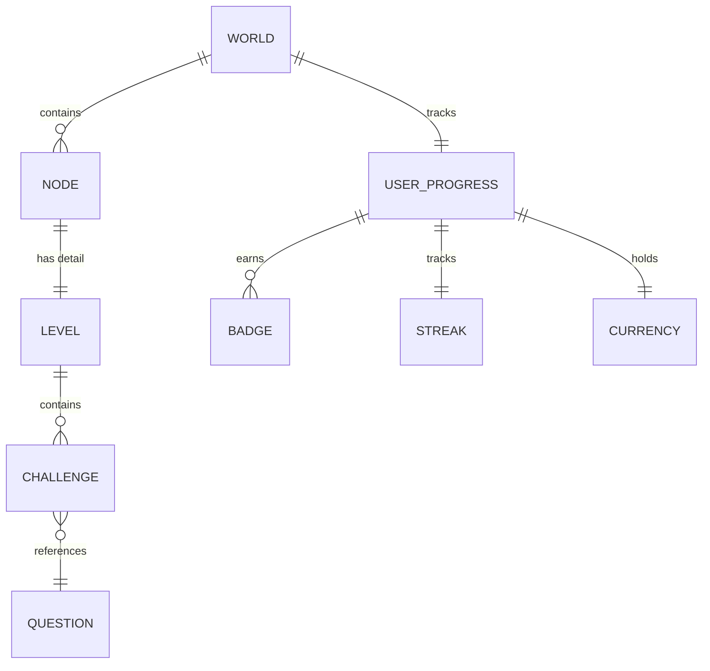
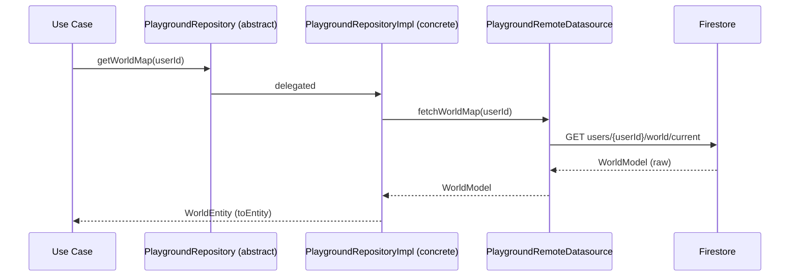
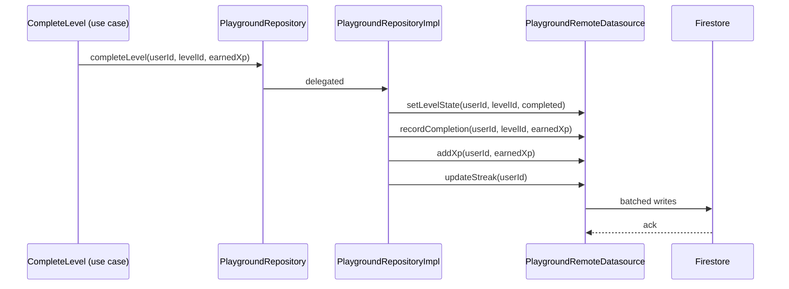
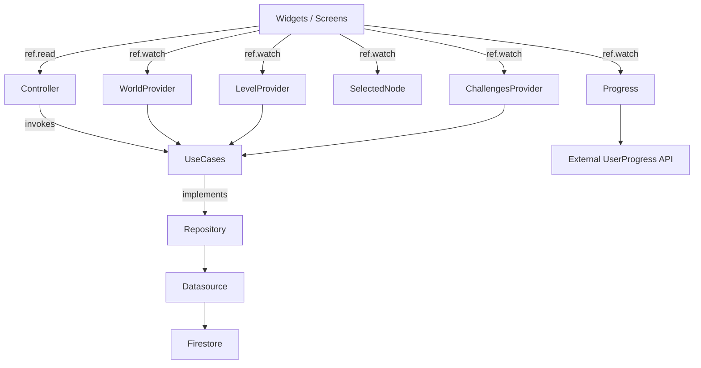
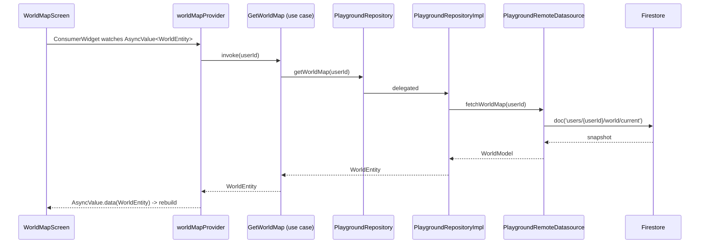
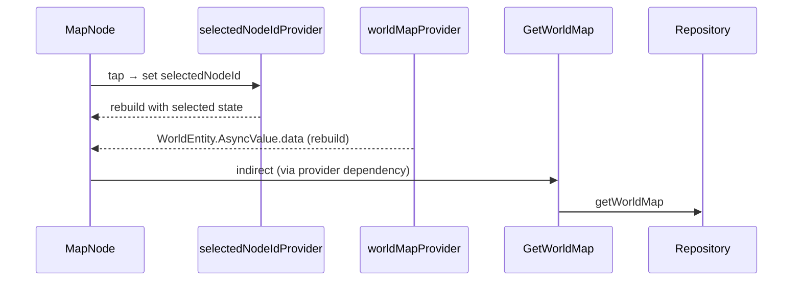
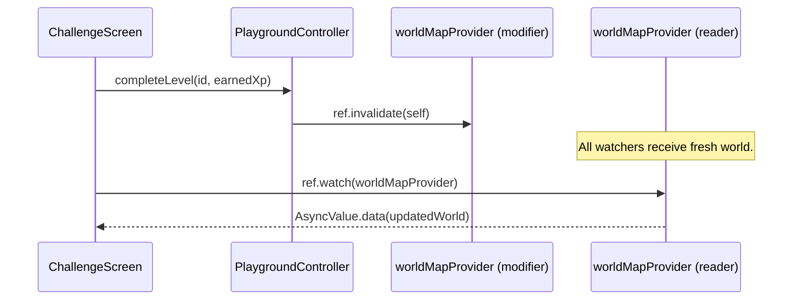

# Playground — Data Flow

> **Audience:** AI agents and developers who must read, write, extend, or debug how data moves through the Playground feature.
> **Purpose:** Define the feature architecture, entity relationships, repository flow, use cases, provider responsibilities, data sources, API flow, and UI flow of the Playground. This document describes the **on-disk implementation** of `lib/features/playground/{data,domain,presentation}`.
> **Related docs:** [State Management](./PLAYGROUND_STATE_MANAGEMENT.md), [Gameplay Flow](./PLAYGROUND_GAMEPLAY_FLOW.md), [Folder Structure](./PLAYGROUND_FOLDER_STRUCTURE.md), [Widget Architecture](./PLAYGROUND_WIDGET_ARCHITECTURE.md).

---

## 1. Feature Architecture

The Playground feature is implemented as **Clean Architecture** with three layers and a strict inward-only dependency rule.

```
┌───────────────────────────────────────────────────────────────────────────┐
│                           PRESENTATION LAYER                              │
│  Screens ◀──▶ Providers (Riverpod) ◀──▶ Widgets                          │
│  + constants / extensions / utils (helpers)                              │
└──────────────────────────────────┬────────────────────────────────────────┘
                                   │ uses
                                   ▼
┌───────────────────────────────────────────────────────────────────────────┐
│                              DOMAIN LAYER                                 │
│  Entities ◀──▶ Repositories (abstract) ◀──▶ Use Cases                     │
└──────────────────────────────────┬────────────────────────────────────────┘
                                   │ implemented by
                                   ▼
┌───────────────────────────────────────────────────────────────────────────┐
│                                DATA LAYER                                 │
│  Models ◀──▶ Remote Datasource (Firestore)  ──▶ Repository Implementation│
└───────────────────────────────────────────────────────────────────────────┘
```

### 1.1 Dependency rule

| Layer          | May import                                   | May *not* import                                  |
|----------------|----------------------------------------------|---------------------------------------------------|
| `domain/`      | `dart:core`, `dart:convert` only             | `package:flutter/*`, `package:cloud_firestore/*`, `data/` |
| `data/`        | `domain/`, `dart:core`, `package:cloud_firestore/*` | `presentation/`, `package:flutter/*`              |
| `presentation/` | All of the above (for glue)                  | `data/` internals (only via `PlaygroundRepository`) |

Widgets and providers consume *abstractions* (`PlaygroundRepository`), not concrete implementations.

### 1.2 Folder split

```
lib/features/playground/
├── data/
│   ├── datasources/playground_remote_datasource.dart
│   ├── models/{world,node,level,challenge}_model.dart
│   └── repositories/playground_repository_impl.dart
├── domain/
│   ├── entities/{world,node,level,challenge}_entity.dart
│   ├── repositories/playground_repository.dart
│   └── usecases/{get_world_map,get_level,get_challenges,start_level,complete_level,unlock_next_level}.dart
└── presentation/
    ├── constants/  extensions/  utils/  providers/  screens/  widgets/
```

See [Folder Structure](./PLAYGROUND_FOLDER_STRUCTURE.md) for the complete file inventory.

---

## 2. Entity Relationships



### 2.1 Entities

| Entity                  | File                                         | Fields (abridged)                                                                              |
|-------------------------|----------------------------------------------|------------------------------------------------------------------------------------------------|
| `WorldEntity`           | `domain/entities/world_entity.dart`          | `id`, `title`, `nodes`, `userLevel`, `totalXp`, `currentStreak`.                               |
| `NodeEntity`            | `domain/entities/node_entity.dart`           | `id`, `index`, `title`, `status`, `xpReward`, `isBoss`, `position`.                            |
| `LevelEntity`           | `domain/entities/level_entity.dart`          | `id`, `nodeId`, `title`, `description`, `challenges`, `reward`, `requiresLevel`.               |
| `ChallengeEntity`       | `domain/entities/challenge_entity.dart`      | `id`, `levelId`, `type`, `questionIds`, `xpReward`, `completedAt`.                             |
| `LevelReward` (value)   | inline in `level_entity.dart`                | XP, coins, badges, optional streak shield.                                                     |

Supporting enums live in domain:

```dart
enum NodeStatus { locked, unlocked, inProgress, completed, boss }
enum ChallengeType { reading, quiz, miniBoss, aiTask, mock }
```

### 2.2 Foreign keys

| Reference                          | Source-of-truth location                                  | Resolved by                                              |
|------------------------------------|-----------------------------------------------------------|----------------------------------------------------------|
| `NodeEntity.position`              | Computed at runtime by `node_position_calculator.dart`.   | `PathGenerator` + `PlaygroundCamera` + `MapNode`.        |
| `LevelEntity.nodeId`               | Firestore `levels/{levelId}.nodeId`.                       | `GetLevel` use case.                                     |
| `ChallengeEntity.levelId`          | Firestore `challenges/{challengeId}.levelId`.              | `GetChallenges` use case.                                |
| `ChallengeEntity.questionIds[]`    | Firestore `challenges/{challengeId}.questionIds[]`.       | `Quiz` feature loader.                                   |

### 2.3 Invariants

- `NodeEntity.id` and `LevelEntity.id` are 1:1 — every node corresponds to exactly one level.
- `LevelEntity.challenges` are ordered; index 0 is the first stage.
- A `NodeEntity` with `isBoss == true` must have `xpReward >= 100`.
- `WorldEntity.nodes` is ordered by `index` (ascending).

---

## 3. Repository Flow

The repository layer mediates between the domain (pure Dart) and the data layer (Firestore / future REST).

### 3.1 Contract

```dart
abstract class PlaygroundRepository {
  Future<WorldEntity> getWorldMap(String userId);
  Future<LevelEntity> getLevel(String levelId);
  Future<List<ChallengeEntity>> getChallenges(String levelId);
  Future<void> startLevel({required String userId, required String levelId});
  Future<void> completeLevel({
    required String userId,
    required String levelId,
    required int earnedXp,
  });
  Future<LevelEntity> unlockNextLevel(String userId, String currentLevelId);
}
```

### 3.2 Sequence (read)



### 3.3 Sequence (write)



### 3.4 Implementation contract

`PlaygroundRepositoryImpl` is the single implementation. Its responsibilities:

1. Delegate every method to `PlaygroundRemoteDatasource`.
2. Convert `Model → Entity` via `toEntity()`.
3. Handle errors via `Failure` types (not exceptions).
4. Provide a `Stream<WorldEntity>` variant for live updates when the user has the screen open.

```dart
class PlaygroundRepositoryImpl implements PlaygroundRepository {
  PlaygroundRepositoryImpl(this._ds);

  final PlaygroundRemoteDatasource _ds;

  @override
  Future<WorldEntity> getWorldMap(String userId) async {
    final model = await _ds.fetchWorldMap(userId);
    return model.toEntity();
  }

  @override
  Future<LevelEntity> getLevel(String levelId) async {
    final model = await _ds.fetchLevel(levelId);
    return model.toEntity();
  }

  // ... every method follows the same shape.
}
```

---

## 4. Use Cases

Every use case is a single-verb class. Their only dependency is the repository abstract.

### 4.1 The 6 use cases

| Use case                  | Input                                       | Output / Effect                                              |
|---------------------------|---------------------------------------------|---------------------------------------------------------------|
| `GetWorldMap`             | `userId`                                    | `Future<WorldEntity>`                                         |
| `GetLevel`                | `levelId`                                   | `Future<LevelEntity>`                                         |
| `GetChallenges`           | `levelId`                                   | `Future<List<ChallengeEntity>>`                               |
| `StartLevel`              | `userId`, `levelId`                         | Persists level status = `inProgress`.                          |
| `CompleteLevel`           | `userId`, `levelId`, `earnedXp`             | Persists level status = `completed`, awards XP and coins.     |
| `UnlockNextLevel`         | `userId`, `currentLevelId`                  | Returns the next `LevelEntity` and persists status = `unlocked`. |

### 4.2 Anatomy

```dart
class CompleteLevel {
  final PlaygroundRepository _repo;
  CompleteLevel(this._repo);

  Future<LevelEntity> call({
    required String userId,
    required String levelId,
    required int earnedXp,
  }) {
    return _repo.completeLevel(
      userId: userId,
      levelId: levelId,
      earnedXp: earnedXp,
    );
  }
}
```

### 4.3 Composition rules

- A use case must take its dependencies via constructor only.
- A use case must expose `call(...)` (or another verb-named method) — no other public API.
- A use case must not orchestrate other use cases. If orchestration is needed, that orchestration lives in the controller.
- A use case must not catch exceptions or convert them — failures propagate to the controller.

### 4.4 Why single-verb use cases?

Single-verb use cases are easy to:
- Unit-test (one verb, one outcome).
- Refactor (verb names rarely change).
- Cache (each use case maps cleanly to a Riverpod provider).
- Trace (provider → use case → repository → datasource is a single chain).

---

## 5. Provider Responsibilities

Presentation never calls use cases directly from widgets — it goes through `playgroundControllerProvider` (an action surface) or one of the state-bearing providers.

### 5.1 Provider inventory

| Provider                              | Type                                          | Reads from           | Writes to             |
|---------------------------------------|-----------------------------------------------|-----------------------|------------------------|
| `worldMapProvider`                    | `AsyncNotifierProvider<…, WorldEntity>`        | `GetWorldMap`         | invalidates on completion |
| `currentLevelProvider.family(id)`     | `FutureProvider.family<…, String>`            | `GetLevel`            | none                    |
| `challengesProvider.family(levelId)`  | `FutureProvider.family<…, String>`            | `GetChallenges`       | none                    |
| `selectedNodeIdProvider`              | `StateProvider<String?>`                      | n/a                   | tap events              |
| `levelProgressProvider`               | `AsyncNotifierProvider<…, LevelProgress>`      | user progress API     | completion/invalidation |
| `playgroundControllerProvider`       | `NotifierProvider<…, PlaygroundController>`   | n/a                   | use cases               |

### 5.2 Provider graph



### 5.3 Controller responsibilities

`PlaygroundController` is a `Notifier` exposing action methods:

```dart
class PlaygroundController extends Notifier<PlaygroundState> {
  late final GetWorldMap _getWorldMap;
  late final StartLevel _startLevel;
  late final CompleteLevel _completeLevel;
  late final UnlockNextLevel _unlockNext;

  Future<void> tapNode(String nodeId) async { /* ... */ }
  Future<void> startLevel(String id) async { /* ... */ }
  Future<LevelEntity> completeLevel({required String id, required int earnedXp}) async { /* ... */ }
  Future<void> claimReward() async { /* ... */ }
}
```

The controller is the **only** place where:
- Use cases are chained.
- Provider invalidations happen.
- Navigation side-effects are dispatched (via `ref.read(routerProvider)`).

### 5.4 Provider lifecycle

| Provider                  | Created when                       | Disposed when                       |
|---------------------------|------------------------------------|--------------------------------------|
| `worldMapProvider`        | First screen mount.                 | Screen unmount.                       |
| `currentLevelProvider`    | First arg is read.                  | Arg removed from family.              |
| `challengesProvider`      | First arg is read.                  | Arg removed from family.              |
| `selectedNodeIdProvider` | First read.                          | App unmount (StateProvider global).   |
| `levelProgressProvider`   | HUD first reads.                    | HUD unmount.                          |
| `playgroundControllerProvider` | First read.                      | App unmount.                          |

---

## 6. Data Sources

The Playground data layer currently talks to **Firestore only**. Future REST is pluggable via `PlaygroundRepositoryImpl`.

### 6.1 Firestore paths

| Document                                  | Shape                                                                                          |
|-------------------------------------------|-------------------------------------------------------------------------------------------------|
| `users/{userId}/world/current`            | `{ nodes: [{ nodeId, status, completedAt }], userLevel, totalXp, currentStreak }`              |
| `worlds/{worldId}/nodes/{nodeId}`         | `{ id, index, title, status, xpReward, isBoss, position: {x, y}, levelId }`                   |
| `levels/{levelId}`                        | `{ id, nodeId, title, description, requiresLevel, challenges: [challengeId], reward }`          |
| `challenges/{challengeId}`                | `{ id, levelId, type, questionIds, xpReward }`                                                 |
| `users/{userId}/levels/{levelId}`         | `{ status, startedAt, completedAt, earnedXp, earnedCoins }`                                    |
| `users/{userId}/progress`                 | `{ userLevel, totalXp, currentStreak, coins, badges: [], hearts, lastActiveAt }`               |

### 6.2 Datasource interface

```dart
abstract class PlaygroundRemoteDatasource {
  Future<WorldModel> fetchWorldMap(String userId);
  Stream<WorldModel> watchWorldMap(String userId);
  Future<LevelModel> fetchLevel(String levelId);
  Future<List<ChallengeModel>> fetchChallenges(String levelId);
  Future<void> setLevelState({required String userId, required String levelId, required String state});
  Future<void> recordCompletion({required String userId, required String levelId, required int earnedXp, required int earnedCoins});
  Future<String> unlockNextLevel({required String userId, required String currentLevelId});
}
```

### 6.3 Datasource implementation contract

- All methods return `Future<Model>` (not `Entity`).
- All errors throw `FirestoreFailure` (a domain-mapped failure type).
- All writes use `FieldValue.serverTimestamp()` for `updatedAt`.
- `watchWorldMap` returns a `Stream` so the controller can subscribe/unsubscribe cleanly.

### 6.4 Models vs Entities

| Aspect               | Entity                                       | Model                                                          |
|----------------------|----------------------------------------------|----------------------------------------------------------------|
| Lives in             | `domain/entities/`                           | `data/models/`                                                 |
| Imports              | `dart:core` only                              | `dart:convert`, `package:cloud_firestore`                      |
| Methods              | getters, copyWith, ==                         | `fromJson`, `toJson`, `toEntity`, `fromFirestore`              |
| Immutability         | yes                                          | yes                                                             |
| Used by              | Domain layer + presentation                   | Repository implementation only                                  |
| Returns to caller    | N/A (the model is transformed before return) | Domain entities                                                |

```dart
class WorldModel {
  final String id;
  final String title;
  final List<NodeModel> nodes;
  final int userLevel;
  final int totalXp;
  final int currentStreak;

  WorldModel({
    required this.id,
    required this.title,
    required this.nodes,
    required this.userLevel,
    required this.totalXp,
    required this.currentStreak,
  });

  factory WorldModel.fromJson(Map<String, dynamic> json) { /* ... */ }
  factory WorldModel.fromFirestore(DocumentSnapshot doc) { /* ... */ }
  Map<String, dynamic> toJson() { /* ... */ }
  WorldEntity toEntity() { /* ... */ }
}
```

---

## 7. API Flow

### 7.1 Read paths



### 7.2 Write paths (node completion)

```mermaid
sequenceDiagram
    participant UI as ChallengeScreen
    participant C as PlaygroundController
    participant Cmp as CompleteLevel (use case)
    participant Unl as UnlockNextLevel (use case)
    participant R as PlaygroundRepository
    participant I as PlaygroundRepositoryImpl
    participant D as PlaygroundRemoteDatasource
    participant F as Firestore
    participant P as worldMapProvider

    UI->>C: completeLevel(id, earnedXp, earnedCoins)
    C->>Cmp: call(userId, levelId, earnedXp)
    Cmp->>R: completeLevel(...)
    R->>I: delegated
    I->>D: setLevelState (completed)
    I->>D: recordCompletion (xp, coins)
    I->>D: updateUserProgress
    D->>F: batched write
    F-->>D: ack

    C->>Unl: call(userId, currentLevelId)
    Unl->>R: unlockNextLevel(...)
    R->>I: delegated
    I->>D: setLevelState (nextNode, unlocked)
    D->>F: write
    F-->>D: ack

    C->>P: invalidate
    P->>UC: re-fetch world
    Note over UI: HUD updates; new UnlockAnimation triggers
```

### 7.3 Live updates

- `worldMapProvider` exposes both a future and a stream (`watchWorldMap`).
- When the user is on the map, the controller subscribes to the stream so unlocks from other devices propagate live.
- When the screen unmounts, the subscription is canceled.

---

## 8. UI Flow

### 8.1 UI ↔ Provider ↔ Repository contract

```
UI  ─────────────▶  Provider (ref.watch / ref.read)
                       │
                       ▼
                  Use Case
                       │
                       ▼
                  PlaygroundRepository (abstract)
                       │
                       ▼
                  PlaygroundRepositoryImpl (concrete)
                       │
                       ▼
                  PlaygroundRemoteDatasource
                       │
                       ▼
                  Firestore
```

### 8.2 Read flow



### 8.3 Action flow (completion)



### 8.4 Navigation flow

Navigation is *itself* a side-effect handled by the controller. Providers never push routes directly.

```dart
// PlaygroundController
Future<void> startLevel(String id) async {
  await _startLevel(userId, id);
  ref.read(routerProvider).push('/playground/level/$id');
}
```

### 8.5 Loading, error, empty — UI responsibilities

| State        | UI responsibility                                                                 |
|--------------|--------------------------------------------------------------------------------------|
| Loading      | Show a calm shimmer background (no spinner text).                                   |
| Error        | Show a top banner with retry; cached map remains interactive.                       |
| Empty        | First-time user only — show "Begin your journey" overlay with primary CTA.          |
| Success      | Render the world.                                                                   |
| Offline      | Show "Offline" chip in HUD; map is cached; actions queue locally and sync on resume. |

### 8.6 Failure types

```dart
sealed class PlaygroundFailure {
  const PlaygroundFailure(this.message);
  final String message;
}
class NetworkFailure extends PlaygroundFailure {}
class AuthFailure extends PlaygroundFailure {}
class NotFoundFailure extends PlaygroundFailure {}
class HeartsExhaustedFailure extends PlaygroundFailure {}
class StaleWorldFailure extends PlaygroundFailure {}
```

Failures propagate from datasource → repository → use case → controller. The controller decides whether to surface them as a banner, a sheet, or a modal.

---

## 9. Caching Strategy

| Cache               | Lifetime                        | Invalidation                                              |
|---------------------|---------------------------------|-----------------------------------------------------------|
| World cache         | Per screen lifecycle.           | On `worldMapProvider` invalidation.                        |
| Level cache         | Per family key.                 | On `completeLevel` for that levelId.                       |
| User progress cache | Across screens.                 | On any XP/coin change from any feature.                    |
| Offline queue       | Persistent (`shared_preferences` or DB). | Drained on reconnect.                                |

---

## 10. Cross-Document Map

| If you want to…                                       | Open                                                                                                |
|-------------------------------------------------------|-----------------------------------------------------------------------------------------------------|
| Understand provider state transitions and async state | [State Management](./PLAYGROUND_STATE_MANAGEMENT.md)                                              |
| Understand each game flow                             | [Gameplay Flow](./PLAYGROUND_GAMEPLAY_FLOW.md)                                                    |
| Find a file by purpose                                | [Folder Structure](./PLAYGROUND_FOLDER_STRUCTURE.md)                                               |
| Add a new entity or use case                          | (this document, §2, §4)                                                                            |
| Add a new data source (REST, GraphQL, etc.)           | (this document, §6)                                                                                |

---

**End of document.**