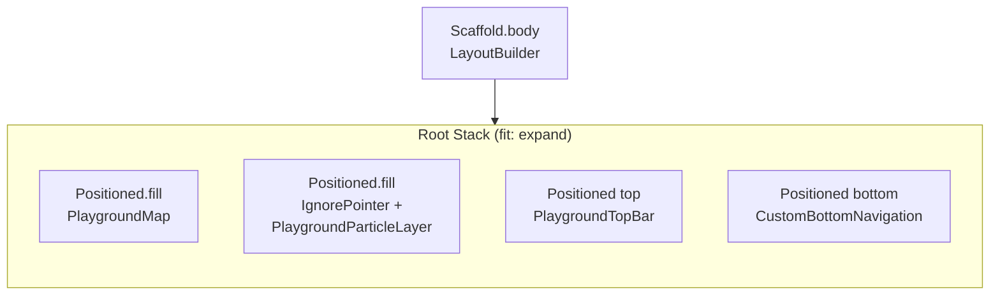
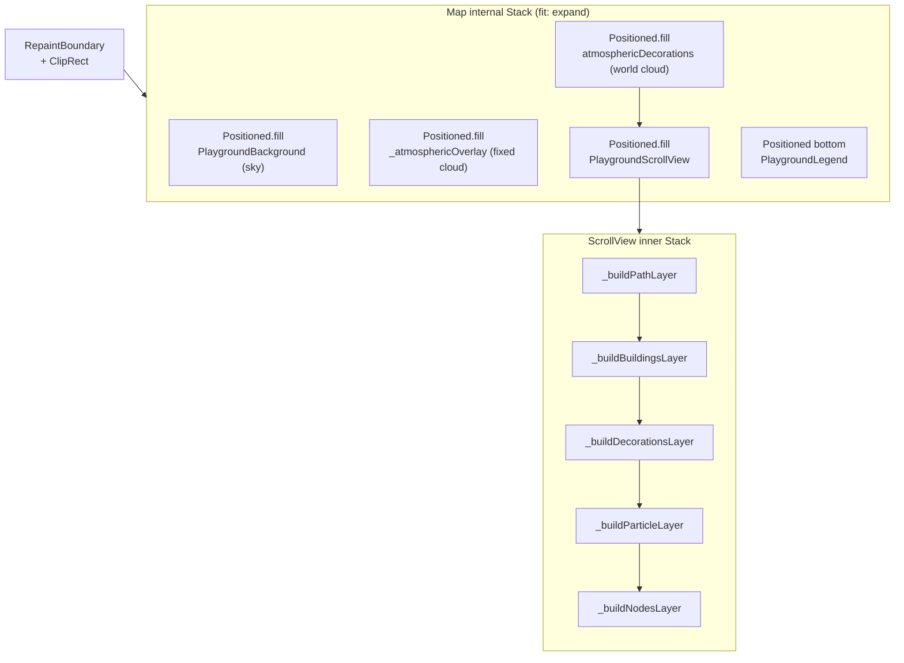
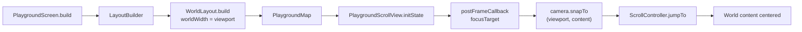
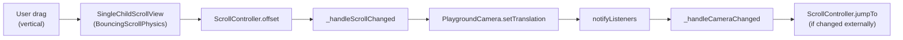
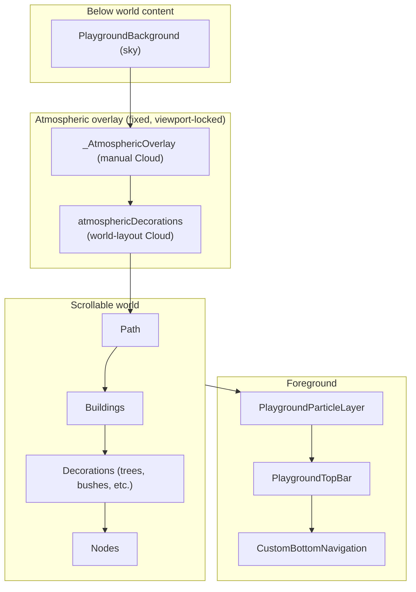
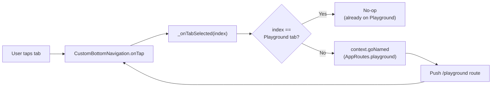

# Playground Architecture Flowcharts

This file collects Mermaid diagrams that describe the structure and runtime behaviour of the Playground feature. Each block is fenced with `mermaid` so it can be rendered by any Mermaid-compatible viewer (GitHub, VS Code with the Mermaid extension, Notion, etc.).

## 1. PlaygroundScreen — Root Stack Composition

## 2. PlaygroundMap — Internal Stack & Scroll View

## 3. Camera Focus Initialization

## 4. Vertical Scrolling Flow

## 5. Atmospheric Cloud Layering

## 6. Bottom Navigation Tab Flow

