# Playground — Gameplay Flow

> **Audience:** AI agents and developers who must implement, tune, or extend the gameplay loops of the Playground feature.
> **Purpose:** Define the learning loop, practice loop, progression loop, and every interaction between World, Building, Chapter, Node, Stage, Question, Boss, Reward, XP, and Unlock. Every flow in this document is implemented across `presentation/screens/`, `presentation/widgets/`, `presentation/providers/playground_provider.dart`, and the domain use cases.
> **Related docs:** [Data Flow](./PLAYGROUND_DATA_FLOW.md), [State Management](./PLAYGROUND_STATE_MANAGEMENT.md), [Animation System](./PLAYGROUND_ANIMATION_SYSTEM.md), [Screen Architecture](./PLAYGROUND_SCREEN_ARCHITECTURE.md).

---

## 1. Learning Loop

> A user enters a building, studies a topic, marks progress, and exits ready for practice.

The Learning Loop is the **theory** side of Playground. Buildings are *permanent knowledge hubs*; they host the reading, formulas, examples, and AI tutor interactions. They are not consumed on visit — they accumulate.

### 1.1 Loop steps

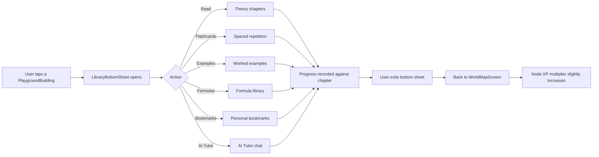

### 1.2 Learning actions table

| Action      | Feature surface                       | Progress side effect                              |
|-------------|----------------------------------------|---------------------------------------------------|
| Read        | `Guidebook` feature (deep-link).       | Increments `chapterProgress`.                     |
| Flashcards  | `Flashcards` feature (deep-link).      | Schedules next review per SM-2 algorithm.         |
| Examples    | `Guidebook` examples screen.           | Marks example as "viewed".                        |
| Formulas    | `Guidebook` formula sheet.             | Adds to "recent formulas".                       |
| Bookmarks   | `Profile` bookmarks tab.               | Adds to user's library.                           |
| AI Tutor    | `AI Tutor` feature (deep-link).        | Conversation saved against subject.               |

### 1.3 Why learn in a building?

Practice without theory produces guessing. Theory without practice produces forgetting. The Learning Loop makes **studying feel like a ritual in the same world as practice**: walking into a building, sitting down, walking out stronger.

### 1.4 Building interaction model

```
PlaygroundBuilding
└── Tap → LibraryBottomSheet (subject-intro + progress % + CTAs)
    ├── "Open library"  → Guidebook feature (chapter list)
    │   └── Chapter → Reader → Bookmark / AI Tutor / Examples
    └── "Quick practice" → if unlocked, deep-link to nearest node
```

### 1.5 Deep-link contract

Buildings reserve a `subjectId` (e.g. `"bangladesh_affairs"`). All deep-links pass it:

```
/guidebook/subject/bangladesh_affairs
/flashcards/deck/bangladesh_affairs
/ai-tutor?subject=bangladesh_affairs
```

---

## 2. Practice Loop

> A user enters a node, plays its stages, earns XP, and the node is marked completed.

The Practice Loop is the **play** side. Nodes are *consumed on visit* (their challenges are completed exactly once), but the XP and rewards stick.

### 2.1 Loop steps

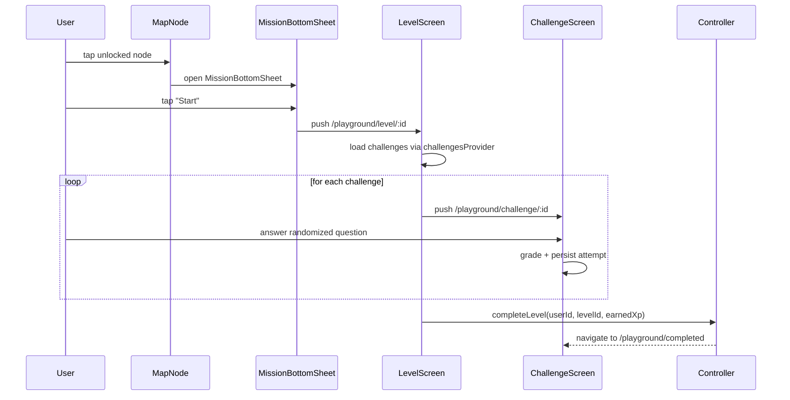

### 2.2 Stage structure

A node's *level* contains an ordered list of challenges. Each challenge is one *stage*. Stages come in two flavors:

| Stage type       | Description                                              | XP reward     |
|------------------|----------------------------------------------------------|---------------|
| `reading`        | Short passage + 1 comprehension question.                 | 5 XP          |
| `quiz`           | 1 randomized question from `question_bank`.              | 10 XP         |
| `miniBoss`       | 3 questions back-to-back, no hearts lost on first try.   | 25 XP         |
| `aiTask`         | AI-generated prompt + brief written answer.               | 30 XP         |
| `mock`           | 5 questions, full difficulty of level's subject.          | 50 XP         |

A typical node has 3–5 stages.

### 2.3 Question randomization

- Pull N questions from `question_bank` filtered by `subjectId` and `difficulty ∈ [level - 1, level + 1]`.
- Cache the selected IDs in `NodeEntity.questions` until the node is completed.
- If a level is replayed (premium reward), re-randomize.

### 2.4 Hearts & retry

- Each user has 5 hearts.
- A wrong answer consumes one heart.
- Hearts regenerate at `1 / 4 hours`, capped at 5.
- A premium reward can refill hearts.

### 2.5 Completion criteria

A node is `completed` only when **all stages** are passed. Partial credit does not unlock the next node.

---

## 3. Progression Loop

> The user climbs an S-shaped path; each completion unlocks the next; levels and worlds accumulate.

The Progression Loop is the **macro** view. It governs how nodes unlock, how the world map evolves, and how buildings become available.

### 3.1 Hierarchy

```
World                (e.g. "BCS World", "Bank World")
  └── Building       (subject knowledge hub)
  └── Path           (the journey polyline)
       └── Node      (one level)
            └── Stage        (a challenge)
                  └── Question (from question_bank)
                  └── Reward (XP, coins, badges)
```

### 3.2 Loop steps

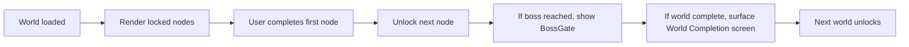

### 3.3 Unlock rules

| Rule                          | Description                                                                |
|-------------------------------|----------------------------------------------------------------------------|
| Linear                        | Node `n+1` unlocks when `n` is completed.                                   |
| Branch                        | Boss node unlocks when all 5 sibling nodes are completed.                  |
| World completion              | A new world unlocks when the previous world is fully completed.            |
| Premium fast-track            | A premium purchase can skip a node.                                         |
| Time-gated (events)           | Some nodes are only available during events.                                |

All rules are config-driven (`world_config.dart`) — no hard-coded rule logic in widgets.

### 3.4 Path geometry

The path is an **S-shaped polyline** by default. `node_position_calculator.dart` computes per-index `(x, y)` based on the chosen algorithm:

```dart
Offset positionFor(int index, Size stageSize) {
  // sinusoidal S-curve: y oscillates as x advances
  final x = stageSize.width * 0.1 + (index * 0.18 * stageSize.width);
  final y = stageSize.height * 0.5 +
      sin(index * 1.2) * stageSize.height * 0.25 +
      (index % 2 == 0 ? -20 : 20);
  return Offset(x, y);
}
```

### 3.5 Boss mechanics

A *boss node* is a level that combines:
- 10 randomized questions (vs the usual 5).
- Higher difficulty weight.
- A 2-hearts-loss penalty for wrong answers (vs the usual 1).
- A premium reward chest on completion.

Boss nodes are **gateways** to buildings. Defeating a boss unlocks the building's full content.

---

## 4. Node Completion

The Node Completion flow is the moment a level transitions from `inProgress` → `completed`. It is one of the most orchestrated flows in the feature.

### 4.1 Sequence

```mermaid
sequenceDiagram
    participant L as LevelScreen
    participant C as ChallengeScreen (last)
    participant R as PlaygroundController
    participant U as UnlockNextLevel (use case)
    participant P as worldMapProvider
    participant S as LevelCompletedScreen
    participant M as MapNode (next node)

    C->>R: notifyChallengeCompleted(result)
    R->>L: navigate to /playground/completed
    R->>R: compute earnedXp + coins
    R->>U: completeLevel(userId, levelId, earnedXp)
    U->>R: nextLevel (with status=unlocked)
    R->>R: invalidate worldMapProvider
    R->>P: refetch + emit updated WorldEntity
    R->>S: mount LevelCompletedScreen
    S->>S: play RewardPopup animations
    S->>S: animate XP bar / coin counter
    S->>S: user taps "Continue"
    S->>M: pop back; next node now glows (unlocked)
    M->>M: play UnlockAnimation
```

### 4.2 Completion artifacts

When a node completes, the controller:

1. Calls `completeLevel` use case → updates Firestore `users/{uid}/levels/{levelId}.status = "completed"` and adds XP.
2. Calls `unlockNextLevel` use case → updates next node status to `unlocked`.
3. Invalidates `worldMapProvider` → the map rebuilds and the next node's `MapNode` switches to `unlocked` visual + `UnlockAnimation`.

### 4.3 What the user sees

1. **Camera** recenters to the just-completed node.
2. **`RewardPopup`** mounts with chest, XP, coin, badges.
3. **`PathAnimation`** draws the segment to the next node.
4. **Next node**'s `UnlockAnimation` plays once (ring expand + particles + bounce).
5. **`Camera`** pans gently to the next node.
6. **Continue** dismisses; back on the map.

---

## 5. Stage Progression

A *stage* is a single challenge inside a level. The level screens render one stage at a time, sequentially.

### 5.1 Stage state machine

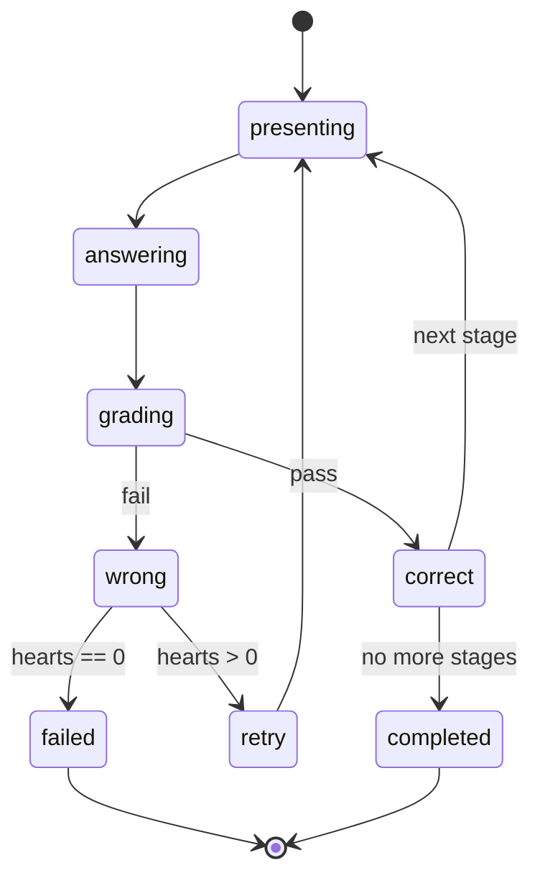

### 5.2 Stage types in detail

| Stage type     | UI behaviour                                                                 |
|----------------|------------------------------------------------------------------------------|
| `reading`      | One paragraph + 1 multiple-choice question. Hearts not consumed.            |
| `quiz`         | 1 multiple-choice question. Hearts consumed on wrong.                        |
| `miniBoss`     | 3 back-to-back questions, 15-second timer each. Hearts consumed on wrong.   |
| `aiTask`       | AI-generated prompt + free-text answer. Cooldown 24h per task.              |
| `mock`         | 5 questions, mix of types. Higher XP, full hearts penalty.                   |

### 5.3 Stage-2-stage navigation

Stages are not separate routes. The `LevelScreen` keeps them in one `PageView` and updates state as the user advances. Only the *player* (`ChallengeScreen`) is a separate route — see how routing handles this below:

| Mechanism       | Stages                                                          |
|-----------------|------------------------------------------------------------------|
| `PageView`      | First 3 stages within a level (without leaving `LevelScreen`).    |
| `Navigator.push`| A `ChallengeScreen` for the boss's 10 questions.                  |

This means the user mostly stays on `LevelScreen` and only sees a separate full-screen player for boss challenges.

---

## 6. Question Flow

A Question is the smallest unit. It originates from the `question_bank` feature and is graded by the `quiz` feature.

### 6.1 Sequence

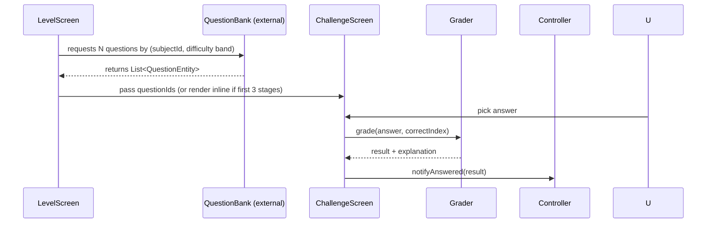

### 6.2 Question types

| Question type | Description                                                                |
|---------------|----------------------------------------------------------------------------|
| `mcq`         | 4-option multiple-choice.                                                   |
| `truefalse`   | True/false statement.                                                       |
| `multiAnswer` | Multi-select MCQ. All-or-nothing.                                           |
| `fillBlank`   | Fill in the blank (text input).                                             |
| `matchPairs`  | Match column A to column B (drag-drop).                                      |
| `orderItems`  | Order a list of items correctly (drag-drop).                                |
| `aiExplain`   | Free-text answer; AI scores and gives feedback (uses `ai_tutor` feature).   |

### 6.3 Difficulty band

- The level's `requiresLevel` defines a difficulty center.
- Pull questions whose difficulty ∈ `[requiresLevel − 1, requiresLevel + 1]`.
- Bosses widen to `[requiresLevel − 2, requiresLevel + 2]`.

### 6.4 Question persistence

- Each attempt is recorded with `attemptedAt`, `correct`, `timeSpent`.
- The `weakness_tracker` feature ingests these to drive personalized question selection.

---

## 7. Boss Challenges

Boss Challenges are the **gated milestones** of the Playground.

### 7.1 Trigger

A node is marked as `boss` by world config. When the user taps it:

1. `MissionBottomSheet` does **not** open; instead `BossBottomSheet` opens.
2. The sheet shows a dramatic preview (boss name, suggested difficulty, CTA "Accept").
3. Tapping "Accept" pushes `/playground/boss/:id` → `BossChallengeScreen`.

### 7.2 Boss rules

| Aspect            | Normal level         | Boss level                                            |
|-------------------|----------------------|-------------------------------------------------------|
| Question count    | 3–5                  | 10                                                    |
| Hearts penalty    | 1 per wrong          | 2 per wrong                                            |
| Difficulty band   | `±1` of level        | `±2` of level                                          |
| XP reward         | `5–50`               | `200 + (level × 10)`                                    |
| Coins             | `0–10`               | `50 + (level × 5)`                                        |
| Time per question | unlimited            | 30 seconds                                              |
| Skip allowed      | yes                  | no (must complete)                                          |
| Building unlock   | none                 | unlocks the matching `PlaygroundBuilding`'s full content.          |

### 7.3 Boss completion flow

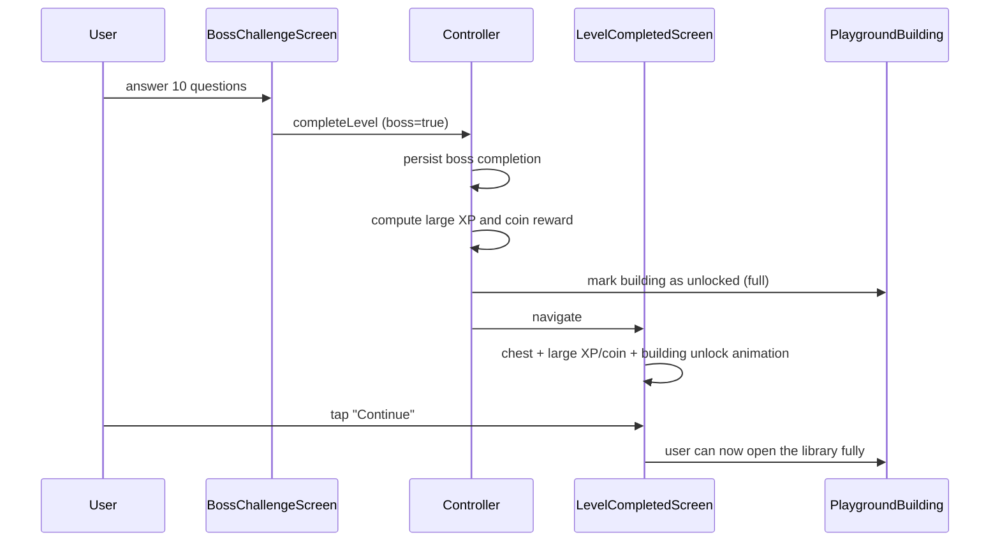

---

## 8. Reward Flow

Rewards are the **emotional payoff** of every loop. They are orchestrated by the controller and visualized by `RewardPopup`.

### 8.1 Reward types

| Reward            | Source                  | Size                                  |
|-------------------|-------------------------|----------------------------------------|
| XP                | completed stage         | 5–50 XP (stage-based)                 |
| XP (boss)         | completed boss          | 200 + level × 10                       |
| Coins             | completed stage         | 0–10 (quiz/stage-dependent)            |
| Coins (boss)      | completed boss          | 50 + level × 5                          |
| Hearts            | level up                | `+1` heart (capped at 5)              |
| Streak flame      | daily activity          | `+1 day` (separately driven)           |
| Badges            | milestones              | "First level", "Boss Slayer", etc.     |
| Streak shield     | streak rescue reward    | 1 use (prevents streak loss)           |

### 8.2 Reward sequence

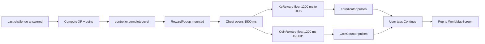

### 8.3 Reward popup composition

```
LevelRewardDialog (modal)
└── RewardPopup (overlay stack)
    ├── RewardChest (with ChestAnimation)
    ├── XpReward  (floats to XpIndicator)
    └── CoinReward (floats to CoinCounter)
```

### 8.4 Reward persistence

- XP is added to user total + level progress.
- Coins are added to soft-currency balance.
- Badges are stored in `users/{uid}/badges`.
- Streak shield is consumed by the streak feature, not Playground.

---

## 9. XP Flow

XP is the single most important currency in Playground.

### 9.1 XP sources

| Source                          | XP                                |
|---------------------------------|-----------------------------------|
| Reading a chapter (in a building)| 5 XP                              |
| Stage `reading`                 | 5 XP                              |
| Stage `quiz`                    | 10 XP                             |
| Stage `miniBoss`                | 25 XP                             |
| Stage `aiTask`                  | 30 XP                             |
| Stage `mock`                    | 50 XP                             |
| Completing a node               | bonus XP = level × 5              |
| Completing a boss               | 200 XP + level × 10               |
| 7-day streak milestone          | 100 XP                            |
| Daily login                     | 10 XP                             |

### 9.2 XP consumption

XP is **only consumed** to compute the user's *level*, which gates future unlocks. There is no XP-spending mechanic. This is by design — XP is a measure of progress, not a sunk cost.

### 9.3 Level-up rules

- Level threshold table: `level_n_threshold = 100 + 50 × (n - 1)`. Level 1 = 100 XP, level 2 = 150, level 3 = 200, ...
- Crossing a threshold triggers a `LevelUp` modal *only* if the user opens Settings → "Show on level up" is enabled.
- A level-up *fades the XpIndicator* to its new value over 600 ms.

### 9.4 XP flow diagram

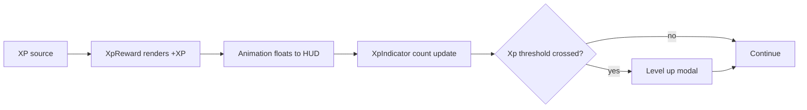

---

## 10. Unlock Flow

Unlocks govern what content is visible and accessible. There are three kinds:

| Unlock type    | Trigger                                                  | Effect                                                |
|----------------|----------------------------------------------------------|-------------------------------------------------------|
| Node unlock    | previous node completed.                                  | Next node's status = `unlocked`. Plays `UnlockAnimation`. |
| Building unlock| matching boss defeated.                                  | `PlaygroundBuilding` is fully interactive. Library bottom sheet shows 100%. |
| World unlock   | previous world fully completed.                          | New world added to `worldMapProvider`.                |

### 10.1 Node unlock flow

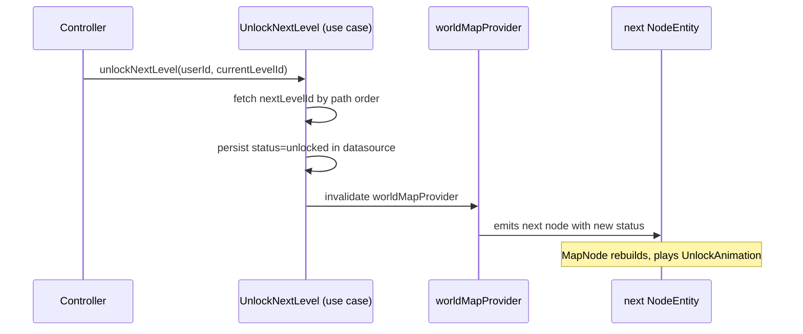

### 10.2 Building unlock flow

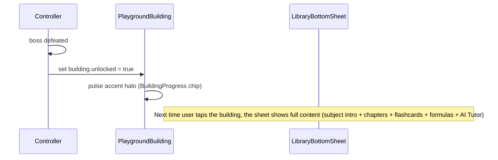

### 10.3 World unlock flow

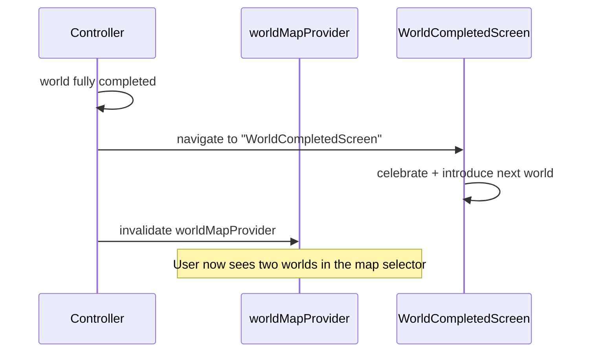

---

## 11. Cross-Loop Coordination

The three loops interact constantly. The rule: **practice unlocks, learning multiplies.**

### 11.1 Loop interaction table

| Loop          | Triggers                      | Affected by                                  |
|---------------|-------------------------------|-----------------------------------------------|
| Learning      | Building tap.                  | Progress %, XP multiplier (from practice).    |
| Practice      | Node tap.                     | Knowledge from buildings (XP multiplier).      |
| Progression   | Practice completion.           | World config (which node unlocks next).       |

### 11.2 State ownership

| State              | Owner                            | Read by                                       |
|--------------------|----------------------------------|------------------------------------------------|
| Selected node      | `selectedNodeIdProvider`          | Camera, sheets, HUD animations.                |
| World map          | `worldMapProvider`                | Map, HUD legend, current level index.          |
| User progress      | `levelProgressProvider`           | HUD (`XpIndicator`, `StreakCard`, etc.).      |
| Hearts             | `levelProgressProvider`           | `EnergyIndicator`, `ChallengeScreen`.         |
| Coins              | `levelProgressProvider`           | `CoinCounter`, store.                          |
| Building progress  | `worldMapProvider` + chapter providers (external) | `BuildingProgress`.                |

---

## 12. Cross-Document Map

| If you want to…                                  | Open                                                                |
|--------------------------------------------------|---------------------------------------------------------------------|
| Understand the data layer behind these flows     | [Data Flow](./PLAYGROUND_DATA_FLOW.md)                              |
| Understand provider state transitions            | [State Management](./PLAYGROUND_STATE_MANAGEMENT.md)                |
| Time the animations for each flow moment         | [Animation System](./PLAYGROUND_ANIMATION_SYSTEM.md)                |
| See where each flow step happens in the widget tree | [Widget Architecture](./PLAYGROUND_WIDGET_ARCHITECTURE.md)       |
| Add a new loop type (e.g. seasonal event loop)   | [Future Expansion](./PLAYGROUND_FUTURE_EXPANSION.md)                |

---

**End of document.**