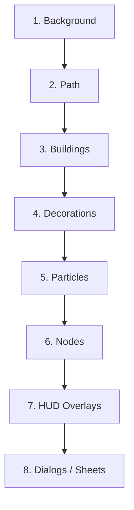
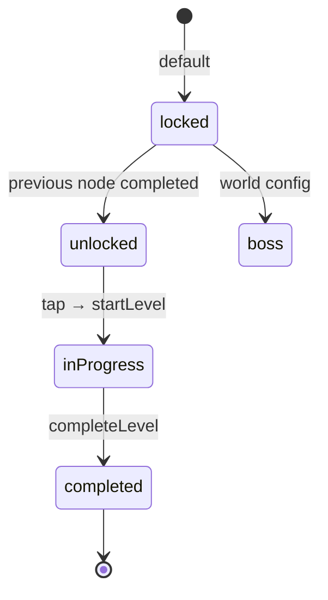

# Playground — Rendering Pipeline

> **Audience:** AI agents and developers who must implement, optimize, or debug how the Playground paints to the screen.
> **Purpose:** Define the rendering order, layer architecture, the responsibility of every painting layer (background, path, buildings, nodes, particles, overlays, dialogs), and the performance considerations that follow from that order.
> **Related docs:** [Widget Architecture](./PLAYGROUND_WIDGET_ARCHITECTURE.md), [Animation System](./PLAYGROUND_ANIMATION_SYSTEM.md), [UI Guidelines](./PLAYGROUND_UI_GUIDELINES.md), [Screen Architecture](./PLAYGROUND_SCREEN_ARCHITECTURE.md).

---

## 1. Rendering Order

The Playground is a `Stack` of *eight rendering layers*. They are painted **back to front**, in this exact order, every frame:

```
1. Background Layer        (parallax sky + ground)
2. Path Layer              (journey polylines + glow)
3. Building Layer          (knowledge hubs + ornaments)
4. Decoration Layer        (trees, rivers, mountains, bridges, flags)
5. Particle Layer          (clouds, ambient particles)
6. Node Layer              (interactive practice checkpoints)
7. Overlay Layer (HUD)     (top bar, legend, mini-cards)
8. Dialog/Sheet Layer      (modals, bottom sheets, reward popup)
```



### 1.1 Why this order

- **Background first** because it sets mood and never changes interaction.
- **Path before buildings** because a path can run under a building, never above it.
- **Buildings before decorations** so a tree can partially obscure a building entrance (depth).
- **Decorations before particles** because particles drift over scenery but the scenery must be solid beneath them.
- **Nodes after particles** so the user can always see the interactive element clearly even when many particles are active.
- **HUD above world** because the user must always see XP, streak, coins, and hearts.
- **Dialogs and sheets last** because they need scrim focus.

### 1.2 Back-to-front invariants

- Every layer must respect the layer beneath it (no clipping except intentional UI).
- No overlay can be painted beneath the HUD (except within HUD's own compositing).
- Dialogs and sheets have a backdrop filter that darkens every layer beneath them.

---

## 2. Layer Architecture

The map is implemented as a single `Stack` inside `PlaygroundMap` with the following children:

| Index | Layer         | Widget                                                         | Painter                                                                |
|------:|---------------|----------------------------------------------------------------|------------------------------------------------------------------------|
| 0     | Background    | `PlaygroundBackground`                                         | `playground_background.dart` (custom paint + gradient + parallax)      |
| 1     | Path          | `PlaygroundPathPainter` wrapped by `AnimatedPath`              | `playground_path_painter.dart` + `dashed_path_painter.dart`            |
| 2     | Buildings     | `PlaygroundBuilding` × N                                       | sprite + `BuildingLabel` + `BuildingProgress`                          |
| 3     | Decorations   | `Tree`, `Bush`, `Mountain`, `River`, `Bridge`, `Flag` × N      | sprite + procedural offset                                             |
| 4     | Particles     | `PlaygroundParticleLayer`                                      | child `Particles` + `Cloud` (animated)                                 |
| 5     | Nodes         | `MapNode` × N → `PlaygroundNode`                                | `NodeRing`, `NodeIcon`, `NodeBadge`, `NodeLabel`, `NodeProgressIndicator` + `NodeGlowPainter` |
| 6     | HUD Overlays  | `PlaygroundTopBar`, `PlaygroundLegend`, `LevelProgressCard`, `MissionCard` | n/a                                                            |
| 7     | Dialogs/Sheets| `LevelRewardDialog`, `RewardPopup`, `MissionBottomSheet`, `LibraryBottomSheet`, `BossBottomSheet`, `RewardBottomSheet` | n/a |

### 2.1 Painter vs Widget

| Use a `CustomPainter` when…                                                              | Use a `Widget` when…                                                                  |
|------------------------------------------------------------------------------------------|----------------------------------------------------------------------------------------|
| You draw arcs, curves, gradients, glows, dashed strokes, particle halos.                 | You compose icons, text, buttons, chips, or interactive content.                       |
| Performance is critical and `repaint` boundaries need to be tight.                        | You need hit-testing beyond the bounding rect.                                        |
| The element is decorative, not interactive.                                              | The element must respond to gestures.                                                  |

Playground uses both. Painters live in `widgets/painters/` and are stateless. Widgets live everywhere else.

---

## 3. Background Layer

The Background Layer is a single widget (`PlaygroundBackground`) that combines three painter passes:

### 3.1 Pass A — Sky gradient

- Vertical linear gradient from `surface.primary.top` to `surface.primary.bottom` (token-driven; see [UI Guidelines](./PLAYGROUND_UI_GUIDELINES.md#background-sky-gradient)).
- Painted via `Canvas.drawRect` + `Paint()..shader = Gradient.linear`.

### 3.2 Pass B — Parallax mountains

- Three mountain silhouettes at parallax factors `0.2`, `0.4`, `0.6` (further = slower).
- Painted as a single `CustomPainter` that draws three filled paths.
- `Mountain` decoration is the static silhouette (no animation).

### 3.3 Pass C — Ground gradient

- Linear gradient anchored to the bottom 40% of the screen.
- Painted via `Canvas.drawRect`.

### 3.4 Implementation contract

```dart
class PlaygroundBackground extends StatelessWidget {
  @override
  Widget build(BuildContext context) {
    return CustomPaint(
      painter: _BackgroundPainter(...),
      child: const SizedBox.expand(),
    );
  }
}
```

- **No children**, no gestures, no semantics. It is purely visual.
- The painter must be `const` and use `shouldRepaint` carefully (only when biome changes).
- The background never animates — animations happen on layers above.

### 3.5 Performance

- Background is painted once per biome change, not per frame.
- The `CustomPaint` is given an explicit `child` only when it must (we use `SizedBox.expand` so it remains inert).

---

## 4. Path Layer

The Path Layer visualizes the journey between nodes. It is composed of:

1. A `CustomPaint` with `PlaygroundPathPainter`.
2. (Optional) An overlay of `DashedPathPainter` for segments still in the future.
3. An optional `AnimatedPath` wrapper that animates a stroke being drawn.

### 4.1 Painter responsibilities

| Painter                    | Responsibility                                                                                                |
|----------------------------|----------------------------------------------------------------------------------------------------------------|
| `PlaygroundPathPainter`    | Draws the full polyline. Each segment is colored by status (`completed`, `active`, `locked`). Applies the glow halo. |
| `DashedPathPainter`        | Draws a dashed stroke on top of `locked → next-unlocked` segments to signal "incoming".                       |
| `NodeGlowPainter`          | Draws a soft radial glow centered on each *active* node. Layered beneath the node widget via a `Stack`.         |

### 4.2 Geometry source

The polyline is computed by `path_generator.dart` from a list of `(x, y)` positions returned by `node_position_calculator.dart`. The painter never computes geometry — it consumes a `List<Offset>` plus a list of `NodeStatus` values.

### 4.3 Stroke and glow

| Element       | Stroke width | Color                                          | Glow                                     |
|---------------|--------------|-------------------------------------------------|------------------------------------------|
| Completed     | `6 dp`       | `path.completed`                                | none                                     |
| Active        | `6 dp`       | `path.active`                                   | `path.glow` (4 dp shadow blur)           |
| Dashed future | `4 dp`       | `path.dashed`                                   | none                                     |

### 4.4 Animation

- `AnimatedPath` animates a stroke from `start → end` over `PlaygroundDurations.pathReveal` (default `800ms`).
- Triggered by the controller when a node completes.
- Reduced motion disables the stroke draw and snaps to the final stroke.

### 4.5 Performance

- A single `CustomPaint` paints all path segments in one pass.
- `shouldRepaint` returns `true` only when:
  - The polyline changes (new node added).
  - A segment's status changes.
  - An animation's progress changes (the painter is given the current animation value).
- Never call `setState` on the painter's parent to repaint — pass new args via a `ValueListenable`.

---

## 5. Building Layer

Buildings are the **knowledge hubs** of the playground. Each building is rendered by a `PlaygroundBuilding` subclass (e.g. `AcademyBuilding`, `LibraryBuilding`).

### 5.1 Render passes per building

1. **Base sprite** — a single image painted via `RawImage` (or `Image.asset` wrapped in `Image.asset` widget).
2. **`BuildingLabel`** — overlay above the sprite showing the building's name.
3. **`BuildingProgress`** — a chip pinned to the bottom-right showing "Lv. 3" or progress %.

### 5.2 Layer position

Buildings are children of the same `Stack` as the path. They are positioned with `Positioned(left, top)` using the `(x, y)` coordinates from `node_position_calculator.dart` plus an *offset* that pulls them off the path (away from the polyline so the path can pass between them).

### 5.3 Hit testing

- Building hit area: full `PlaygroundBuilding` bounding box (96–120 dp).
- Tap dispatches `onTap` to open `LibraryBottomSheet` or `BossBottomSheet`.
- Hit area is rendered as a transparent `GestureDetector` child, not the sprite itself, so the tap area remains predictable.

### 5.4 Performance

- Buildings are static assets. They do not animate.
- The `BuildingProgress` chip is the only animated element (small pulse on level-up). It uses an internal `AnimationController`.

---

## 6. Node Layer

The Node Layer is the **interactive** layer. Every node is composed via `MapNode` → `PlaygroundNode`.

### 6.1 Node render order

For each node, the layer paints (in order):

1. **`NodeGlowPainter`** — radial glow halo (only for `unlocked`, `inProgress`, `boss`).
2. **`NodeRing`** — outer ring. Color and stroke style depend on `NodeStatus`.
3. **`NodeProgressIndicator`** — mini progress arc (only for `inProgress`).
4. **`NodeIcon`** — central subject icon.
5. **`NodeBadge`** — boss crown / NEW / completed check (optional).
6. **`NodeLabel`** — floating title (only on long-press or active focus).
7. **`NodeGlowAnimation`** — animated pulse (driven by `AnimationController`).

### 6.2 Painter vs widget split

| Element                  | Type          | Justification                                                                              |
|--------------------------|---------------|---------------------------------------------------------------------------------------------|
| `NodeGlowPainter`        | CustomPainter | Radial gradient halo — needs efficient `drawCircle` with `MaskFilter.blur`.                  |
| `NodeRing`               | Widget        | Composed of stroke + status-driven color + animation.                                       |
| `NodeProgressIndicator`  | Widget        | Draws an arc that depends on progress; uses `CustomPaint` internally.                       |
| `NodeIcon`               | Widget        | Subject icon (asset) — needs hit-testing.                                                   |
| `NodeBadge`              | Widget        | Composed of icon + optional label.                                                          |
| `NodeLabel`              | Widget        | Floating text with optional backdrop.                                                       |
| `NodeGlowAnimation`      | Widget        | Wraps the node in a tween that pulses opacity and scale.                                     |

### 6.3 State-driven visuals



For each state:

| State        | Ring color           | Glow  | Icon          | Badge   | Label    | Animation |
|--------------|----------------------|-------|---------------|---------|----------|-----------|
| `locked`     | `status.locked`      | none  | `node_lock`   | —       | —        | —         |
| `unlocked`   | `status.unlocked`    | yes   | subject icon  | —       | —        | gentle pulse |
| `inProgress` | `status.inProgress`  | yes   | subject icon  | —       | shown    | strong pulse |
| `completed`  | `status.completed`   | none  | subject icon  | check   | —        | shine + sparkle |
| `boss`       | `status.boss`        | yes   | subject icon  | crown   | shown    | dramatic pulse |

### 6.4 Performance

- Each node has its own `RepaintBoundary` to isolate repaints.
- `NodeGlowPainter.shouldRepaint` returns `true` only when:
  - Active node count changes.
  - Animation value changes (passed in via `Listenable`).
- Animated nodes use `AnimatedBuilder` + `Transform.scale` + `Opacity` to avoid rebuilding the node tree on every frame.

---

## 7. Particle Layer

The Particle Layer is implemented by `PlaygroundParticleLayer`. It is an `OverlayEntry`-style layer that paints *ambient* life on top of the world but below nodes and HUD.

### 7.1 Composition

```dart
PlaygroundParticleLayer
├── Particles       // 12–24 instances
└── Cloud × N       // 3–6 instances, animated horizontally
```

### 7.2 Render strategy

- The layer uses a single `Ticker` to drive all particle animations.
- Particles are positioned via a normalized `(x, y)` in `[0, 1]` and scaled by camera state.
- The painter draws each particle as a small radial dot + soft halo.
- Clouds are drawn as semi-transparent ellipses with a `shader` for the soft edge.

### 7.3 Performance

- Cap particle count to 24 (per particle bucket).
- Cap cloud count to 6.
- Use a single `CustomPaint` for particles (one painter, many draws) rather than many widgets.
- Throttle updates to 30fps when the screen is idle (`AppLifecycleState.paused`).

---

## 8. Overlay Layer (HUD)

The HUD always sits on top of the world. It is not part of the map `Stack` — it is a sibling in `WorldMapScreen`'s body.

### 8.1 HUD composition

```
Scaffold.body
├── WorldMapScreen (full-bleed)
│   └── PlaygroundMap (the Stack described above)
├── PlaygroundTopBar (Row, safe-area top)
│   ├── ProfileSummary
│   ├── XpIndicator
│   ├── StreakCard
│   ├── CoinCounter
│   └── EnergyIndicator
├── PlaygroundLegend (collapsed by default; toggled)
├── LevelProgressCard (only on compact widths)
└── MissionCard (floating, top-right)
```

### 8.2 Render properties

| Property               | Value                                                              |
|------------------------|--------------------------------------------------------------------|
| Background             | transparent (uses `BackdropFilter` for a subtle blur on dark).     |
| Elevation              | `8` (uses `Material` with `elevation`).                            |
| Pointer passthrough    | none — HUD elements are tappable.                                   |
| Repaint boundary       | yes — HUD repaints never trigger map repaints.                     |

### 8.3 Performance

- HUD widgets watch Riverpod providers only for their slice of state (e.g. `XpIndicator` watches `xpProvider`, not the entire `worldMapProvider`).
- Avoid `setState` in HUD widgets — let Riverpod rebuild them.

---

## 9. Dialog Layer

The Dialog Layer includes both modal routes (`LevelRewardDialog`) and modal bottom sheets (`MissionBottomSheet`, `LibraryBottomSheet`, `BossBottomSheet`, `RewardBottomSheet`) and the `RewardPopup` overlay.

### 9.1 Render order

```
Scaffold.body
├── (everything below)
└── showModalBottomSheet / showDialog
    ├── backdrop (scrim with optional blur)
    └── surface
        ├── handle (bottom sheets)
        ├── hero (chest in reward popup)
        ├── content (text, badges)
        └── CTAs
```

### 9.2 Backdrop policy

- Bottom sheets: 40% black scrim, no blur (keeps the world visible as context).
- Dialogs: 60% black scrim, blur 8 dp (full focus).
- Reward popup: same as dialogs (full celebration).

### 9.3 Animation

- Sheets enter with `Curves.easeOutCubic` 240ms from below.
- Dialogs enter with `Curves.easeOutBack` 280ms, scale `0.92 → 1.0`.
- Reward popup enters with `Curves.elasticOut` 420ms.

---

## 10. Performance Considerations

### 10.1 Frame budget

The map must hold **60 fps** on a mid-tier Android device (e.g. Snapdragon 720G). Budget per frame:

| Layer                  | Frame budget (ms) | Notes                                                          |
|------------------------|-------------------|----------------------------------------------------------------|
| Background             | 0.3               | Painted once per biome.                                        |
| Path                   | 0.6               | Single `CustomPaint` with many draws.                          |
| Buildings              | 0.4               | Sprites only; cheap.                                           |
| Decorations            | 0.6               | Mixed sprites + procedural.                                    |
| Particles              | 1.0               | Cap at 24 particles + 6 clouds.                                |
| Nodes                  | 1.2               | Per-node `RepaintBoundary` isolates cost.                      |
| HUD                    | 0.4               | Stateless widgets watching narrow providers.                   |
| Dialogs/sheets         | 0.5               | Modal entrance only; static thereafter.                        |
| **Total**              | **5.0**           | Leaves 11.6 ms for input + system.                             |

### 10.2 Repaint boundaries

| Widget                          | Has `RepaintBoundary`? | Why                                                              |
|---------------------------------|------------------------|------------------------------------------------------------------|
| `PlaygroundBackground`          | yes                    | Prevents parallax from repainting nodes.                         |
| `AnimatedPath`                  | yes                    | Path-draw animation doesn't trigger world repaint.               |
| `PlaygroundBuilding`            | yes                    | Building taps don't repaint the path.                            |
| `PlaygroundParticleLayer`       | yes                    | Particle drift doesn't repaint buildings or nodes.              |
| `MapNode`                       | yes                    | Node glow animations don't repaint siblings.                    |
| HUD widgets                     | yes                    | XP gain animation doesn't repaint the map.                       |

### 10.3 Const usage

Every widget that does not depend on instance state **must** declare a `const` constructor and be instantiated `const` wherever possible. The widget tree's `const`-ness lets Flutter skip `update` calls entirely for unchanged subtrees.

### 10.4 Listenable usage

Animations are passed to painters via `ValueListenable` or `Animation<double>` rather than through `setState`. This avoids rebuilding the parent widget.

### 10.5 Lazy lists and grids

Long worlds (50+ nodes) use `ListView.builder` semantics inside `PlaygroundScrollView`. Off-screen nodes are not laid out.

### 10.6 Asset strategy

| Asset            | Format     | Why                                                              |
|------------------|------------|------------------------------------------------------------------|
| Building sprites  | WebP       | 70% smaller than PNG.                                            |
| Decorations       | WebP/SVG   | SVGs for vector decorations (trees, mountains).                 |
| Streak flame      | Lottie     | Smooth 60fps animation, small bundle size.                       |
| Path glow shader  | Custom     | Avoids large images; gradient + blur is enough.                  |
| Sounds            | OGG/MP3    | Two channels max (reward, error).                                |

### 10.7 Avoiding common pitfalls

1. **Don't** call `setState` in painters or in node widgets during animation — use `AnimationController` directly or `ListenableBuilder`.
2. **Don't** place HUD widgets *inside* the map `Stack`. They lose their independent repaint boundary.
3. **Don't** read providers in `CustomPainter.paint` — providers are not available there; pass values in.
4. **Don't** rely on `Opacity` for fade-in animations; use `FadeTransition` so the framework can skip layout.
5. **Don't** add layers to the stack without an explicit responsibility — every layer earns its place.
6. **Don't** paint text directly in `CustomPainter`. Use widgets; they're text-engine-aware.

### 10.8 Profiling checklist

Before merging any change that affects rendering:

- [ ] Open Flutter DevTools "Performance" overlay.
- [ ] Confirm 60 fps on the map idle (no animation).
- [ ] Confirm 60 fps during node glow animation.
- [ ] Confirm 60 fps during path-draw animation.
- [ ] Confirm 60 fps during reward popup.
- [ ] Run `flutter run --profile` and check `Timeline` for any jank > 8 ms.
- [ ] Verify `RepaintBoundary`s via DevTools "Show Repaint Rainbow".

### 10.9 Memory

- Asset cache is bounded to 64 MB by `PlaygroundAssets.assetCacheSize`.
- Particle pool is fixed-size (24 + 6). Particles are recycled, not recreated.
- Node widgets are recycled via `RepaintBoundary` — moving off-screen does not destroy them.

### 10.10 Reduced motion

All animations check `MediaQuery.disableAnimations` before starting. When true:

- Node glow becomes a static ring.
- Path draw snaps to final state.
- Reward popup uses the static layout without elastic bounce.
- Cloud drift pauses.

See [Animation System § Reduced Motion](./PLAYGROUND_ANIMATION_SYSTEM.md#reduced-motion-accessibility).

---

## 11. Cross-Document Map

| If you want to…                                       | Open                                                                                                |
|-------------------------------------------------------|-----------------------------------------------------------------------------------------------------|
| See how widgets compose                               | [Widget Architecture](./PLAYGROUND_WIDGET_ARCHITECTURE.md)                                          |
| Tune animation timings and curves                     | [Animation System](./PLAYGROUND_ANIMATION_SYSTEM.md)                                                |
| Adjust colors, sizes, or fonts                        | [UI Guidelines](./PLAYGROUND_UI_GUIDELINES.md)                                                      |
| Understand navigation and routing                     | [Screen Architecture](./PLAYGROUND_SCREEN_ARCHITECTURE.md)                                          |
| Add a new layer (e.g. weather overlay)                | [Future Expansion](./PLAYGROUND_FUTURE_EXPANSION.md)                                                |

---

**End of document.**