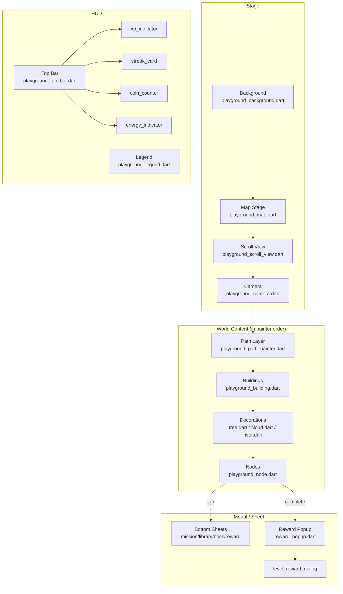
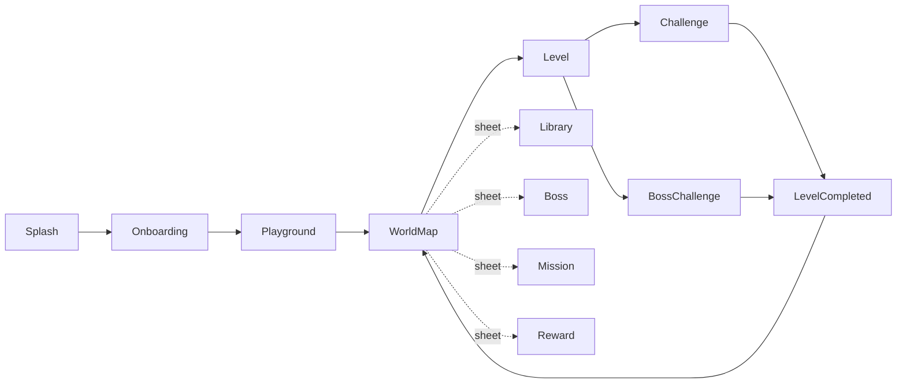
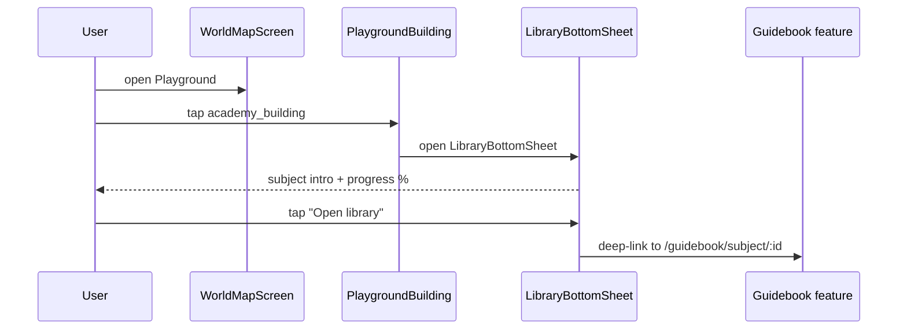
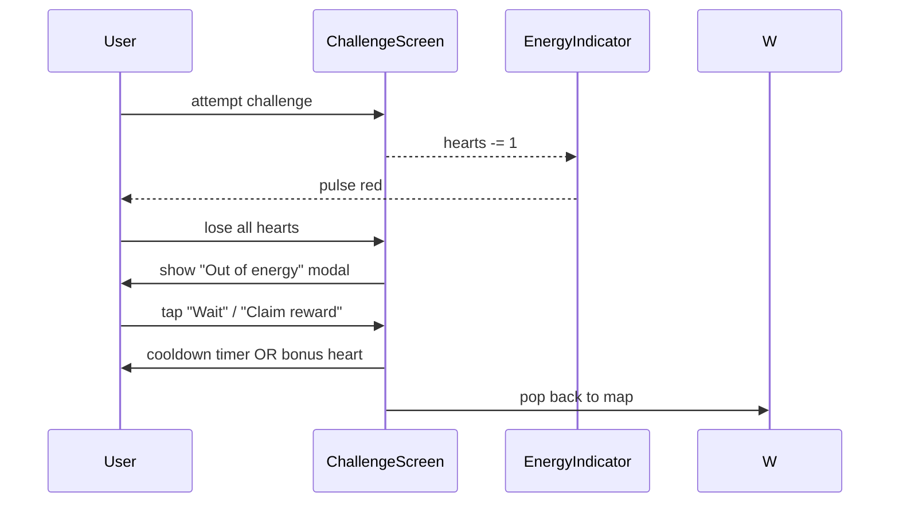
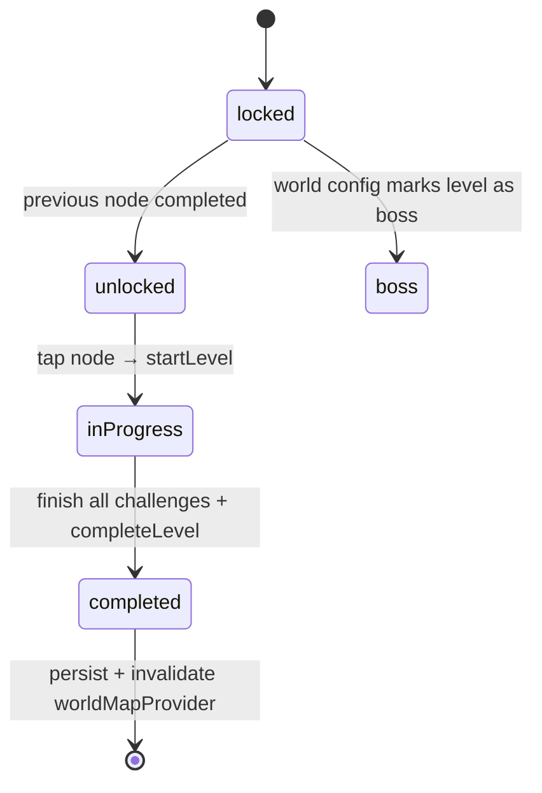

# Playground — Screen Architecture

> **Audience:** AI agents and developers who must implement, maintain, or extend the Playground screen surfaces.
> **Purpose:** Define the screen composition model, rendering layers, widget hierarchy, navigation, interaction flow, and state flow that any agent can follow without prior context.
> **Related docs:** [Widget Architecture](./PLAYGROUND_WIDGET_ARCHITECTURE.md), [Rendering Pipeline](./PLAYGROUND_RENDERING_PIPELINE.md), [State Management](./PLAYGROUND_STATE_MANAGEMENT.md), [Data Flow](./PLAYGROUND_DATA_FLOW.md), [UI Guidelines](./PLAYGROUND_UI_GUIDELINES.md).

---

## 1. Overview

The Playground is the **primary post-onboarding experience** in PrepQuest. It is not a single screen — it is a *compositional surface* built from six top-level routes and a deeply-modular widget tree. The visual reference is a map that resembles Duolingo's progression but introduces **educational buildings** that act as permanent knowledge hubs.

This document describes **what a user sees, what an AI must build, and how every piece fits together** at the screen level.

---

## 2. Vision

> "A living educational world, not a list of lessons."

- The user enters a **world map** that feels like a small kingdom: paths, buildings, gardens, mountains, particles, weather.
- Nodes along an **S-shaped path** mark *practice checkpoints*. Each node represents a level composed of *stages* of randomized questions.
- **Buildings** stand beside the path. A building is a *library for a subject* — theory, formulas, flashcards, previous questions, AI tutor — the place a learner *studies* before tackling a node.
- Tapping a node opens a *practice journey*. Tapping a building opens a *learning hub*. The two activities are separate but interconnected: buildings prepare, nodes test.
- Every interaction rewards XP, coins, or streak progress.

This vision rejects the idea that learning is "do level N then level N+1." Instead, learning and practice are two distinct rituals the user performs in the same world.

---

## 3. User Experience Goals

| #   | Goal                                                                              | Why it matters                                                                 |
|-----|-----------------------------------------------------------------------------------|--------------------------------------------------------------------------------|
| 1   | **The map must feel alive** — always something moving (clouds, glow, particles).    | Idle users feel invited back.                                                  |
| 2   | **A single gesture must always work.** Tap a node → level. Tap a building → library. | Reduces friction; no hidden menus.                                              |
| 3   | **Progress must be visible at all times.** XP bar, streak flame, coin balance are pinned. | Users feel momentum.                                                            |
| 4   | **Locked content must look inviting, not punishing.**                              | Dim but colorful, with a clear unlock preview.                                  |
| 5   | **Completions must celebrate.** Chest, confetti, +XP floats.                       | Reinforces the loop.                                                            |
| 6   | **Loading and offline states must degrade gracefully.**                            | Field users on flaky networks must still tap something.                         |
| 7   | **Accessibility must be a feature, not an afterthought.** Larger taps, color-blind palette, reduced-motion. | Inclusive design widens audience.                                               |

---

## 4. Screen Composition

The Playground is built from six routes organized in a small graph. Each route's *job* is described in the table below.

### 4.1 Screen roster

| Route                     | Screen                              | Purpose                                                                                |
|---------------------------|-------------------------------------|----------------------------------------------------------------------------------------|
| `/playground`             | `playground_screen.dart`            | Shell. Hosts the map tab and the bottom navigation. Sets up `worldMapProvider`.        |
| `/playground/map`         | `world_map_screen.dart`             | **The map.** The primary surface.                                                       |
| `/playground/level/:id`   | `level_screen.dart`                 | Briefing + challenge list for a tapped node.                                           |
| `/playground/challenge/:id`| `challenge_screen.dart`            | Plays a single challenge (quiz, reading, mini-task).                                   |
| `/playground/boss/:id`    | `boss_challenge_screen.dart`        | Plays a boss challenge. Higher stakes, dramatic visuals.                                |
| `/playground/completed`   | `level_completed_screen.dart`       | Reward / celebration.                                                                  |

### 4.2 Visual decomposition of `world_map_screen.dart`

Looking at the screen from top to bottom, the user perceives (in z-order from far → near):

1. **Background layer** — sky gradient, parallax mountains, ground gradient.
2. **World layer** — the map itself (`playground_map`), inside a `playground_scroll_view` handled by `playground_camera`.
3. **Path layer** — curving lines connecting nodes, painted by `playground_path_painter`, animated on reveal.
4. **Building layer** — `academy_building`, `library_building`, etc., drawn between the path bends.
5. **Decoration layer** — trees, clouds, rivers, bridges, particles.
6. **Node layer** — glowing map nodes composed of `playground_node.dart`.
7. **Overlay layer (HUD)** — top bar (XP, streak, coins, hearts, profile), legend, mini-cards.
8. **Sheet layer** — bottom sheets (`mission_bottom_sheet`, `library_bottom_sheet`, `boss_bottom_sheet`, `reward_bottom_sheet`) shown on tap.
9. **Dialog layer** — `level_reward_dialog.dart` for modal celebrations.

> **Layer rule:** each screen paints layers in this exact order (back → front). See [Rendering Pipeline](./PLAYGROUND_RENDERING_PIPELINE.md) for the painter breakdown.

---

## 5. Rendering Layers



### 5.1 Layer responsibilities

| Layer              | Role                                                                                  | Implementation                                       |
|--------------------|---------------------------------------------------------------------------------------|------------------------------------------------------|
| Background         | Sets mood, never interacts.                                                            | `playground_background.dart` (parallax + gradient). |
| Stage              | Provides the world canvas, scroll, and camera.                                        | `playground_map.dart`, `playground_scroll_view.dart`, `playground_camera.dart`. |
| Path               | Visualizes journey progression. Animates when a node unlocks.                          | `painters/playground_path_painter.dart`, `path/animated_path.dart`. |
| Buildings          | Knowledge hubs. Tap opens `library_bottom_sheet` or `boss_bottom_sheet`.              | `buildings/playground_building.dart` (+ variants).   |
| Decorations        | Static scenery; particles add ambient life.                                           | `decorations/*`.                                    |
| Nodes              | Interactive practice checkpoints. Tap opens `level_screen.dart`.                       | `nodes/playground_node.dart`, `widgets/map_node.dart`. |
| Overlays (HUD)     | Always-visible stats pinned to safe areas.                                             | `overlays/*`.                                       |
| Sheets             | Contextual detail / CTAs surfaced on tap.                                              | `sheets/*`.                                         |
| Dialog             | Celebratory modal. Replaces HUD focus.                                                 | `level_reward_dialog.dart`, `rewards/reward_popup.dart`. |

---

## 6. Widget Hierarchy

The full tree from app root down to leaf widgets. Indentation reflects composition (parent → child).

```
MaterialApp.router
└── PlaygroundScreen                       presentation/screens/playground_screen.dart
    └── Scaffold
        ├── PlayGroundTopBar              overlays/playground_top_bar.dart
        │   ├── ProfileSummary            overlays/profile_summary.dart
        │   ├── XpIndicator               overlays/xp_indicator.dart
        │   ├── StreakCard                overlays/streak_card.dart
        │   ├── CoinCounter               overlays/coin_counter.dart
        │   └── EnergyIndicator           overlays/energy_indicator.dart
        │
        ├── WorldMapScreen                 screens/world_map_screen.dart
        │   └── SafeArea
        │       └── PlaygroundMap         widgets/map/playground_map.dart
        │           └── Stack
        │               ├── PlaygroundBackground                  map/playground_background.dart
        │               ├── PlaygroundScrollView                 map/playground_scroll_view.dart
        │               │   └── InteractiveViewer [transform]
        │               │       └── PlaygroundCamera              map/playground_camera.dart
        │               │           └── CustomPaint (path painter)
        │               │               ├── PlaygroundPathPainter painters/playground_path_painter.dart
        │               │               ├── DashedPathPainter     painters/dashed_path_painter.dart
        │               │               └── NodeGlowPainter       painters/node_glow_painter.dart
        │               │
        │               ├── PlaygroundParticleLayer  decorations/playground_particle_layer.dart
        │               │   ├── Particles                           decorations/particles.dart
        │               │   └── Clouds (animated)                    decorations/cloud.dart
        │               │
        │               ├── PlaygroundBuilding × N    buildings/playground_building.dart
        │               │   ├── AcademyBuilding                     buildings/academy_building.dart
        │               │   ├── LibraryBuilding                     buildings/library_building.dart
        │               │   ├── BuildingLabel                      buildings/building_label.dart
        │               │   └── BuildingProgress                   buildings/building_progress.dart
        │               │
        │               ├── Decorations × N            decorations/{tree,bush,mountain,river,bridge,flag}.dart
        │               │
        │               ├── MapNode × N                widgets/map_node.dart
        │               │   └── PlaygroundNode        widgets/nodes/playground_node.dart
        │               │       ├── NodeRing          widgets/nodes/node_ring.dart
        │               │       ├── NodeIcon          widgets/nodes/node_icon.dart
        │               │       ├── NodeBadge         widgets/nodes/node_badge.dart
        │               │       ├── NodeLabel         widgets/nodes/node_label.dart
        │               │       └── NodeProgressIndicator widgets/nodes/node_progress_indicator.dart
        │               │
        │               └── PlaygroundLegend           map/playground_legend.dart
        │
        ├── LevelProgressCard              cards/level_progress_card.dart (overlays the map on small screens)
        │
        ├── MissionCard                    cards/mission_card.dart
        │
        └── [Modal routes]
            ├── MissionBottomSheet         sheets/mission_bottom_sheet.dart
            ├── LibraryBottomSheet         sheets/library_bottom_sheet.dart
            ├── BossBottomSheet            sheets/boss_bottom_sheet.dart
            └── RewardBottomSheet          sheets/reward_bottom_sheet.dart
```

### 6.1 Composite widget roles

| Widget                              | Inputs                                                   | Outputs                                                       |
|-------------------------------------|----------------------------------------------------------|---------------------------------------------------------------|
| `PlaygroundScreen`                  | none (reads providers)                                   | `Scaffold` with HUD + map.                                    |
| `WorldMapScreen`                    | none (consumes `worldMapProvider`)                        | `Stack` of map layers.                                         |
| `PlaygroundMap`                     | `WorldEntity?`                                           | composable stack.                                              |
| `PlaygroundScrollView`              | `child`                                                  | pannable + zoomable InteractiveViewer.                        |
| `PlaygroundCamera`                  | `targetNodeId`, world size                               | transform matrix (centers target, applies zoom).              |
| `MapNode`                           | `NodeEntity`, `onTap`                                    | assembles node composite + animations.                        |
| `PlaygroundBuilding` (abstract)     | `biome`, `level`, `tint`                                 | positioning + tap dispatch.                                   |
| `RewardPopup`                       | `RewardPayload`                                          | Stack of `RewardChest`, `XpReward`, `CoinReward`.            |
| `LevelRewardDialog`                 | `LevelReward`                                            | Modal with sparkle and claim CTA.                             |

---

## 7. Responsive Behaviour

The Playground targets phones first, with a responsive scale-up for tablets/web.

### 7.1 Breakpoints

| Width           | Class        | Behaviour                                                                        |
|-----------------|--------------|----------------------------------------------------------------------------------|
| `< 600dp`       | Phone        | HUD top-bar, bottom navigation, full-bleed map. Legend collapsed to icon.         |
| `600–1024dp`    | Tablet       | HUD pinned left or top. Legend persistent. Map zoom range expanded.              |
| `> 1024dp`      | Web/Desktop | Side rail with mini-map + building index. Camera transitions snap, no parallax tilt. |

### 7.2 Implementation contract

- Wrap the map root in `ResponsiveBuilder` (from `lib/core/widgets/`).
- Use `playground_sizes.dart` for base sizes (phone scale). For tablet+, multiply by `1.15` (tablet) or `1.3` (web) inside a `ResponsiveLayout`.
- Bottom sheets convert to **center modals** on `> 1024dp` via `showDialog` instead of `showModalBottomSheet`.
- Re-render `playground_legend.dart` expanded on tablet+.

### 7.3 Orientation

| Orientation | Action                                                                                    |
|-------------|-------------------------------------------------------------------------------------------|
| Portrait    | Default. Full HUD.                                                                        |
| Landscape   | HUD moves to the right as a rail. Camera recenters on next unlocked node.                 |

---

## 8. Accessibility

| Concern                  | Approach                                                                                                                                       |
|--------------------------|------------------------------------------------------------------------------------------------------------------------------------------------|
| Color contrast           | All text on background meets WCAG AA. See [UI Guidelines § Color Palette](./PLAYGROUND_UI_GUIDELINES.md#color-palette).                          |
| Touch targets            | Nodes, buttons, and tappable chips have a minimum hit area of `48dp × 48dp`.                                                                  |
| Screen readers           | Every node has a `Semantics` label: *"Level 3: Foundations of Bangladesh, 70% complete, tap to begin."*                                            |
| Reduce motion            | All `AnimationController`s check `MediaQuery.disableAnimations` (and the system "reduce motion" setting) before starting. Static fallbacks exist. See [Animation System § Reduced Motion](./PLAYGROUND_ANIMATION_SYSTEM.md#reduced-motion-accessibility). |
| Color-blind support      | Node states use **shape + color** (ring + icon), not color alone. Locked = padlock icon, completed = checkmark.                                  |
| Text scaling             | All copy uses `TextStyle` with `textScaler` clamped to `[1.0, 1.3]` to avoid breaking layouts.                                                  |
| Focus & keyboard         | On web/desktop, tab order traverses nodes naturally via `FocusTraversalGroup`.                                                                  |
| Live region              | Reward popup announces XP/coin gains via `Semantics.liveRegion = true`.                                                                         |

---

## 9. Navigation Flow

### 9.1 Route graph



### 9.2 Route definitions

```dart
GoRoute(
  path: '/playground',
  builder: (_, __) => const PlaygroundScreen(),
  routes: [
    GoRoute(path: 'map',            builder: (_, __) => const WorldMapScreen()),
    GoRoute(path: 'level/:id',      builder: (_, s) => LevelScreen(levelId: s.pathParameters['id']!)),
    GoRoute(path: 'challenge/:id',  builder: (_, s) => ChallengeScreen(challengeId: s.pathParameters['id']!)),
    GoRoute(path: 'boss/:id',       builder: (_, s) => BossChallengeScreen(levelId: s.pathParameters['id']!)),
    GoRoute(path: 'completed',      builder: (_, __) => const LevelCompletedScreen()),
  ],
),
```

### 9.3 Sheet / dialog navigation

Sheets are **not** GoRouter routes — they are state-driven modal surfaces:

| Trigger                                | Surface                              | Dismiss condition                       |
|----------------------------------------|--------------------------------------|-----------------------------------------|
| Tap on a `playground_node` (regular)    | `mission_bottom_sheet.dart`          | Tap CTA "Start" → `level_screen`        |
| Tap on a `playground_node` (boss)      | `boss_bottom_sheet.dart`             | Tap CTA "Accept" → `boss_challenge_screen` |
| Tap on a `playground_building`         | `library_bottom_sheet.dart`          | Tap CTA "Open library" → guidebook feature |
| Tap "Claim reward" on reward popup      | `reward_bottom_sheet.dart`           | Drag down or tap CTA "Continue" → back to `world_map_screen` |

---

## 10. Interaction Flow

### 10.1 Happy path: tap node → complete → claim

```mermaid
sequenceDiagram
    participant U as User
    participant W as WorldMapScreen
    participant N as MapNode
    participant S as MissionBottomSheet
    participant L as LevelScreen
    participant C as ChallengeScreen
    participant R as LevelCompletedScreen
    participant P as RewardPopup

    U->>W: open Playground
    W->>N: render path with active node
    U->>N: tap unlocked node
    N->>S: open MissionBottomSheet
    U->>S: tap "Start"
    S->>L: push /playground/level/:id
    L->>C: push /playground/challenge/:id
    C-->>C: randomized question
    U->>C: answer all → submit
    C->>R: push /playground/completed
    R->>P: animate reward popup
    P-->>U: confetti, +XP, +Coins
    U->>R: tap "Continue"
    R->>W: pop to /playground/map
    W->>W: invalidate worldMapProvider; unlock next node
```

### 10.2 Learning detour: tap building



### 10.3 Failure path: energy depleted



---

## 11. State Flow

### 11.1 Providers and their consumers

| Provider                     | Type                                  | Consumed by                                            |
|------------------------------|---------------------------------------|--------------------------------------------------------|
| `worldMapProvider`           | `AsyncNotifierProvider<…, WorldEntity>` | `WorldMapScreen`, `PlaygroundMap`, `PlaygroundCamera`. |
| `currentLevelProvider`       | `FutureProvider.family<…, String>`    | `LevelScreen`.                                          |
| `challengesProvider`         | `FutureProvider.family<…, String>`    | `LevelScreen`, `ChallengeScreen`.                       |
| `selectedNodeIdProvider`     | `StateProvider<String?>`              | `PlaygroundCamera` (centers).                          |
| `levelProgressProvider`      | `AsyncNotifierProvider<…, Progress>`  | HUD (`XpIndicator`, `StreakCard`, `CoinCounter`).      |
| `playgroundControllerProvider`| `Notifier<…>`                        | All sheet + dialog CTAs (action dispatch).              |

### 11.2 State transitions per node



### 11.3 Error / loading / empty policy

| State    | Surface                                                                                          |
|----------|--------------------------------------------------------------------------------------------------|
| Loading  | `playground_background.dart` shows a calm gradient + shimmer. No spinner, no text.                  |
| Error    | Top banner with retry button; cached map remains interactive.                                     |
| Empty    | Only possible for new users: a friendly 3-step "Begin your journey" overlay with a primary CTA.   |
| Offline  | HUD shows offline chip; map is cached; challenges queue locally and sync on reconnect.            |

### 11.4 Refresh strategy

- The map auto-refreshes whenever:
  - A node completes (controller invalidates `worldMapProvider`).
  - The user re-enters the screen.
  - A streak cross-day event fires.
- A pull-to-refresh gesture is intentionally **not exposed** — the world updates feel like a stream, not a manual pull.

> For deeper provider rules and cache invalidation, see [State Management](./PLAYGROUND_STATE_MANAGEMENT.md).

---

## 12. Cross-Document Map

| If you want to…                                                          | Open                                                         |
|--------------------------------------------------------------------------|--------------------------------------------------------------|
| Add a new node visual                                                    | [Widget Architecture](./PLAYGROUND_WIDGET_ARCHITECTURE.md)    |
| Tune colors / spacing                                                    | [UI Guidelines](./PLAYGROUND_UI_GUIDELINES.md)                |
| Optimize painter / layer order                                           | [Rendering Pipeline](./PLAYGROUND_RENDERING_PIPELINE.md)      |
| Add a new motion (e.g. boss entrance)                                    | [Animation System](./PLAYGROUND_ANIMATION_SYSTEM.md)          |
| Define what happens after a node completes                               | [Gameplay Flow](./PLAYGROUND_GAMEPLAY_FLOW.md)                |
| Wire a new repository / use case                                         | [Data Flow](./PLAYGROUND_DATA_FLOW.md)                        |
| Add a new provider or async state                                        | [State Management](./PLAYGROUND_STATE_MANAGEMENT.md)          |
| Add a world, biome, or seasonal event                                    | [Future Expansion](./PLAYGROUND_FUTURE_EXPANSION.md)          |
| Find a file by purpose                                                   | [Folder Structure](./PLAYGROUND_FOLDER_STRUCTURE.md)           |

---

**End of document.**