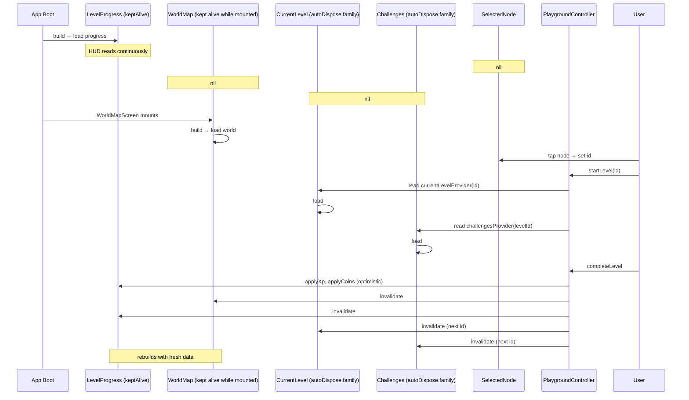

# Playground — State Management

> **Audience:** AI agents and developers who must implement, debug, or extend the Riverpod state management of the Playground feature.
> **Purpose:** Define every provider's responsibility, the loading/error/empty/success state model, the caching strategy, offline behaviour, and refresh strategy. Every provider described here lives in `presentation/providers/playground_provider.dart`. Every state shape is consumed by widgets described in [Widget Architecture](./PLAYGROUND_WIDGET_ARCHITECTURE.md).
> **Related docs:** [Data Flow](./PLAYGROUND_DATA_FLOW.md), [Gameplay Flow](./PLAYGROUND_GAMEPLAY_FLOW.md), [Folder Structure](./PLAYGROUND_FOLDER_STRUCTURE.md), [Screen Architecture](./PLAYGROUND_SCREEN_ARCHITECTURE.md).

---

## 1. State Management Stack

Playground uses **Riverpod** as its state management library, with `AsyncNotifier` for async data, `Notifier` for synchronous state, and `StateProvider`/`StateNotifier` for selected values.

### 1.1 Provider kinds in Playground

| Kind                   | Used for                                                                |
|------------------------|--------------------------------------------------------------------------|
| `AsyncNotifierProvider`| World map, user progress, current level.                                |
| `FutureProvider.family`| Per-level lazy loads (current level, challenges).                       |
| `StateProvider`        | Selection (selected node id, current tab).                                |
| `NotifierProvider`     | `PlaygroundController` — action methods that mutate other providers.    |
| `StreamProvider`       | Optional live world updates from `watchWorldMap`.                       |

### 1.2 Why this mix?

- **Async state** uses `AsyncNotifier` to expose `loading / error / data` cleanly.
- **Lazy per-id data** uses `FutureProvider.family` so each level is fetched only when needed and cached per argument.
- **Selection state** is plain `StateProvider` because it has no async semantics.
- **Cross-provider mutations** live in a single `Notifier` (`PlaygroundController`) so they are easy to test and audit.

---

## 2. Provider Responsibilities

### 2.1 Provider inventory

| Provider                              | Type                                              | Owns                                                                       |
|---------------------------------------|---------------------------------------------------|----------------------------------------------------------------------------|
| `worldMapProvider`                    | `AsyncNotifierProvider<WorldController, WorldEntity>` | The whole-world model for the active user.                              |
| `currentLevelProvider(id)`            | `FutureProvider.family<LevelEntity, String>`     | The level detail for a tapped node.                                       |
| `challengesProvider(levelId)`         | `FutureProvider.family<List<ChallengeEntity>, String>` | The list of stages inside a level.                                   |
| `selectedNodeIdProvider`              | `StateProvider<String?>`                          | The id of the focused node.                                               |
| `levelProgressProvider`               | `AsyncNotifierProvider<ProgressController, LevelProgress>` | XP, hearts, coins, streak, user level.                       |
| `playgroundControllerProvider`        | `NotifierProvider<PlaygroundController, PlaygroundState>` | Action methods (startLevel, completeLevel, unlockNext, claim). |

### 2.2 `worldMapProvider`

```dart
class WorldController extends AsyncNotifier<WorldEntity> {
  late final GetWorldMap _getWorldMap;

  @override
  Future<WorldEntity> build() async {
    final userId = ref.read(currentUserIdProvider);
    return _getWorldMap(userId);
  }

  Future<void> refresh() async {
    state = const AsyncValue.loading();
    state = await AsyncValue.guard(() async {
      final userId = ref.read(currentUserIdProvider);
      return _getWorldMap(userId);
    });
  }

  void invalidate() {
    ref.invalidateSelf();
  }
}
```

**Responsibilities:**
- Load the world once when first watched.
- Expose `refresh()` for pull-to-refresh or programmatic re-fetch.
- Expose `invalidate()` for the controller to clear after a write.
- Translate repository failures into `AsyncValue<Error>`.

### 2.3 `currentLevelProvider(id)` — `FutureProvider.family`

```dart
final currentLevelProvider = FutureProvider.family<LevelEntity, String>((ref, id) async {
  final getLevel = ref.read(getLevelUseCaseProvider);
  return getLevel(id);
});
```

**Responsibilities:**
- Lazily load one level by id.
- Auto-dispose when no widget watches it.
- Invalidate when the user starts or completes that level (via `ref.invalidate(currentLevelProvider(id))`).

### 2.4 `challengesProvider(levelId)` — `FutureProvider.family`

```dart
final challengesProvider = FutureProvider.family<List<ChallengeEntity>, String>((ref, levelId) async {
  final getChallenges = ref.read(getChallengesUseCaseProvider);
  return getChallenges(levelId);
});
```

**Responsibilities:**
- Load all challenges for a level.
- Auto-dispose when the level screen unmounts.

### 2.5 `selectedNodeIdProvider` — `StateProvider`

```dart
final selectedNodeIdProvider = StateProvider<String?>((ref) => null);
```

**Responsibilities:**
- Hold the id of the currently focused node.
- Read by `PlaygroundCamera` (to center the map) and sheets (to know what to preview).
- Written by `MapNode` `onTap` callbacks.

### 2.6 `levelProgressProvider` — `AsyncNotifier<LevelProgress>`

```dart
class LevelProgress {
  final int userLevel;
  final int totalXp;
  final int xpInLevel;
  final int coins;
  final int hearts;
  final int currentStreak;
  final DateTime lastActiveAt;
}

class ProgressController extends AsyncNotifier<LevelProgress> {
  @override
  Future<LevelProgress> build() async {
    return ref.read(progressApiProvider).fetchUserProgress();
  }

  void applyXp(int delta) {
    final current = state.value;
    if (current == null) return;
    state = AsyncValue.data(current.copyWith(totalXp: current.totalXp + delta));
  }
}
```

**Responsibilities:**
- Hold the user's XP, level, hearts, streak, coins.
- Expose optimistic-update helpers (`applyXp`, `applyCoins`) for the controller.
- Invalidate on app foreground or after `completeLevel`.

### 2.7 `playgroundControllerProvider` — `Notifier<PlaygroundState>`

```dart
class PlaygroundController extends Notifier<PlaygroundState> {
  late final StartLevel _startLevel;
  late final CompleteLevel _completeLevel;
  late final UnlockNextLevel _unlockNext;
  late final GetLevel _getLevel;

  @override
  PlaygroundState build() => const PlaygroundState.initial();

  Future<void> startLevel(String id) async { /* ... */ }
  Future<LevelEntity> completeLevel({required String id, required int earnedXp, required int earnedCoins}) async { /* ... */ }
  Future<LevelEntity> unlockNext(String currentLevelId) async { /* ... */ }
  void claimReward() { /* ... */ }
}
```

**Responsibilities:**
- Chain use cases.
- Invalidate `worldMapProvider`, `currentLevelProvider(id)`, `challengesProvider(levelId)`, and `levelProgressProvider`.
- Dispatch navigation side effects (`router.push(...)`).
- Set the `selectedNodeIdProvider` value.
- Surface failure states.

### 2.8 Use-case providers

Each use case is exposed as a Riverpod provider so the controller (and tests) can inject mocks:

```dart
final getWorldMapUseCaseProvider = Provider((ref) => GetWorldMap(ref.read(playgroundRepositoryProvider)));
final startLevelUseCaseProvider = Provider((ref) => StartLevel(ref.read(playgroundRepositoryProvider)));
// ... etc.
```

---

## 3. Loading States

### 3.1 What "loading" means in Playground

Loading must feel **calm**. The map must never show a spinner over the world. Instead, the world stays visible (cached or placeholders) and a soft shimmer or empty-state appears on top.

### 3.2 Loading state matrix

| Provider                          | Loading UI                                                              |
|-----------------------------------|--------------------------------------------------------------------------|
| `worldMapProvider` (first load)   | `PlaygroundBackground` + soft shimmer overlay + "Preparing your world…" copy. |
| `worldMapProvider` (refresh)      | No interruption — old map stays visible; new data swaps in atomically.   |
| `currentLevelProvider(id)`        | Inline shimmer inside `LevelScreen`.                                     |
| `challengesProvider(levelId)`     | Skeleton tiles (`LevelCard` shimmer).                                     |
| `levelProgressProvider` (HUD)     | HUD widgets fade in once data arrives.                                    |

### 3.3 Implementation contract

Every consumer handles `AsyncValue.when` *or* `AsyncValue.guard` cleanly:

```dart
return worldMap.when(
  data: (world) => PlaygroundMap(world: world),
  loading: () => const _MapLoading(),
  error: (e, st) => _MapErrorBanner(e: e, onRetry: () => ref.invalidate(worldMapProvider)),
);
```

Loading widgets **must not show interactive controls** that don't have data underneath.

---

## 4. Error States

### 4.1 Error philosophy

Errors are *informational*. They never block the user entirely. The map is always recoverable — cached map remains interactive, sheets can still open from cache, errors surface as banners.

### 4.2 Error matrix

| Provider                          | Error surface                                                            |
|-----------------------------------|--------------------------------------------------------------------------|
| `worldMapProvider`                | Top banner with retry button. Cached world (if any) remains interactive.|
| `currentLevelProvider(id)`        | Inline error inside `LevelScreen`; user can still close and retry.       |
| `challengesProvider(levelId)`     | Inline error inside the challenges list; user can retry or "fall back to AI Tutor". |
| `levelProgressProvider` (HUD)     | HUD shows `--` for stats; never blocks usage.                            |
| `completeLevel` action            | Snackbar with retry; navigation to `LevelCompletedScreen` is delayed until the write succeeds. |

### 4.3 Failure types

```dart
sealed class PlaygroundFailure {
  final String message;
  const PlaygroundFailure(this.message);
}
class NetworkFailure extends PlaygroundFailure {}
class AuthFailure extends PlaygroundFailure {}
class NotFoundFailure extends PlaygroundFailure {}
class HeartsExhaustedFailure extends PlaygroundFailure {}
class StaleWorldFailure extends PlaygroundFailure {}
```

`PlaygroundRepositoryImpl` converts datasource exceptions into these. The controller maps them to UI.

### 4.4 Retry semantics

| Action                 | Retry strategy                                                        |
|------------------------|-----------------------------------------------------------------------|
| `getWorldMap`          | Manual via banner button. Three retries built in for transient.       |
| `getLevel`             | Manual retry inside `LevelScreen`.                                     |
| `completeLevel`        | Auto-retry 3× with exponential backoff.                                |
| `unlockNextLevel`      | Auto-retry 3× with exponential backoff.                                |
| `startLevel`           | Auto-retry 1×; manual on failure.                                      |

---

## 5. Empty States

### 5.1 When the world is empty

The Playground will only be "empty" for new users. The empty state is a friendly **3-step overlay** introducing the world's vision.

### 5.2 Empty state UI

```
PlaygroundMap (cached welcome background)
└── Centered overlay
    ├── Title  : "Welcome to your Playground."
    ├── Body   : "Walk the path, complete levels, and unlock buildings along the way."
    ├── 3 illustrated steps with icons
    └── Primary CTA: "Begin your journey"
```

### 5.3 Implementation

A `WorldEmptyOverlay` widget is shown when `worldMapProvider.value?.nodes.isEmpty == true`. Tap on CTA navigates to a tutorial, then sets `selectedNodeIdProvider` to the first node.

---

## 6. Success States

### 6.1 Per-provider success contracts

| Provider                          | Success criteria                                                      |
|-----------------------------------|-----------------------------------------------------------------------|
| `worldMapProvider`                | Non-null `WorldEntity` with at least one node, status populated.       |
| `currentLevelProvider(id)`        | Non-null `LevelEntity` whose `nodeId` matches.                        |
| `challengesProvider(levelId)`     | Non-empty list of `ChallengeEntity`.                                  |
| `levelProgressProvider`           | Non-null `LevelProgress`.                                              |
| `playgroundControllerProvider`    | `PlaygroundState.idle` after a successful action.                     |

### 6.2 Mapping AsyncValue to UI

```dart
AsyncValue<WorldEntity> → WorldMapScreen
   .when(
     data: (world) => success,
     loading: () => shimmer,
     error: (e, _) => banner,
   );
```

### 6.3 What success looks like visually

- The world map renders fully.
- The HUD is populated.
- The active node glows.
- The path is drawn with completed and active segments.

---

## 7. Caching Strategy

### 7.1 Caches

| Provider                          | Cache scope                              | Cache key      | Invalidation trigger                            |
|-----------------------------------|------------------------------------------|----------------|--------------------------------------------------|
| `worldMapProvider`                | Screen lifetime.                         | n/a            | `completeLevel`, `unlockNextLevel`, app resume.  |
| `currentLevelProvider(id)`        | Family: per `levelId`.                   | `levelId`      | `startLevel`, `completeLevel` for the same id.  |
| `challengesProvider(levelId)`     | Family: per `levelId`.                   | `levelId`      | On `startLevel` for the same id.                 |
| `levelProgressProvider`           | App lifetime.                            | n/a            | Any XP / coin / hearts change.                   |
| `selectedNodeIdProvider`          | App lifetime.                             | n/a            | Reset on user logout.                            |

### 7.2 Auto-dispose rules

- `currentLevelProvider(id)` and `challengesProvider(levelId)` are `autoDispose.family`. They release memory when no widget watches them.
- `worldMapProvider` is **kept alive** while the map is mounted.
- `levelProgressProvider` is kept alive at app level because HUD constantly reads it.

### 7.3 Persistence (offline support)

| Cache                     | Storage                                       |
|---------------------------|-----------------------------------------------|
| World map                 | Firestore offline persistence.                |
| User progress             | Firestore offline persistence.                |
| Level progress            | Firestore offline persistence.                |
| Pending writes            | Local queue (e.g. `shared_preferences`).     |

---

## 8. Offline Behaviour

The Playground must remain **functional** offline. Maps and HUD stay visible; actions queue locally.

### 8.1 What works offline

- Browsing the map.
- Tapping nodes and opening `MissionBottomSheet`.
- Reading previously loaded levels.
- Reading previously loaded challenges.
- Viewing cached HUD values.

### 8.2 What does not work offline

- Starting a fresh level (network needed).
- Completing a level (queued; resync on reconnect).
- Unlocking a boss or world (queued).
- Fetching new challenges (cache only).

### 8.3 Offline queue

- All failed writes from the controller are pushed to a local queue.
- The queue drains on `connectivity` event.
- Successful drains invalidate the relevant providers.

```dart
final pendingWritesProvider = StateNotifierProvider<PendingWritesController, List<PendingWrite>>(...);
```

### 8.4 Offline UI

- HUD shows an "Offline" chip when `connectivity_plus` reports no connection.
- Tap on the chip shows a sheet with queued actions and a "Retry now" button.

---

## 9. Refresh Strategy

### 9.1 Triggers for refresh

| Trigger                                                | Provider invalidated                                  |
|--------------------------------------------------------|--------------------------------------------------------|
| User completes a node (`completeLevel` succeeds).       | `worldMapProvider`, `levelProgressProvider`, `currentLevelProvider(id)` (for next node's id), `challengesProvider(nextLevelId)`. |
| User starts a level (`startLevel`).                    | `currentLevelProvider(id)`, `challengesProvider(levelId)`. |
| User opens the screen after a long absence.            | `worldMapProvider`, `levelProgressProvider`.            |
| App foreground event (resume).                          | `worldMapProvider`, `levelProgressProvider`.            |
| User performs pull-to-refresh.                         | `worldMapProvider`.                                     |
| Server-sent event (rare).                              | Targeted invalidation.                                  |

### 9.2 Atomic refresh

`worldMapProvider` does **not** clear state on refresh. It keeps the old world visible while fetching the new one. The new world replaces the old atomically in a single frame to avoid flicker.

```dart
Future<void> refresh() async {
  final next = await AsyncValue.guard(_getWorldMap);
  // Guard against flicker: keep previous data if new fetch fails.
  state = next is AsyncData ? next : state;
}
```

### 9.3 Debouncing

- Refresh is debounced 250 ms within the controller to avoid hammering Firestore when a user taps multiple CTAs in quick succession.

### 9.4 No "pull-to-refresh" on the map by default

The map refreshes *automatically*. There is no `RefreshIndicator` on `WorldMapScreen` for the world. A pull gesture is reserved for power users via a long-press on the legend.

---

## 10. Optimistic Updates

The controller uses optimistic updates for fast perceived performance.

### 10.1 What is updated optimistically

| Update             | Optimistic? | Rollback on failure                                |
|--------------------|-------------|------------------------------------------------------|
| XP gain            | yes         | Subtract delta; show snackbar.                       |
| Coin gain          | yes         | Subtract delta; show snackbar.                       |
| Heart spend        | yes         | Restore heart; show snackbar.                        |
| Streak +1 day      | yes         | Roll back; show snackbar with explanation.           |
| Node unlock        | yes (animation only — actual unlock waits for ack) | Wait for ack; show error.                |

### 10.2 Rollback helper

```dart
class OptimisticUpdate<T> {
  final T previousState;
  final void Function(T) rollback;
  OptimisticUpdate(this.previousState, this.rollback);
}
```

The controller wraps every optimistic write in an `OptimisticUpdate` so failure handling is consistent.

---

## 11. Failure → Action mapping

| Failure                    | UI action                                                            |
|----------------------------|----------------------------------------------------------------------|
| `NetworkFailure`           | Top banner + offline chip enqueued.                                  |
| `AuthFailure`              | Force reauth flow; rarely seen.                                      |
| `NotFoundFailure`          | Snackbar "Content unavailable"; reset navigation to map.            |
| `HeartsExhaustedFailure`   | Modal: "Out of energy — wait N hours or claim reward."               |
| `StaleWorldFailure`        | Silent refresh + retry.                                              |

---

## 12. Test and Mock Strategy

### 12.1 Provider-level tests

- `worldMapProvider.build` returns `WorldEntity` from a mock `GetWorldMap`.
- `playgroundControllerProvider.completeLevel` chain is verified end-to-end with mock use cases.
- `OptimisticUpdate` rollback is verified by throwing from the repository.

### 12.2 Family providers

- Use `ProviderContainer.read(provider(id))` in tests; verify auto-disposal with `container.read(provider.autoDispose)` lifecycle.

### 12.3 Integration

- Use `addTearDown` to reset the container per test.
- For live updates, fake a `Stream` via `Stream.fromIterable`.

---

## 13. Provider Lifecycle Summary



---

## 14. Cross-Document Map

| If you want to…                                          | Open                                                                |
|----------------------------------------------------------|---------------------------------------------------------------------|
| Understand which provider triggers which animation       | [Animation System](./PLAYGROUND_ANIMATION_SYSTEM.md)               |
| Understand provider ↔ use case ↔ repository wiring       | [Data Flow](./PLAYGROUND_DATA_FLOW.md)                             |
| Understand how each gameplay step uses providers         | [Gameplay Flow](./PLAYGROUND_GAMEPLAY_FLOW.md)                     |
| See which widget watches which provider                 | [Widget Architecture](./PLAYGROUND_WIDGET_ARCHITECTURE.md)         |
| Add a new provider                                       | (this document, §2)                                                  |

---

**End of document.**