# Playground Widget Flow

Visualizes the runtime widget tree of the Playground feature, from GoRouter routes down through layered subtrees and the callback graph.

```mermaid
flowchart TD

%%==================================================
%% ROUTES
%%==================================================

A[GoRouter Route]
A --> B[PlaygroundScreen]
A --> C[WorldMapScreen]

%%==================================================
%% PLAYGROUND SCREEN
%%==================================================

subgraph PLAYGROUND_SCREEN["PlaygroundScreen (Tier 1 Route)"]

B --> PScaffold[Scaffold]
PScaffold --> StackRoot[Stack]

StackRoot --> BackgroundLayer
StackRoot --> ScrollLayer
StackRoot --> HUDLayer
StackRoot --> BottomOverlayLayer
StackRoot --> FloatingLayer
StackRoot --> DialogLayer

end

%%==================================================
%% BACKGROUND
%%==================================================

subgraph BACKGROUND["Background Layer"]

BackgroundLayer --> PlaygroundBackground

end

%%==================================================
%% MAP
%%==================================================

subgraph MAP["Scrollable World"]

ScrollLayer --> PlaygroundCamera
PlaygroundCamera --> PlaygroundScrollView
PlaygroundScrollView --> PlaygroundMap

PlaygroundMap --> ProgressPath
PlaygroundMap --> PlaygroundBuildings
PlaygroundMap --> PlaygroundDecorations
PlaygroundMap --> PlaygroundNodes
PlaygroundMap --> PlaygroundLegend

end

%%==================================================
%% PATH
%%==================================================

subgraph PATH_LAYER["Progress Path"]

ProgressPath --> AnimatedPath
ProgressPath --> CompletedPath
ProgressPath --> PathSegment

end

%%==================================================
%% BUILDINGS
%%==================================================

subgraph BUILDINGS

PlaygroundBuildings --> AcademyBuilding
PlaygroundBuildings --> LibraryBuilding
PlaygroundBuildings --> PlaygroundBuilding
PlaygroundBuildings --> BuildingLabel
PlaygroundBuildings --> BuildingProgress

end

%%==================================================
%% DECORATIONS
%%==================================================

subgraph DECORATIONS

PlaygroundDecorations --> Tree
PlaygroundDecorations --> Bush
PlaygroundDecorations --> River
PlaygroundDecorations --> Bridge
PlaygroundDecorations --> Cloud
PlaygroundDecorations --> Mountain
PlaygroundDecorations --> Flag

end

%%==================================================
%% NODES
%%==================================================

subgraph NODE_LAYER

PlaygroundNodes --> PlaygroundNode

PlaygroundNode --> NodeRing
PlaygroundNode --> NodeIcon
PlaygroundNode --> NodeBadge
PlaygroundNode --> NodeLabel
PlaygroundNode --> NodeProgressIndicator

end

%%==================================================
%% HUD
%%==================================================

subgraph HUD

HUDLayer --> PlaygroundTopBar

PlaygroundTopBar --> ProfileSummary
PlaygroundTopBar --> StreakCard
PlaygroundTopBar --> EnergyIndicator
PlaygroundTopBar --> CoinCounter
PlaygroundTopBar --> XpIndicator

end

%%==================================================
%% BOTTOM
%%==================================================

subgraph BOTTOM_OVERLAYS

BottomOverlayLayer --> LevelProgressCard
BottomOverlayLayer --> MissionCard

end

%%==================================================
%% FLOATING
%%==================================================

subgraph FLOATING_OBJECTS

FloatingLayer --> RewardChest
FloatingLayer --> PlaygroundParticleLayer

end

%%==================================================
%% DIALOGS
%%==================================================

subgraph DIALOGS

DialogLayer --> RewardPopup
DialogLayer --> LevelRewardDialog

DialogLayer --> BossBottomSheet
DialogLayer --> MissionBottomSheet
DialogLayer --> RewardBottomSheet
DialogLayer --> LibraryBottomSheet

end

%%==================================================
%% WORLD MAP SCREEN
%%==================================================

subgraph WORLD_MAP["WorldMapScreen"]

C --> WMScaffold[Scaffold]

WMScaffold --> WorldMap

WorldMap --> PlaygroundCamera
WorldMap --> PlaygroundScrollView
WorldMap --> PlaygroundMap

WorldMap --> PlaygroundLegend

end

%%==================================================
%% CALLBACKS
%%==================================================

PlaygroundNode -.Tap.-> LevelCard
LevelCard -.Start Level.-> RewardPopup
RewardPopup -.Claim.-> CoinCounter
RewardPopup -.XP.-> XpIndicator
RewardChest -.Open.-> PlaygroundParticleLayer
MissionCard -.Open.-> MissionBottomSheet
AcademyBuilding -.Tap.-> LibraryBottomSheet
BossGate -.Tap.-> BossBottomSheet

%%==================================================
%% LAYERS
%%==================================================

classDef route fill:#1E3A8A,color:#fff
classDef layer fill:#2563EB,color:#fff
classDef widget fill:#10B981,color:#fff
classDef overlay fill:#F59E0B,color:#fff
classDef dialog fill:#DC2626,color:#fff

class B,C route
class PlaygroundMap,PlaygroundCamera,PlaygroundScrollView layer
class PlaygroundNode,PlaygroundTopBar,LevelProgressCard,MissionCard widget
class RewardPopup,LevelRewardDialog,BossBottomSheet,MissionBottomSheet,RewardBottomSheet,LibraryBottomSheet dialog
```

## Reading Guide

- **Solid arrows** = widget composition (parent builds child).
- **Dashed arrows** = runtime callbacks (tap → opens, claim → increments).
- **Color classes**:
  - `route` (deep blue) — Tier 1 GoRouter routes.
  - `layer` (blue) — cross-cutting map / camera / scroll primitives.
  - `widget` (green) — composite widgets and HUD chrome.
  - `overlay` / `dialog` (amber / red) — bottom overlays and modal surfaces.
- **Subgraphs** mirror the Stack layers in `PlaygroundScreen` so the diagram doubles as a map of the layer stack.

## Cross-References

- Layer semantics and z-ordering: see `PLAYGROUND_RENDERING_PIPELINE.md` §2.1.
- Widget responsibilities and ownership: see `PLAYGROUND_WIDGET_ARCHITECTURE.md`.
- Animation choreography between layers: see `PLAYGROUND_ANIMATION_SYSTEM.md`.
